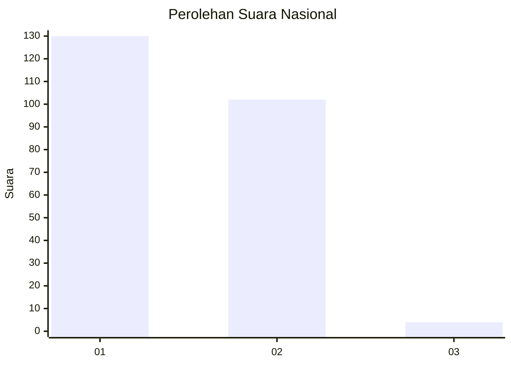
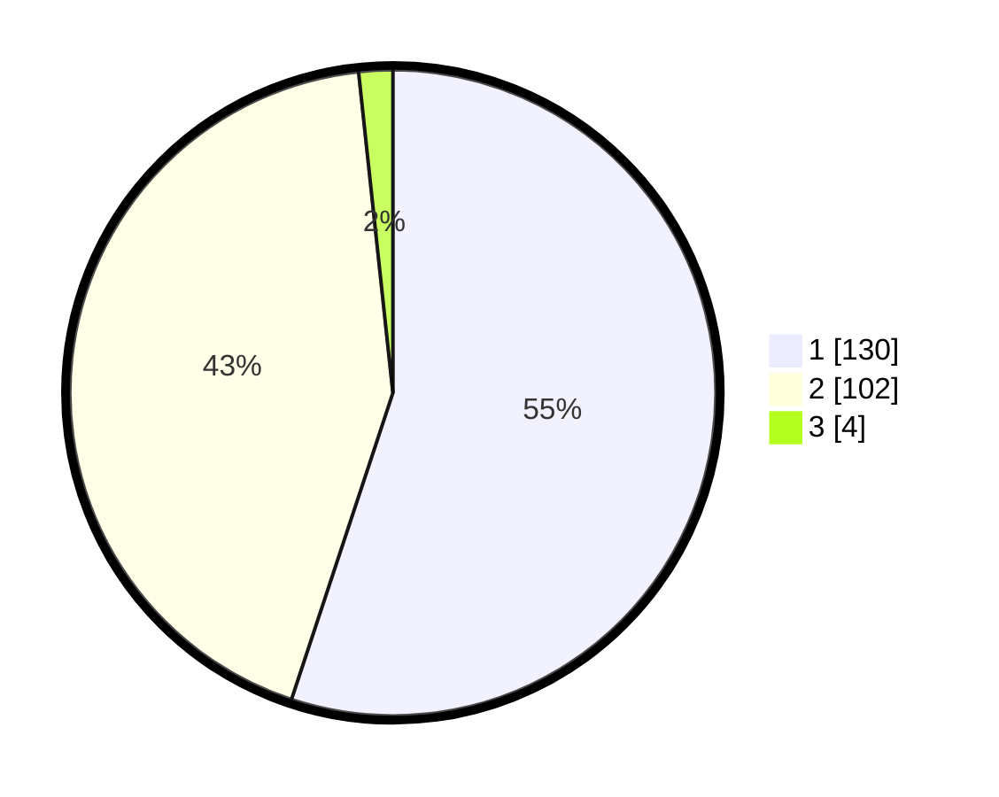

# Hasil

## Grafik

## Tabel

| No. | Nama Paslon    | Suara | Suara (raw) | Persentase |
|:--- |:-------------- | -----:| -----------:| ----------:|
| 1   | ANIES MUHAIMIN | 130   | [130][p-1]  | 55,08      |
| 2   | PRABOWO GIBRAN | 102   | [102][p-2]  | 43,22      |
| 3   | GANJAR MAHFUD  | 4     | [4][p-3]    | 1,69       |

[p-1]: https://github.com/gigit-pemilu/pemilu-2024/blob/main/pilpres/hitung-suara/sub/14-riau/sub/01-kampar/sub/10-tapung/sub/2002-pantai-cermin/sub/001-tps/sub/paslon-1.txt
[p-2]: https://github.com/gigit-pemilu/pemilu-2024/blob/main/pilpres/hitung-suara/sub/14-riau/sub/01-kampar/sub/10-tapung/sub/2002-pantai-cermin/sub/001-tps/sub/paslon-2.txt
[p-3]: https://github.com/gigit-pemilu/pemilu-2024/blob/main/pilpres/hitung-suara/sub/14-riau/sub/01-kampar/sub/10-tapung/sub/2002-pantai-cermin/sub/001-tps/sub/paslon-3.txt

## Foto C Plano

https://sirekap-obj-formc.kpu.go.id/8a42/pemilu/ppwp/14/01/10/20/02/1401102002001-20240214-223734--84856a21-2aee-4440-a2df-2b705b1b5db2.jpg

https://sirekap-obj-formc.kpu.go.id/8a42/pemilu/ppwp/14/01/10/20/02/1401102002001-20240214-223909--529ff3cb-f335-4a05-8cc0-399fe4cc2e56.jpg

https://sirekap-obj-formc.kpu.go.id/8a42/pemilu/ppwp/14/01/10/20/02/1401102002001-20240214-224129--0bc4b5d0-3ffb-4406-aab5-d2855b2f2a74.jpg

## Metadata

| Key        | Value               |
| ---------- | ------------------- |
| Time Stamp | 2024-02-15 23:29:50 |

