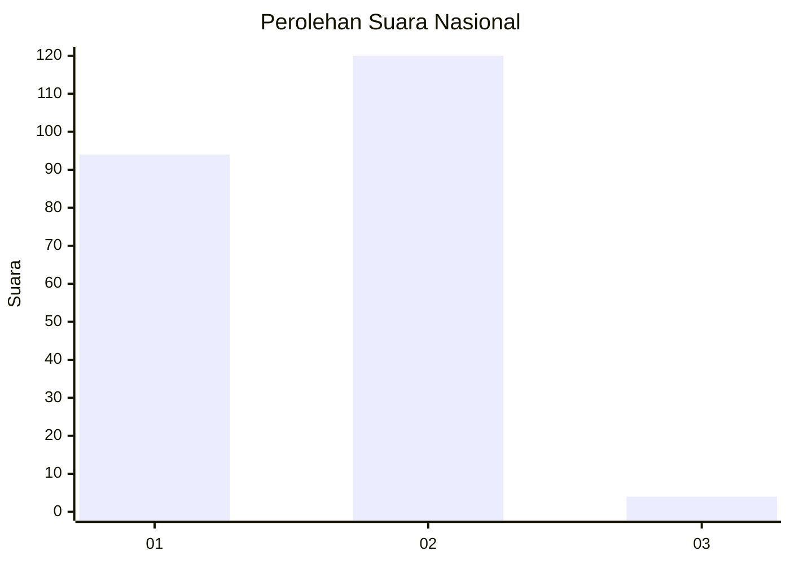
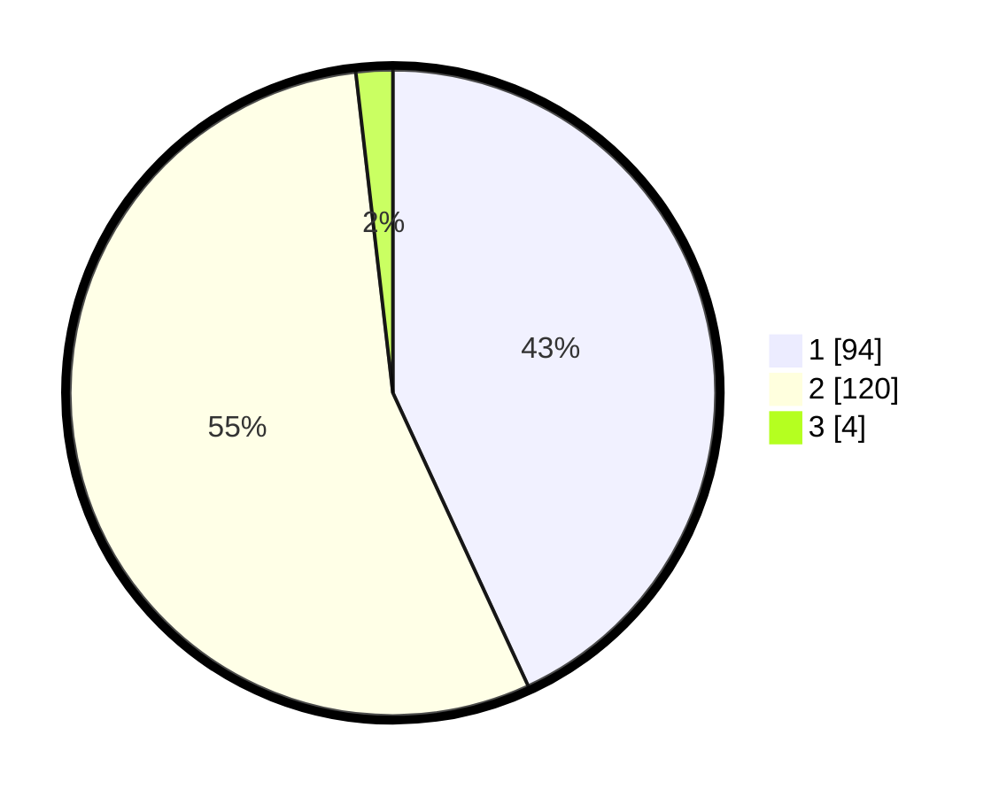

# Hasil

## Grafik

## Tabel

| No. | Nama Paslon    | Suara | Suara (raw) | Persentase |
|:--- |:-------------- | -----:| -----------:| ----------:|
| 1   | ANIES MUHAIMIN | 94    | [94][p-1]   | 43,12      |
| 2   | PRABOWO GIBRAN | 120   | [120][p-2]  | 55,05      |
| 3   | GANJAR MAHFUD  | 4     | [4][p-3]    | 1,83       |

[p-1]: https://github.com/gigit-pemilu/pemilu-2024/blob/main/pilpres/hitung-suara/sub/14-riau/sub/01-kampar/sub/10-tapung/sub/2002-pantai-cermin/sub/003-tps/sub/paslon-1.txt
[p-2]: https://github.com/gigit-pemilu/pemilu-2024/blob/main/pilpres/hitung-suara/sub/14-riau/sub/01-kampar/sub/10-tapung/sub/2002-pantai-cermin/sub/003-tps/sub/paslon-2.txt
[p-3]: https://github.com/gigit-pemilu/pemilu-2024/blob/main/pilpres/hitung-suara/sub/14-riau/sub/01-kampar/sub/10-tapung/sub/2002-pantai-cermin/sub/003-tps/sub/paslon-3.txt

## Foto C Plano

https://sirekap-obj-formc.kpu.go.id/5a69/pemilu/ppwp/14/01/10/20/02/1401102002003-20240214-175445--39bad02f-d42c-4eac-a3ee-913f868adf13.jpg

https://sirekap-obj-formc.kpu.go.id/5a69/pemilu/ppwp/14/01/10/20/02/1401102002003-20240214-193050--3f1eb9ba-c7d3-42a2-b86c-0763682e89a0.jpg

https://sirekap-obj-formc.kpu.go.id/5a69/pemilu/ppwp/14/01/10/20/02/1401102002003-20240214-231153--d98140ad-d97e-49c7-bd7b-9f0f06bf447a.jpg

## Metadata

| Key        | Value               |
| ---------- | ------------------- |
| Time Stamp | 2024-02-25 16:00:00 |

