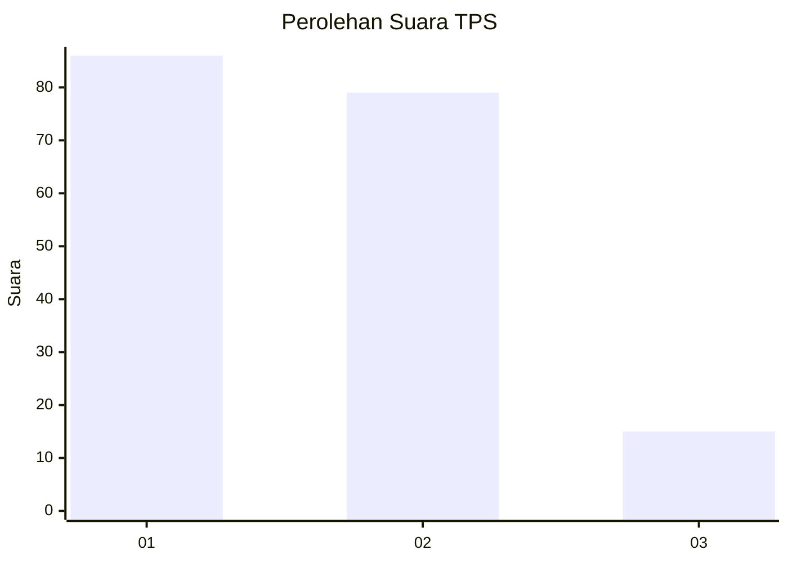
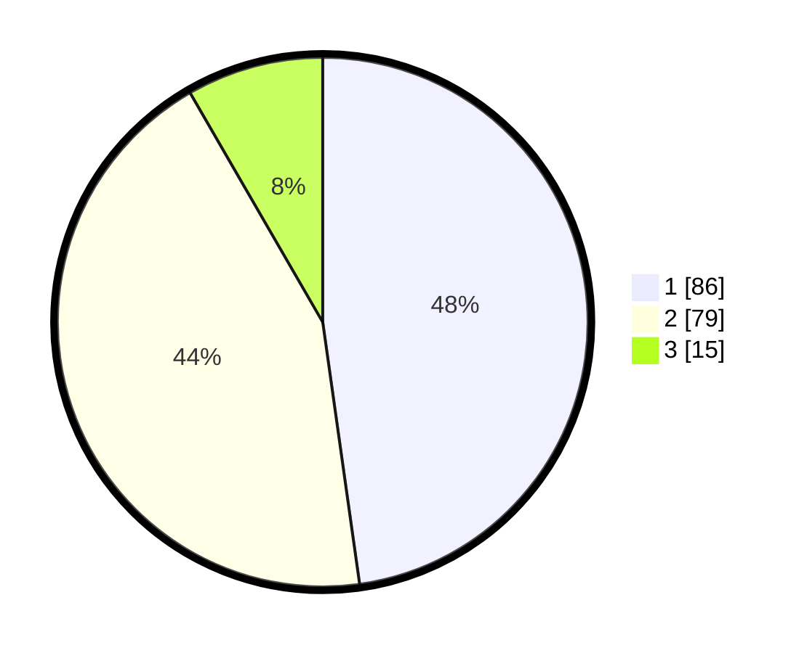

# Hasil

## Grafik

## Tabel

| No. | Nama Paslon    | Suara | Suara (raw) | Persentase |
|:--- |:-------------- | -----:| -----------:| ----------:|
| 1   | ANIES MUHAIMIN | 86    | [86][p-1]   | 47,78      |
| 2   | PRABOWO GIBRAN | 79    | [79][p-2]   | 43,89      |
| 3   | GANJAR MAHFUD  | 15    | [15][p-3]   | 8,33       |

[p-1]: https://github.com/gigit-pemilu/pemilu-2024-14-riau/blob/main/pilpres/hitung-suara/sub/14-riau/sub/01-kampar/sub/10-tapung/sub/2002-pantai-cermin/sub/006-tps/sub/paslon-1.txt
[p-2]: https://github.com/gigit-pemilu/pemilu-2024-14-riau/blob/main/pilpres/hitung-suara/sub/14-riau/sub/01-kampar/sub/10-tapung/sub/2002-pantai-cermin/sub/006-tps/sub/paslon-2.txt
[p-3]: https://github.com/gigit-pemilu/pemilu-2024-14-riau/blob/main/pilpres/hitung-suara/sub/14-riau/sub/01-kampar/sub/10-tapung/sub/2002-pantai-cermin/sub/006-tps/sub/paslon-3.txt

## Foto C Plano

https://sirekap-obj-formc.kpu.go.id/5949/pemilu/ppwp/14/01/10/20/02/1401102002006-20240214-220245--c5c2afea-b3bd-471b-89b7-00b01c9a7fb5.jpg

https://sirekap-obj-formc.kpu.go.id/5949/pemilu/ppwp/14/01/10/20/02/1401102002006-20240214-194942--28b6b189-4f2e-4765-90c1-9774ce4b8903.jpg

https://sirekap-obj-formc.kpu.go.id/5949/pemilu/ppwp/14/01/10/20/02/1401102002006-20240214-195218--ae54e98e-714e-4fe3-a8be-54360fe8804a.jpg

## Metadata

| Key        | Value               |
| ---------- | ------------------- |
| Time Stamp | 2024-02-15 15:00:29 |

