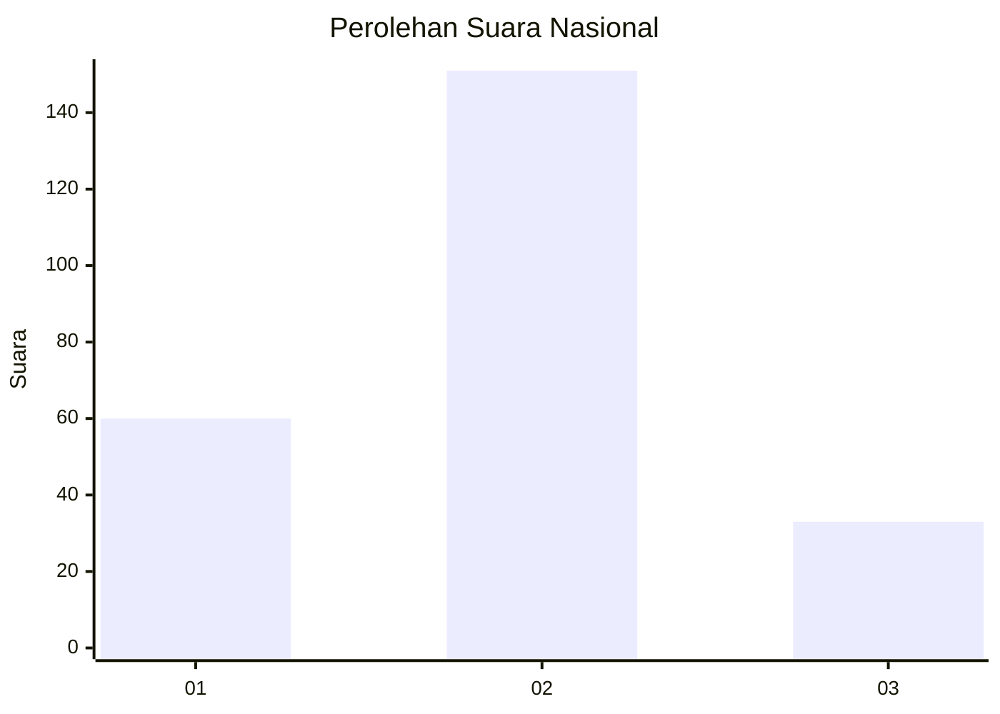
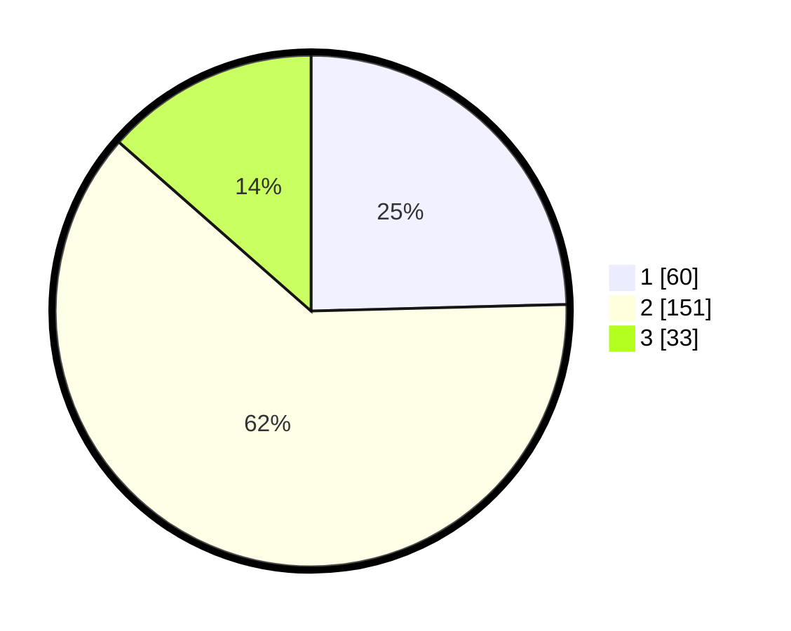

# Hasil

## Grafik

## Tabel

| No. | Nama Paslon    | Suara | Suara (raw) | Persentase |
|:--- |:-------------- | -----:| -----------:| ----------:|
| 1   | ANIES MUHAIMIN | 60    | [60][p-1]   | 24,59      |
| 2   | PRABOWO GIBRAN | 151   | [151][p-2]  | 61,89      |
| 3   | GANJAR MAHFUD  | 33    | [33][p-3]   | 13,52      |

[p-1]: https://github.com/gigit-pemilu/pemilu-2024/blob/main/pilpres/hitung-suara/sub/14-riau/sub/01-kampar/sub/10-tapung/sub/2013-tanjung-sawit/sub/006-tps/sub/paslon-1.txt
[p-2]: https://github.com/gigit-pemilu/pemilu-2024/blob/main/pilpres/hitung-suara/sub/14-riau/sub/01-kampar/sub/10-tapung/sub/2013-tanjung-sawit/sub/006-tps/sub/paslon-2.txt
[p-3]: https://github.com/gigit-pemilu/pemilu-2024/blob/main/pilpres/hitung-suara/sub/14-riau/sub/01-kampar/sub/10-tapung/sub/2013-tanjung-sawit/sub/006-tps/sub/paslon-3.txt

## Foto C Plano

https://sirekap-obj-formc.kpu.go.id/57c6/pemilu/ppwp/14/01/10/20/13/1401102013006-20240214-231726--00f5dd73-ba89-458f-b19f-4191b4fdcd06.jpg

https://sirekap-obj-formc.kpu.go.id/57c6/pemilu/ppwp/14/01/10/20/13/1401102013006-20240214-225644--143fbafb-e42c-4b27-876f-6a1a7ef91c23.jpg

https://sirekap-obj-formc.kpu.go.id/57c6/pemilu/ppwp/14/01/10/20/13/1401102013006-20240214-225736--0b35bc4f-e15d-4c1b-b756-15a210e0a1a0.jpg

## Metadata

| Key        | Value               |
| ---------- | ------------------- |
| Time Stamp | 2024-02-16 21:01:00 |

