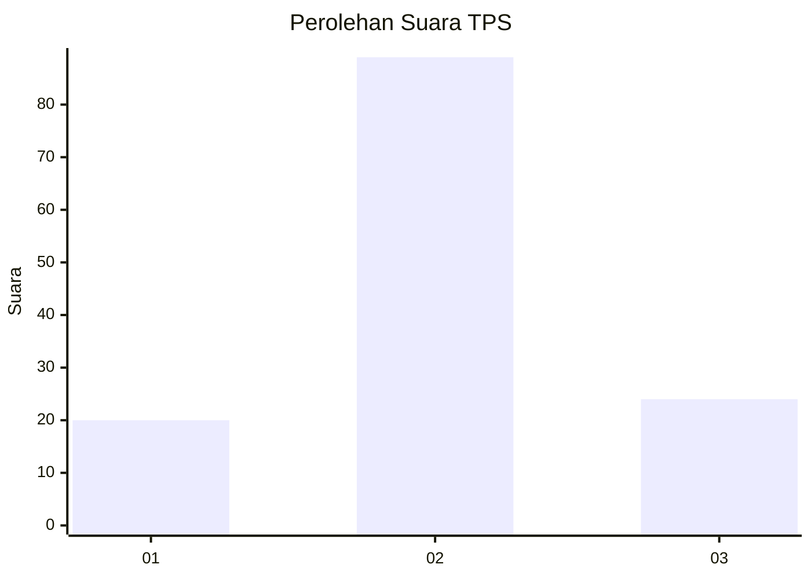
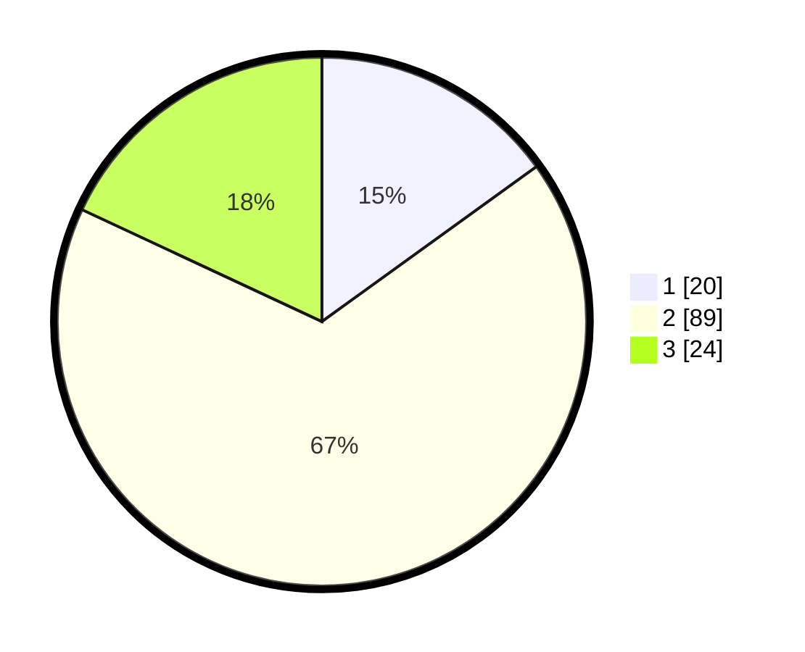

# Hasil

## Grafik

## Tabel

| No. | Nama Paslon    | Suara | Suara (raw) | Persentase |
|:--- |:-------------- | -----:| -----------:| ----------:|
| 1   | ANIES MUHAIMIN | 20    | [20][p-1]   | 15,04      |
| 2   | PRABOWO GIBRAN | 89    | [89][p-2]   | 66,92      |
| 3   | GANJAR MAHFUD  | 24    | [24][p-3]   | 18,05      |

[p-1]: https://github.com/gigit-pemilu/pemilu-2024-14-riau/blob/main/pilpres/hitung-suara/sub/14-riau/sub/01-kampar/sub/10-tapung/sub/2013-tanjung-sawit/sub/007-tps/sub/paslon-1.txt
[p-2]: https://github.com/gigit-pemilu/pemilu-2024-14-riau/blob/main/pilpres/hitung-suara/sub/14-riau/sub/01-kampar/sub/10-tapung/sub/2013-tanjung-sawit/sub/007-tps/sub/paslon-2.txt
[p-3]: https://github.com/gigit-pemilu/pemilu-2024-14-riau/blob/main/pilpres/hitung-suara/sub/14-riau/sub/01-kampar/sub/10-tapung/sub/2013-tanjung-sawit/sub/007-tps/sub/paslon-3.txt

## Foto C Plano

https://sirekap-obj-formc.kpu.go.id/9c52/pemilu/ppwp/14/01/10/20/13/1401102013007-20240223-154722--238793fb-ec7f-4292-a525-f79f7849247e.jpg

https://sirekap-obj-formc.kpu.go.id/9c52/pemilu/ppwp/14/01/10/20/13/1401102013007-20240223-154800--fed8ba4d-b23a-485b-a1c1-6caa522f730e.jpg

https://sirekap-obj-formc.kpu.go.id/9c52/pemilu/ppwp/14/01/10/20/13/1401102013007-20240223-154836--ade24bf9-f249-476a-a229-3f8fcdd75b78.jpg

## Metadata

| Key        | Value               |
| ---------- | ------------------- |
| Time Stamp | 2024-02-24 22:31:28 |

## DATA PEMILIH TETAP

Jumlah pemilih dalam DPT: **637**.
 * L: **71**.
 * P: **866**.

## DATA PENGGUNA HAK PILIH

Jumlah pengguna hak pilih dalam DPT: **609**.
 * L: **54**.
 * P: **855**.

Jumlah pengguna hak pilih dalam DPTb: **8**.
 * L: **803**.
 * P: **885**.

Jumlah pengguna hak pilih dalam DPK: **87**.
 * L: **884**.
 * P: **83**.

Jumlah pengguna hak pilih: **624**.
 * L: **866**.
 * P: **63**.

## JUMLAH SUARA SAH DAN TIDAK SAH

JUMLAH SELURUH SUARA SAH: **623**.

JUMLAH SUARA TIDAK SAH: **3**.

JUMLAH SELURUH SUARA SAH DAN SUARA TIDAK SAH: **224**.

