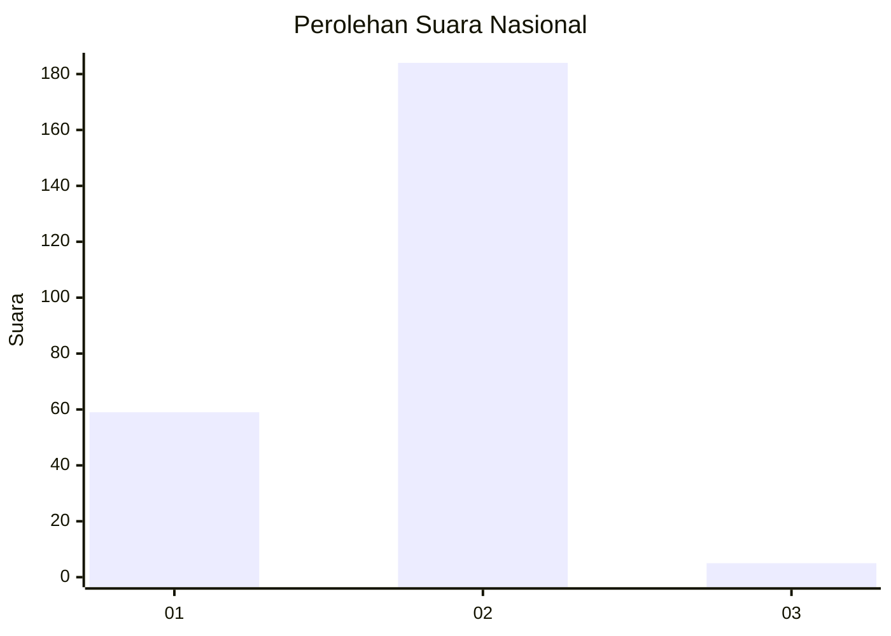
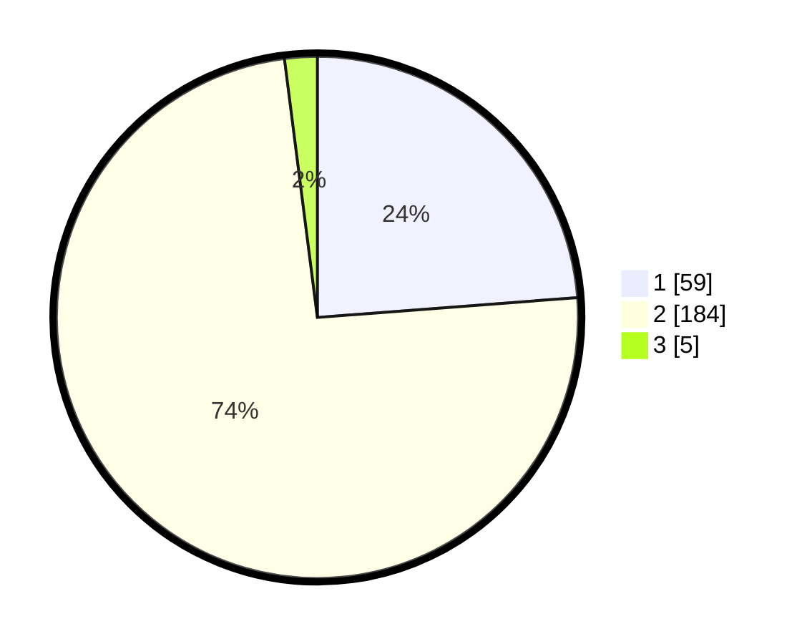

# Hasil

## Grafik

## Tabel

| No. | Nama Paslon    | Suara | Suara (raw) | Persentase |
|:--- |:-------------- | -----:| -----------:| ----------:|
| 1   | ANIES MUHAIMIN | 59    | [59][p-1]   | 23,79      |
| 2   | PRABOWO GIBRAN | 184   | [184][p-2]  | 74,19      |
| 3   | GANJAR MAHFUD  | 5     | [5][p-3]    | 2,02       |

[p-1]: https://github.com/gigit-pemilu/pemilu-2024/blob/main/pilpres/hitung-suara/sub/14-riau/sub/01-kampar/sub/10-tapung/sub/2015-sibuak/sub/003-tps/sub/paslon-1.txt
[p-2]: https://github.com/gigit-pemilu/pemilu-2024/blob/main/pilpres/hitung-suara/sub/14-riau/sub/01-kampar/sub/10-tapung/sub/2015-sibuak/sub/003-tps/sub/paslon-2.txt
[p-3]: https://github.com/gigit-pemilu/pemilu-2024/blob/main/pilpres/hitung-suara/sub/14-riau/sub/01-kampar/sub/10-tapung/sub/2015-sibuak/sub/003-tps/sub/paslon-3.txt

## Foto C Plano

https://sirekap-obj-formc.kpu.go.id/c3ce/pemilu/ppwp/14/01/10/20/15/1401102015003-20240215-013719--a0634f60-97c2-4ad9-ba90-c1fb384c352f.jpg

https://sirekap-obj-formc.kpu.go.id/c3ce/pemilu/ppwp/14/01/10/20/15/1401102015003-20240215-013949--6786dc79-fd34-4fa4-97a7-2b4e1ece77dc.jpg

https://sirekap-obj-formc.kpu.go.id/c3ce/pemilu/ppwp/14/01/10/20/15/1401102015003-20240215-014111--6d03bdaf-5642-4279-bdd7-bd1c508beca7.jpg

## Metadata

| Key        | Value               |
| ---------- | ------------------- |
| Time Stamp | 2024-02-16 21:01:00 |

