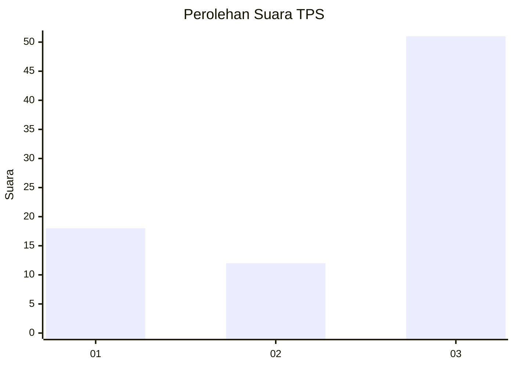
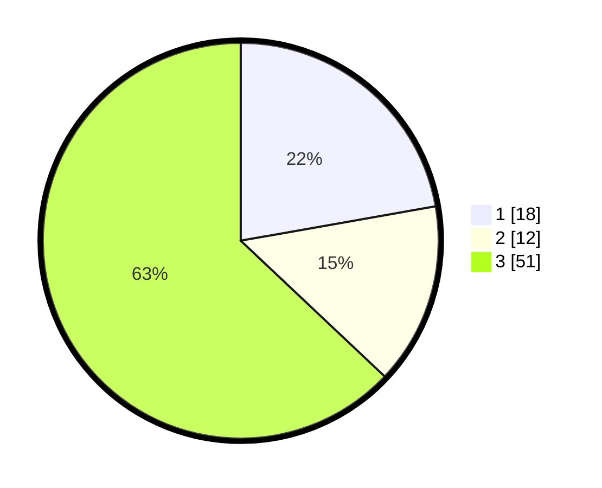

# Hasil

## Grafik

## Tabel

| No. | Nama Paslon    | Suara | Suara (raw) | Persentase |
|:--- |:-------------- | -----:| -----------:| ----------:|
| 1   | ANIES MUHAIMIN | 18    | [18][p-1]   | 22,22      |
| 2   | PRABOWO GIBRAN | 12    | [12][p-2]   | 14,81      |
| 3   | GANJAR MAHFUD  | 51    | [51][p-3]   | 62,96      |

[p-1]: https://github.com/gigit-pemilu/pemilu-2024-14-riau/blob/main/pilpres/hitung-suara/sub/14-riau/sub/01-kampar/sub/10-tapung/sub/2016-pelambaian/sub/005-tps/sub/paslon-1.txt
[p-2]: https://github.com/gigit-pemilu/pemilu-2024-14-riau/blob/main/pilpres/hitung-suara/sub/14-riau/sub/01-kampar/sub/10-tapung/sub/2016-pelambaian/sub/005-tps/sub/paslon-2.txt
[p-3]: https://github.com/gigit-pemilu/pemilu-2024-14-riau/blob/main/pilpres/hitung-suara/sub/14-riau/sub/01-kampar/sub/10-tapung/sub/2016-pelambaian/sub/005-tps/sub/paslon-3.txt

## Foto C Plano

https://sirekap-obj-formc.kpu.go.id/3f56/pemilu/ppwp/14/01/10/20/16/1401102016005-20240219-111318--7f28eaa0-187b-496b-b080-7c1364a7d7d2.jpg

https://sirekap-obj-formc.kpu.go.id/3f56/pemilu/ppwp/14/01/10/20/16/1401102016005-20240219-111707--1d22f5ac-3337-4938-9041-351011c59f69.jpg

https://sirekap-obj-formc.kpu.go.id/3f56/pemilu/ppwp/14/01/10/20/16/1401102016005-20240219-111904--9a6860b4-5fa7-474c-9e49-8b0bc99e43f1.jpg

## Metadata

| Key        | Value               |
| ---------- | ------------------- |
| Time Stamp | 2024-02-19 12:00:00 |

## DATA PEMILIH TETAP

Jumlah pemilih dalam DPT: **201**.
 * L: **106**.
 * P: **95**.

## DATA PENGGUNA HAK PILIH

Jumlah pengguna hak pilih dalam DPT: **208**.
 * L: **217**.
 * P: **409**.

Jumlah pengguna hak pilih dalam DPTb: **2**.
 * L: **3**.
 * P: **2**.

Jumlah pengguna hak pilih dalam DPK: **0**.
 * L: **1**.
 * P: **2**.

Jumlah pengguna hak pilih: **105**.
 * L: **96**.
 * P: **86**.

## JUMLAH SUARA SAH DAN TIDAK SAH

JUMLAH SELURUH SUARA SAH: **181**.

JUMLAH SUARA TIDAK SAH: **1**.

JUMLAH SELURUH SUARA SAH DAN SUARA TIDAK SAH: **182**.

