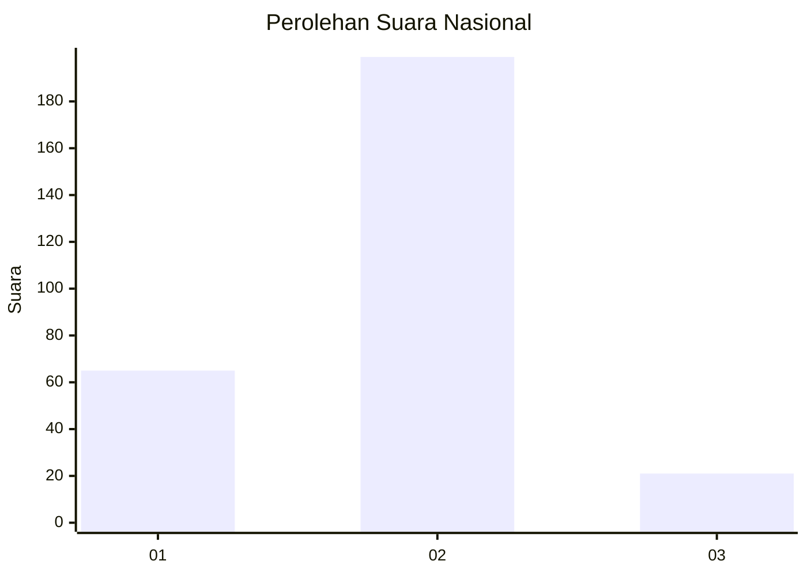
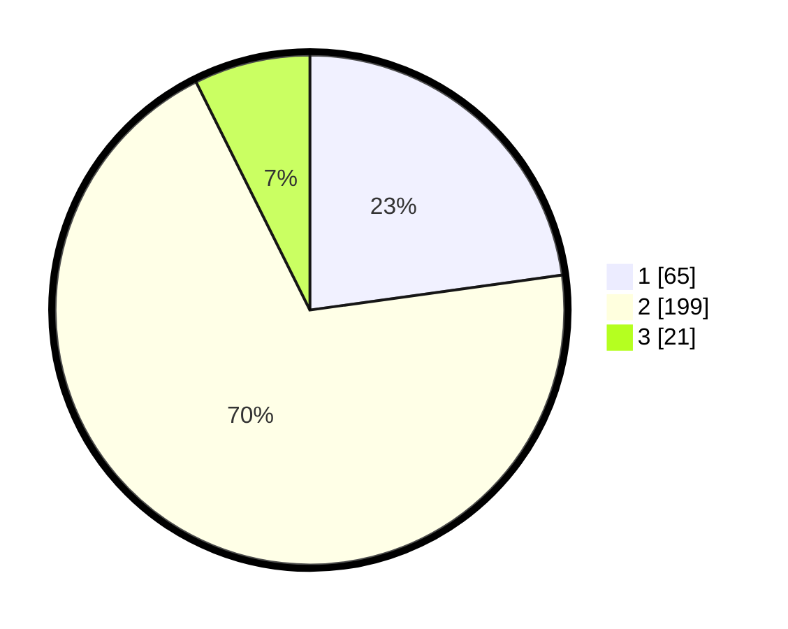

# Hasil

## Grafik

## Tabel

| No. | Nama Paslon    | Suara | Suara (raw) | Persentase |
|:--- |:-------------- | -----:| -----------:| ----------:|
| 1   | ANIES MUHAIMIN | 65    | [65][p-1]   | 22,81      |
| 2   | PRABOWO GIBRAN | 199   | [199][p-2]  | 69,82      |
| 3   | GANJAR MAHFUD  | 21    | [21][p-3]   | 7,37       |

[p-1]: https://github.com/gigit-pemilu/pemilu-2024/blob/main/pilpres/hitung-suara/sub/14-riau/sub/01-kampar/sub/10-tapung/sub/2021-karya-indah/sub/019-tps/sub/paslon-1.txt
[p-2]: https://github.com/gigit-pemilu/pemilu-2024/blob/main/pilpres/hitung-suara/sub/14-riau/sub/01-kampar/sub/10-tapung/sub/2021-karya-indah/sub/019-tps/sub/paslon-2.txt
[p-3]: https://github.com/gigit-pemilu/pemilu-2024/blob/main/pilpres/hitung-suara/sub/14-riau/sub/01-kampar/sub/10-tapung/sub/2021-karya-indah/sub/019-tps/sub/paslon-3.txt

## Foto C Plano

https://sirekap-obj-formc.kpu.go.id/0e3f/pemilu/ppwp/14/01/10/20/21/1401102021019-20240223-150927--ffe6e9cd-9e2d-455b-8fa7-1e3eadad960e.jpg

https://sirekap-obj-formc.kpu.go.id/0e3f/pemilu/ppwp/14/01/10/20/21/1401102021019-20240223-145602--6b3cfb34-751a-4bf9-ba50-03225ebf7c12.jpg

https://sirekap-obj-formc.kpu.go.id/0e3f/pemilu/ppwp/14/01/10/20/21/1401102021019-20240223-145729--655d638d-33bf-4253-a0a9-08350ace5b2d.jpg

## Metadata

| Key        | Value               |
| ---------- | ------------------- |
| Time Stamp | 2024-02-24 22:31:28 |

