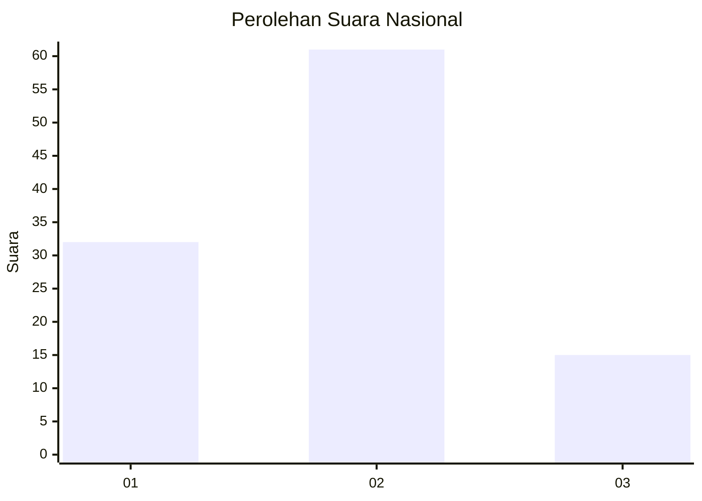
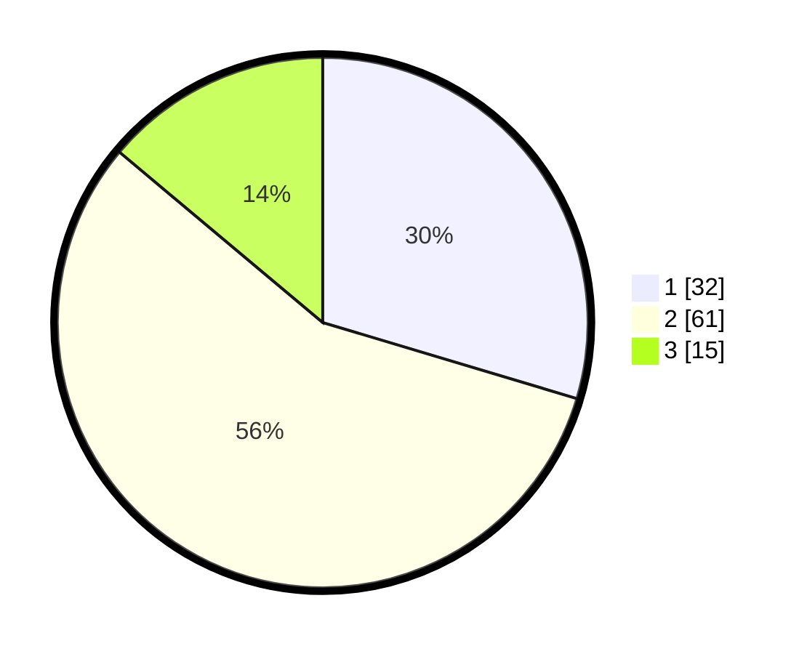

# Hasil

## Grafik

## Tabel

| No. | Nama Paslon    | Suara | Suara (raw) | Persentase |
|:--- |:-------------- | -----:| -----------:| ----------:|
| 1   | ANIES MUHAIMIN | 32    | [32][p-1]   | 29,63      |
| 2   | PRABOWO GIBRAN | 61    | [61][p-2]   | 56,48      |
| 3   | GANJAR MAHFUD  | 15    | [15][p-3]   | 13,89      |

[p-1]: https://github.com/gigit-pemilu/pemilu-2024/blob/main/pilpres/hitung-suara/sub/14-riau/sub/01-kampar/sub/10-tapung/sub/2021-karya-indah/sub/029-tps/sub/paslon-1.txt
[p-2]: https://github.com/gigit-pemilu/pemilu-2024/blob/main/pilpres/hitung-suara/sub/14-riau/sub/01-kampar/sub/10-tapung/sub/2021-karya-indah/sub/029-tps/sub/paslon-2.txt
[p-3]: https://github.com/gigit-pemilu/pemilu-2024/blob/main/pilpres/hitung-suara/sub/14-riau/sub/01-kampar/sub/10-tapung/sub/2021-karya-indah/sub/029-tps/sub/paslon-3.txt

## Foto C Plano

https://sirekap-obj-formc.kpu.go.id/918b/pemilu/ppwp/14/01/10/20/21/1401102021029-20240214-230349--902e6d43-11ed-4362-b399-994000d7893c.jpg

https://sirekap-obj-formc.kpu.go.id/918b/pemilu/ppwp/14/01/10/20/21/1401102021029-20240214-230749--eeb3fc9a-511c-41a2-a125-2cfc0ae11a3d.jpg

https://sirekap-obj-formc.kpu.go.id/918b/pemilu/ppwp/14/01/10/20/21/1401102021029-20240214-230906--4665c4bb-398b-4d21-9bf9-8d789c11b2a1.jpg

## Metadata

| Key        | Value               |
| ---------- | ------------------- |
| Time Stamp | 2024-02-19 06:16:00 |

