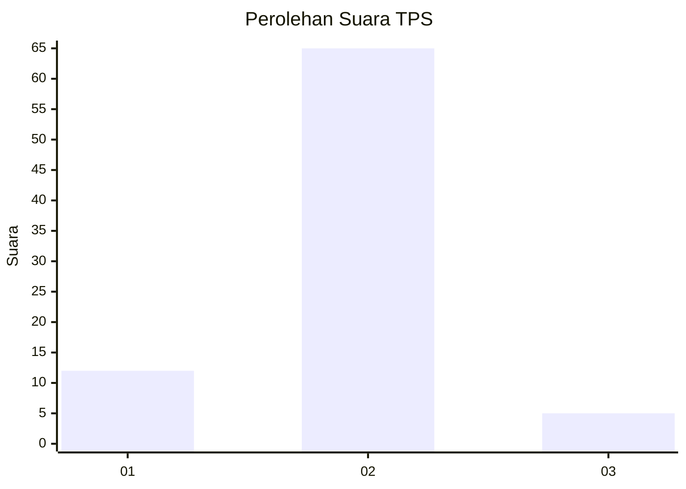
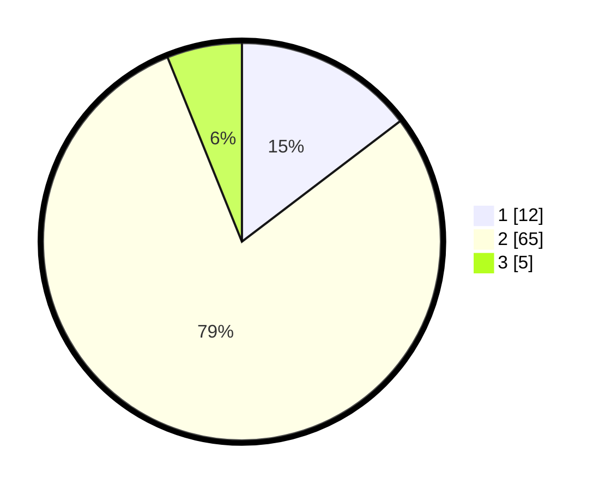

# Hasil

## Grafik

## Tabel

| No. | Nama Paslon    | Suara | Suara (raw) | Persentase |
|:--- |:-------------- | -----:| -----------:| ----------:|
| 1   | ANIES MUHAIMIN | 12    | [12][p-1]   | 14,63      |
| 2   | PRABOWO GIBRAN | 65    | [65][p-2]   | 79,27      |
| 3   | GANJAR MAHFUD  | 5     | [5][p-3]    | 6,10       |

[p-1]: https://github.com/gigit-pemilu/pemilu-2024-14-riau/blob/main/pilpres/hitung-suara/sub/14-riau/sub/01-kampar/sub/12-tapung-hulu/sub/2001-senama-nenek/sub/005-tps/sub/paslon-1.txt
[p-2]: https://github.com/gigit-pemilu/pemilu-2024-14-riau/blob/main/pilpres/hitung-suara/sub/14-riau/sub/01-kampar/sub/12-tapung-hulu/sub/2001-senama-nenek/sub/005-tps/sub/paslon-2.txt
[p-3]: https://github.com/gigit-pemilu/pemilu-2024-14-riau/blob/main/pilpres/hitung-suara/sub/14-riau/sub/01-kampar/sub/12-tapung-hulu/sub/2001-senama-nenek/sub/005-tps/sub/paslon-3.txt

## Foto C Plano

https://sirekap-obj-formc.kpu.go.id/7705/pemilu/ppwp/14/01/12/20/01/1401122001005-20240221-204631--f25ed848-0921-4eaa-8632-d7b7ea560ed2.jpg

https://sirekap-obj-formc.kpu.go.id/7705/pemilu/ppwp/14/01/12/20/01/1401122001005-20240221-213613--327f46bd-3f1c-4b91-b3ab-5232fda89d12.jpg

https://sirekap-obj-formc.kpu.go.id/7705/pemilu/ppwp/14/01/12/20/01/1401122001005-20240221-213612--261871dd-d52b-488f-9d67-439de4ca4174.jpg

## Metadata

| Key        | Value               |
| ---------- | ------------------- |
| Time Stamp | 2024-02-24 22:31:28 |

## DATA PEMILIH TETAP

Jumlah pemilih dalam DPT: **133**.
 * L: **883**.
 * P: **330**.

## DATA PENGGUNA HAK PILIH

Jumlah pengguna hak pilih dalam DPT: **884**.
 * L: **345**.
 * P: **441**.

Jumlah pengguna hak pilih dalam DPTb: **444**.
 * L: **444**.
 * P: **434**.

Jumlah pengguna hak pilih dalam DPK: **488**.
 * L: **643**.
 * P: **336**.

Jumlah pengguna hak pilih: **87**.
 * L: **845**.
 * P: **841**.

## JUMLAH SUARA SAH DAN TIDAK SAH

JUMLAH SELURUH SUARA SAH: **82**.

JUMLAH SUARA TIDAK SAH: **5**.

JUMLAH SELURUH SUARA SAH DAN SUARA TIDAK SAH: **87**.

