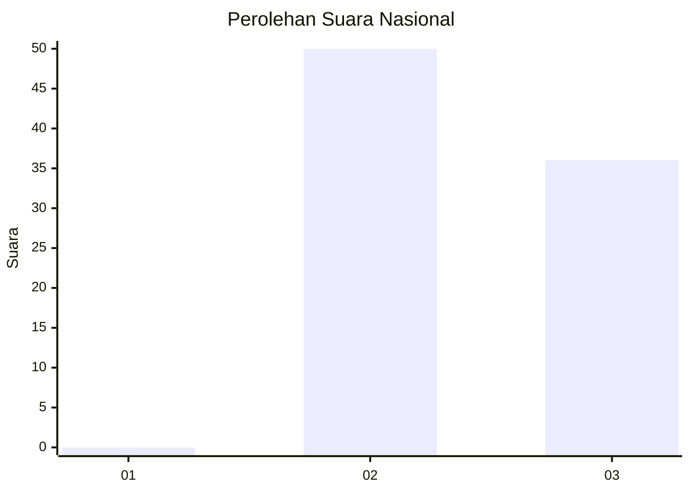
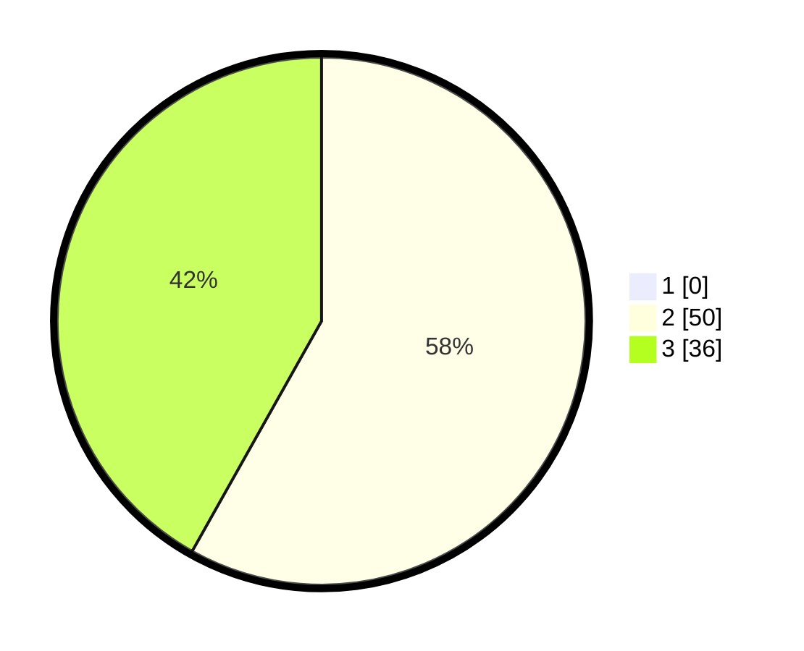

# Hasil

## Grafik

## Tabel

| No. | Nama Paslon    | Suara | Suara (raw) | Persentase |
|:--- |:-------------- | -----:| -----------:| ----------:|
| 1   | ANIES MUHAIMIN | 0     | [0][p-1]    | 0,00       |
| 2   | PRABOWO GIBRAN | 50    | [50][p-2]   | 58,14      |
| 3   | GANJAR MAHFUD  | 36    | [36][p-3]   | 41,86      |

[p-1]: https://github.com/gigit-pemilu/pemilu-2024/blob/main/pilpres/hitung-suara/sub/14-riau/sub/01-kampar/sub/12-tapung-hulu/sub/2004-danau-lancang/sub/018-tps/sub/paslon-1.txt
[p-2]: https://github.com/gigit-pemilu/pemilu-2024/blob/main/pilpres/hitung-suara/sub/14-riau/sub/01-kampar/sub/12-tapung-hulu/sub/2004-danau-lancang/sub/018-tps/sub/paslon-2.txt
[p-3]: https://github.com/gigit-pemilu/pemilu-2024/blob/main/pilpres/hitung-suara/sub/14-riau/sub/01-kampar/sub/12-tapung-hulu/sub/2004-danau-lancang/sub/018-tps/sub/paslon-3.txt

## Foto C Plano

https://sirekap-obj-formc.kpu.go.id/cdbc/pemilu/ppwp/14/01/12/20/04/1401122004018-20240214-210556--6217e78f-1a41-4374-b5ac-792d27350b27.jpg

https://sirekap-obj-formc.kpu.go.id/cdbc/pemilu/ppwp/14/01/12/20/04/1401122004018-20240214-210710--2a9e272c-9eca-4d3f-b6b5-42eeb00d00a4.jpg

https://sirekap-obj-formc.kpu.go.id/cdbc/pemilu/ppwp/14/01/12/20/04/1401122004018-20240214-210729--291fabfa-bd47-4c00-aae9-0e15baf24286.jpg

## Metadata

| Key        | Value               |
| ---------- | ------------------- |
| Time Stamp | 2024-02-15 00:41:44 |

