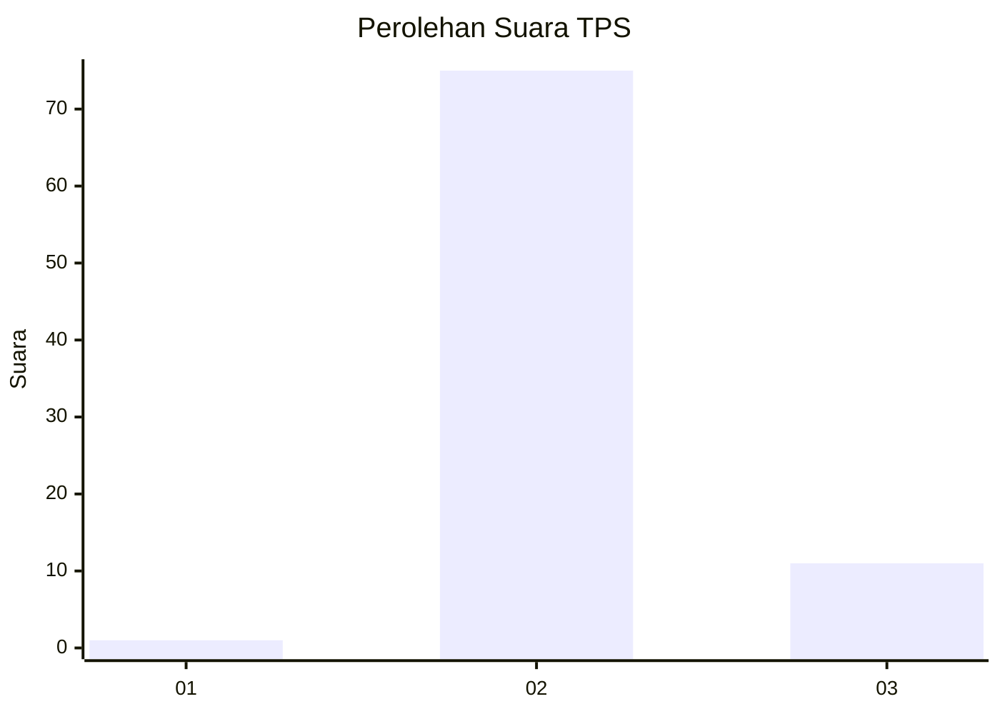
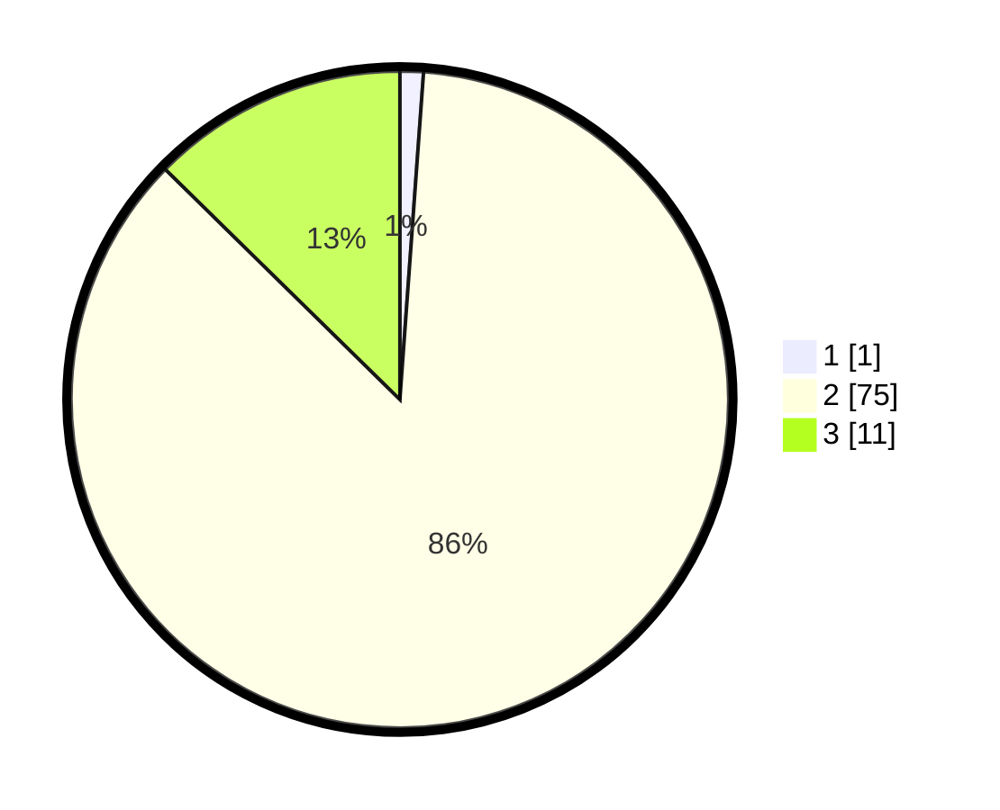

# Hasil

## Grafik

## Tabel

| No. | Nama Paslon    | Suara | Suara (raw) | Persentase |
|:--- |:-------------- | -----:| -----------:| ----------:|
| 1   | ANIES MUHAIMIN | 1     | [1][p-1]    | 1,15       |
| 2   | PRABOWO GIBRAN | 75    | [75][p-2]   | 86,21      |
| 3   | GANJAR MAHFUD  | 11    | [11][p-3]   | 12,64      |

[p-1]: https://github.com/gigit-pemilu/pemilu-2024-14-riau/blob/main/pilpres/hitung-suara/sub/14-riau/sub/01-kampar/sub/12-tapung-hulu/sub/2004-danau-lancang/sub/022-tps/sub/paslon-1.txt
[p-2]: https://github.com/gigit-pemilu/pemilu-2024-14-riau/blob/main/pilpres/hitung-suara/sub/14-riau/sub/01-kampar/sub/12-tapung-hulu/sub/2004-danau-lancang/sub/022-tps/sub/paslon-2.txt
[p-3]: https://github.com/gigit-pemilu/pemilu-2024-14-riau/blob/main/pilpres/hitung-suara/sub/14-riau/sub/01-kampar/sub/12-tapung-hulu/sub/2004-danau-lancang/sub/022-tps/sub/paslon-3.txt

## Foto C Plano

https://sirekap-obj-formc.kpu.go.id/ce9b/pemilu/ppwp/14/01/12/20/04/1401122004022-20240215-143917--395d62de-6480-4805-af53-6c30906f4f97.jpg

https://sirekap-obj-formc.kpu.go.id/ce9b/pemilu/ppwp/14/01/12/20/04/1401122004022-20240215-100657--89a1c3e2-9df1-45c6-94e5-51ffae26b964.jpg

https://sirekap-obj-formc.kpu.go.id/ce9b/pemilu/ppwp/14/01/12/20/04/1401122004022-20240215-100910--36607239-52e1-4b94-8a4b-afab01eaebea.jpg

## Metadata

| Key        | Value               |
| ---------- | ------------------- |
| Time Stamp | 2024-02-15 15:30:25 |

