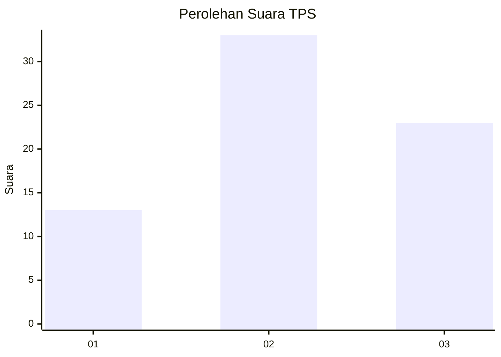
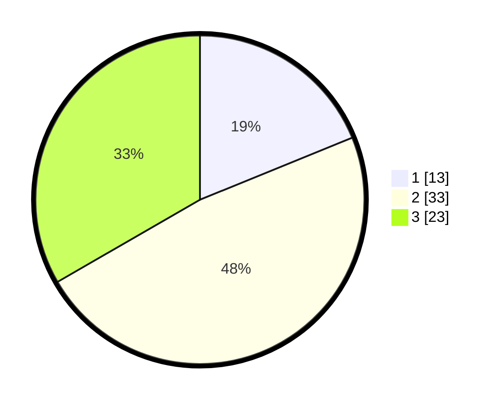

# Hasil

## Grafik

## Tabel

| No. | Nama Paslon    | Suara | Suara (raw) | Persentase |
|:--- |:-------------- | -----:| -----------:| ----------:|
| 1   | ANIES MUHAIMIN | 13    | [13][p-1]   | 18,84      |
| 2   | PRABOWO GIBRAN | 33    | [33][p-2]   | 47,83      |
| 3   | GANJAR MAHFUD  | 23    | [23][p-3]   | 33,33      |

[p-1]: https://github.com/gigit-pemilu/pemilu-2024-14-riau/blob/main/pilpres/hitung-suara/sub/14-riau/sub/01-kampar/sub/12-tapung-hulu/sub/2004-danau-lancang/sub/030-tps/sub/paslon-1.txt
[p-2]: https://github.com/gigit-pemilu/pemilu-2024-14-riau/blob/main/pilpres/hitung-suara/sub/14-riau/sub/01-kampar/sub/12-tapung-hulu/sub/2004-danau-lancang/sub/030-tps/sub/paslon-2.txt
[p-3]: https://github.com/gigit-pemilu/pemilu-2024-14-riau/blob/main/pilpres/hitung-suara/sub/14-riau/sub/01-kampar/sub/12-tapung-hulu/sub/2004-danau-lancang/sub/030-tps/sub/paslon-3.txt

## Foto C Plano

https://sirekap-obj-formc.kpu.go.id/6aad/pemilu/ppwp/14/01/12/20/04/1401122004030-20240216-045604--0f78e961-3313-4e3c-841c-6319fa740f3d.jpg

https://sirekap-obj-formc.kpu.go.id/6aad/pemilu/ppwp/14/01/12/20/04/1401122004030-20240216-045608--dce7d585-04ad-4314-97c6-b4b5d24522ee.jpg

https://sirekap-obj-formc.kpu.go.id/6aad/pemilu/ppwp/14/01/12/20/04/1401122004030-20240216-045122--91bd2928-0dde-40aa-b3e2-ad8071252ddd.jpg

## Metadata

| Key        | Value               |
| ---------- | ------------------- |
| Time Stamp | 2024-02-16 12:51:22 |

## DATA PEMILIH TETAP

Jumlah pemilih dalam DPT: **147**.
 * L: **79**.
 * P: **68**.

## DATA PENGGUNA HAK PILIH

Jumlah pengguna hak pilih dalam DPT: **37**.
 * L: **23**.
 * P: **14**.

Jumlah pengguna hak pilih dalam DPTb: **1**.
 * L: **1**.
 * P: **0**.

Jumlah pengguna hak pilih dalam DPK: **39**.
 * L: **20**.
 * P: **19**.

Jumlah pengguna hak pilih: **77**.
 * L: **44**.
 * P: **33**.

## JUMLAH SUARA SAH DAN TIDAK SAH

JUMLAH SELURUH SUARA SAH: **69**.

JUMLAH SUARA TIDAK SAH: **8**.

JUMLAH SELURUH SUARA SAH DAN SUARA TIDAK SAH: **77**.

