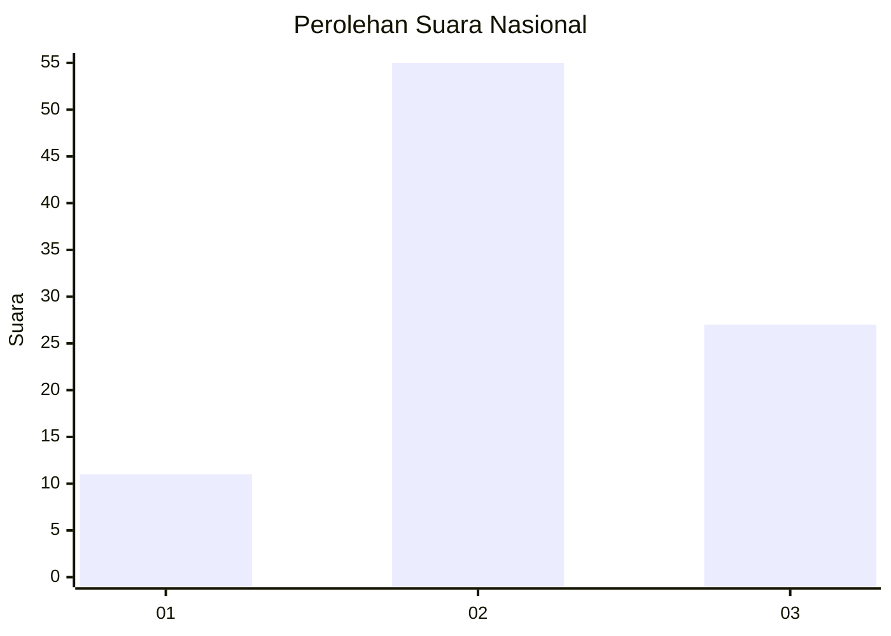
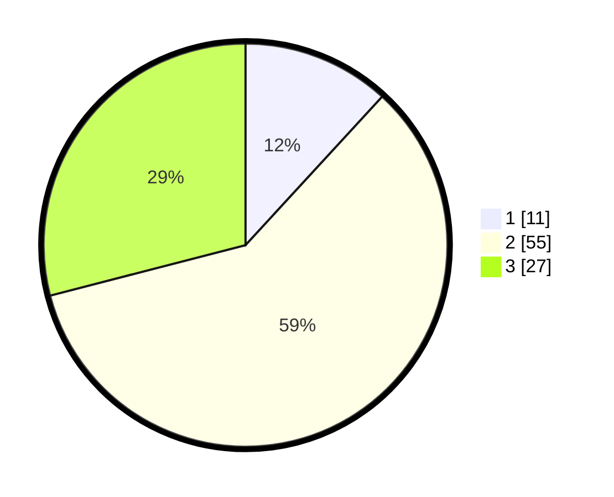

# Hasil

## Grafik

## Tabel

| No. | Nama Paslon    | Suara | Suara (raw) | Persentase |
|:--- |:-------------- | -----:| -----------:| ----------:|
| 1   | ANIES MUHAIMIN | 11    | [11][p-1]   | 11,83      |
| 2   | PRABOWO GIBRAN | 55    | [55][p-2]   | 59,14      |
| 3   | GANJAR MAHFUD  | 27    | [27][p-3]   | 29,03      |

[p-1]: https://github.com/gigit-pemilu/pemilu-2024/blob/main/pilpres/hitung-suara/sub/14-riau/sub/01-kampar/sub/12-tapung-hulu/sub/2004-danau-lancang/sub/037-tps/sub/paslon-1.txt
[p-2]: https://github.com/gigit-pemilu/pemilu-2024/blob/main/pilpres/hitung-suara/sub/14-riau/sub/01-kampar/sub/12-tapung-hulu/sub/2004-danau-lancang/sub/037-tps/sub/paslon-2.txt
[p-3]: https://github.com/gigit-pemilu/pemilu-2024/blob/main/pilpres/hitung-suara/sub/14-riau/sub/01-kampar/sub/12-tapung-hulu/sub/2004-danau-lancang/sub/037-tps/sub/paslon-3.txt

## Foto C Plano

https://sirekap-obj-formc.kpu.go.id/9d83/pemilu/ppwp/14/01/12/20/04/1401122004037-20240214-223750--c90053ca-2c51-4b26-a681-968809e58a1b.jpg

https://sirekap-obj-formc.kpu.go.id/9d83/pemilu/ppwp/14/01/12/20/04/1401122004037-20240214-224609--38aab95e-eace-4168-b1f2-20ecc541f38e.jpg

https://sirekap-obj-formc.kpu.go.id/9d83/pemilu/ppwp/14/01/12/20/04/1401122004037-20240214-210212--9e70c142-8afb-486e-a8eb-f7abd778c029.jpg

## Metadata

| Key        | Value               |
| ---------- | ------------------- |
| Time Stamp | 2024-02-25 11:00:00 |

