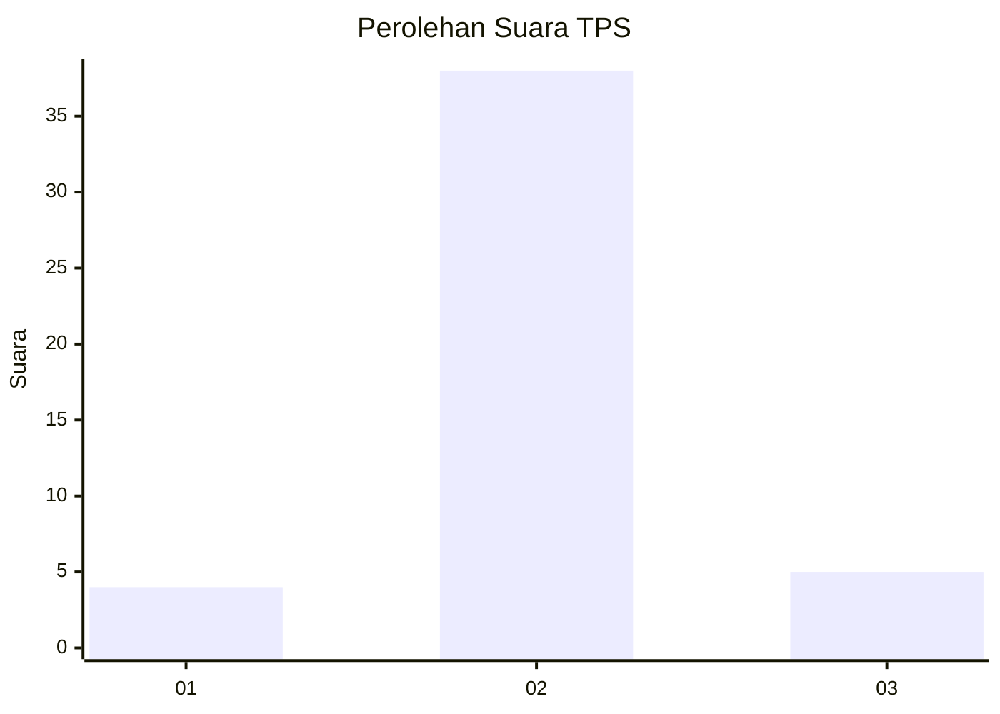
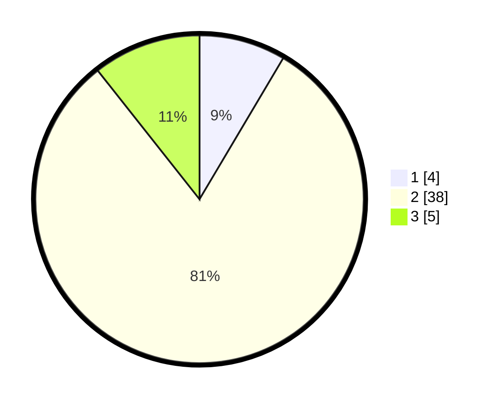

# Hasil

## Grafik

## Tabel

| No. | Nama Paslon    | Suara | Suara (raw) | Persentase |
|:--- |:-------------- | -----:| -----------:| ----------:|
| 1   | ANIES MUHAIMIN | 4     | [4][p-1]    | 8,51       |
| 2   | PRABOWO GIBRAN | 38    | [38][p-2]   | 80,85      |
| 3   | GANJAR MAHFUD  | 5     | [5][p-3]    | 10,64      |

[p-1]: https://github.com/gigit-pemilu/pemilu-2024-14-riau/blob/main/pilpres/hitung-suara/sub/14-riau/sub/01-kampar/sub/12-tapung-hulu/sub/2004-danau-lancang/sub/044-tps/sub/paslon-1.txt
[p-2]: https://github.com/gigit-pemilu/pemilu-2024-14-riau/blob/main/pilpres/hitung-suara/sub/14-riau/sub/01-kampar/sub/12-tapung-hulu/sub/2004-danau-lancang/sub/044-tps/sub/paslon-2.txt
[p-3]: https://github.com/gigit-pemilu/pemilu-2024-14-riau/blob/main/pilpres/hitung-suara/sub/14-riau/sub/01-kampar/sub/12-tapung-hulu/sub/2004-danau-lancang/sub/044-tps/sub/paslon-3.txt

## Foto C Plano

https://sirekap-obj-formc.kpu.go.id/3e37/pemilu/ppwp/14/01/12/20/04/1401122004044-20240214-212143--de0ae565-fc19-4af5-a58e-098af2f3c171.jpg

https://sirekap-obj-formc.kpu.go.id/3e37/pemilu/ppwp/14/01/12/20/04/1401122004044-20240214-212153--9cf9a184-447a-4b6d-af7b-3232b1d0ba84.jpg

https://sirekap-obj-formc.kpu.go.id/3e37/pemilu/ppwp/14/01/12/20/04/1401122004044-20240214-212209--319f5cc5-7d79-45ed-bbb1-1161a6772316.jpg

## Metadata

| Key        | Value               |
| ---------- | ------------------- |
| Time Stamp | 2024-02-15 09:00:24 |

