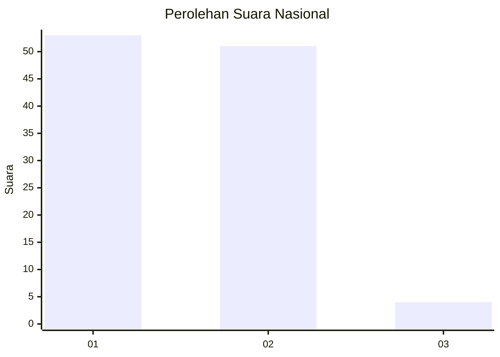
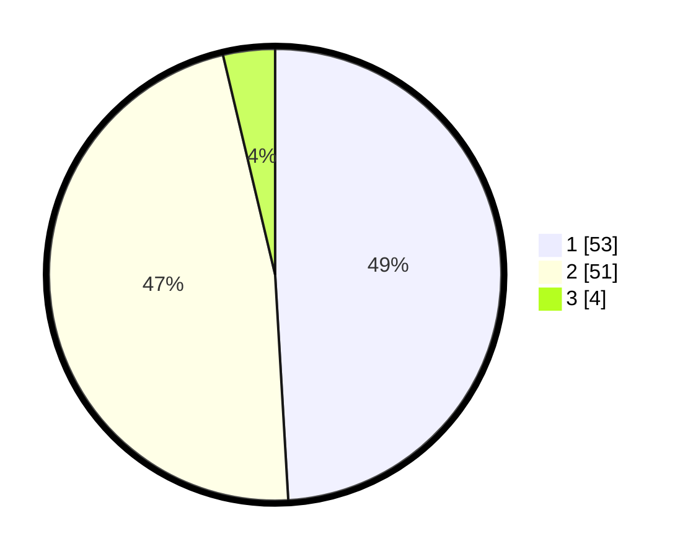

# Hasil

## Grafik

## Tabel

| No. | Nama Paslon    | Suara | Suara (raw) | Persentase |
|:--- |:-------------- | -----:| -----------:| ----------:|
| 1   | ANIES MUHAIMIN | 53    | [53][p-1]   | 49,07      |
| 2   | PRABOWO GIBRAN | 51    | [51][p-2]   | 47,22      |
| 3   | GANJAR MAHFUD  | 4     | [4][p-3]    | 3,70       |

[p-1]: https://github.com/gigit-pemilu/pemilu-2024/blob/main/pilpres/hitung-suara/sub/14-riau/sub/01-kampar/sub/13-salo/sub/2001-salo/sub/003-tps/sub/paslon-1.txt
[p-2]: https://github.com/gigit-pemilu/pemilu-2024/blob/main/pilpres/hitung-suara/sub/14-riau/sub/01-kampar/sub/13-salo/sub/2001-salo/sub/003-tps/sub/paslon-2.txt
[p-3]: https://github.com/gigit-pemilu/pemilu-2024/blob/main/pilpres/hitung-suara/sub/14-riau/sub/01-kampar/sub/13-salo/sub/2001-salo/sub/003-tps/sub/paslon-3.txt

## Foto C Plano

https://sirekap-obj-formc.kpu.go.id/af71/pemilu/ppwp/14/01/13/20/01/1401132001003-20240215-015113--b542507a-d943-4432-ab7f-e2515f617887.jpg

https://sirekap-obj-formc.kpu.go.id/af71/pemilu/ppwp/14/01/13/20/01/1401132001003-20240215-015329--8b706466-7681-4b6e-a6d9-812d5f2bb52e.jpg

https://sirekap-obj-formc.kpu.go.id/af71/pemilu/ppwp/14/01/13/20/01/1401132001003-20240215-015619--df87549b-0db0-415a-b593-f4c11363a097.jpg

## Metadata

| Key        | Value               |
| ---------- | ------------------- |
| Time Stamp | 2024-02-15 12:00:28 |

