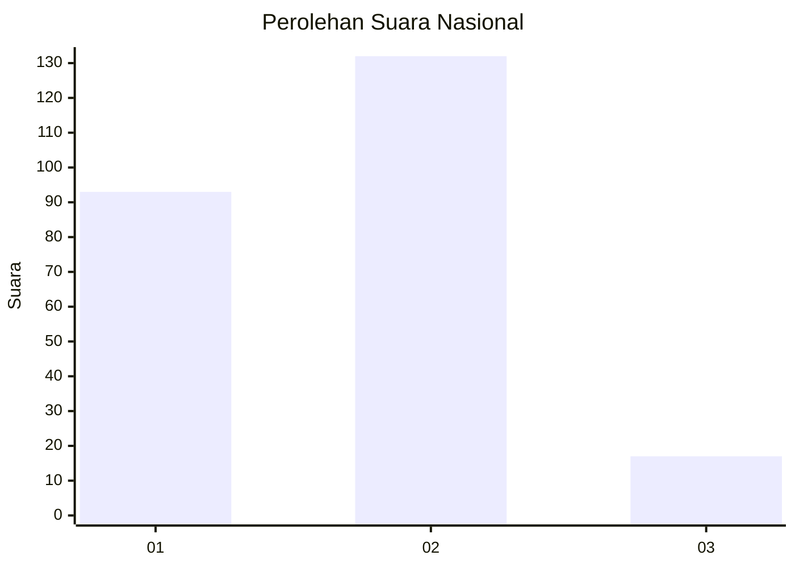

# Hasil

## Grafik

## Tabel

| No. | Nama Paslon    | Suara | Suara (raw) | Persentase |
|:--- |:-------------- | -----:| -----------:| ----------:|
| 1   | ANIES MUHAIMIN | 93    | [93][p-1]   | 38,43      |
| 2   | PRABOWO GIBRAN | 132   | [132][p-2]  | 54,55      |
| 3   | GANJAR MAHFUD  | 17    | [17][p-3]   | 7,02       |

[p-1]: https://github.com/gigit-pemilu/pemilu-2024/blob/main/pilpres/hitung-suara/sub/14-riau/sub/01-kampar/sub/13-salo/sub/2001-salo/sub/005-tps/sub/paslon-1.txt
[p-2]: https://github.com/gigit-pemilu/pemilu-2024/blob/main/pilpres/hitung-suara/sub/14-riau/sub/01-kampar/sub/13-salo/sub/2001-salo/sub/005-tps/sub/paslon-2.txt
[p-3]: https://github.com/gigit-pemilu/pemilu-2024/blob/main/pilpres/hitung-suara/sub/14-riau/sub/01-kampar/sub/13-salo/sub/2001-salo/sub/005-tps/sub/paslon-3.txt

## Foto C Plano

https://sirekap-obj-formc.kpu.go.id/8ab0/pemilu/ppwp/14/01/13/20/01/1401132001005-20240214-220236--80a31a83-b770-483f-a17c-9cc75dec2a3c.jpg

https://sirekap-obj-formc.kpu.go.id/8ab0/pemilu/ppwp/14/01/13/20/01/1401132001005-20240214-230707--df81b553-d7fb-4f9e-9bcc-d140160d4717.jpg

https://sirekap-obj-formc.kpu.go.id/8ab0/pemilu/ppwp/14/01/13/20/01/1401132001005-20240214-214723--4058c0b4-2bc0-4d5a-9c44-9ce64aa0b25a.jpg

## Metadata

| Key        | Value               |
| ---------- | ------------------- |
| Time Stamp | 2024-02-15 17:30:25 |

