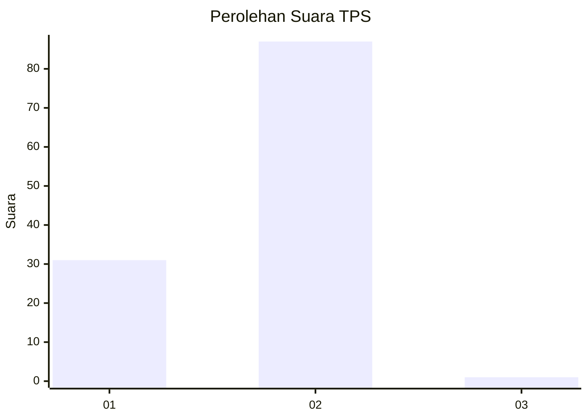
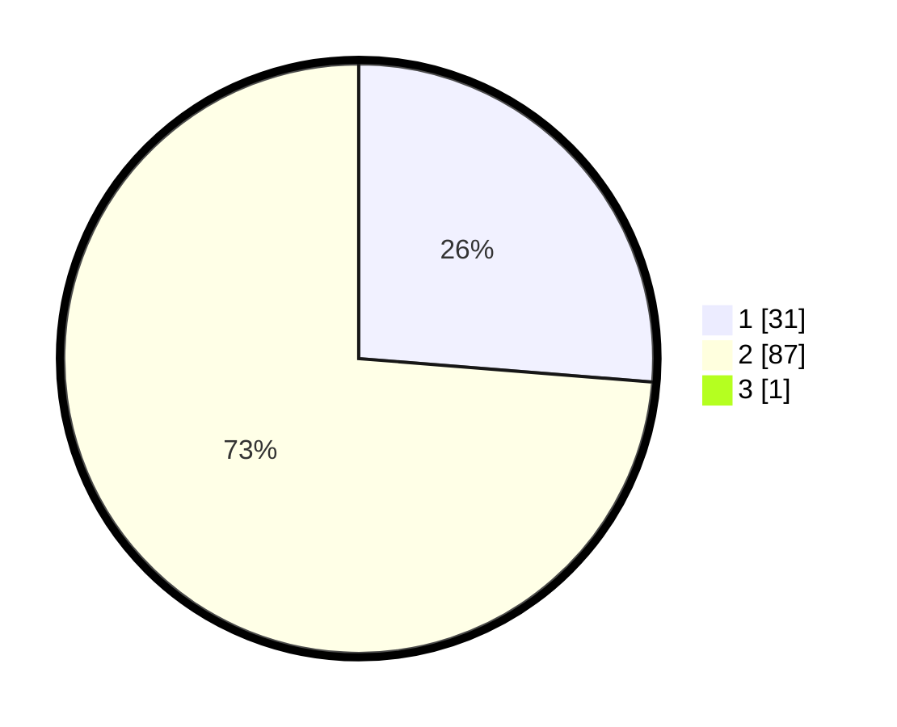

# Hasil

## Grafik

## Tabel

| No. | Nama Paslon    | Suara | Suara (raw) | Persentase |
|:--- |:-------------- | -----:| -----------:| ----------:|
| 1   | ANIES MUHAIMIN | 31    | [31][p-1]   | 26,05      |
| 2   | PRABOWO GIBRAN | 87    | [87][p-2]   | 73,11      |
| 3   | GANJAR MAHFUD  | 1     | [1][p-3]    | 0,84       |

[p-1]: https://github.com/gigit-pemilu/pemilu-2024-14-riau/blob/main/pilpres/hitung-suara/sub/14-riau/sub/01-kampar/sub/13-salo/sub/2002-siabu/sub/007-tps/sub/paslon-1.txt
[p-2]: https://github.com/gigit-pemilu/pemilu-2024-14-riau/blob/main/pilpres/hitung-suara/sub/14-riau/sub/01-kampar/sub/13-salo/sub/2002-siabu/sub/007-tps/sub/paslon-2.txt
[p-3]: https://github.com/gigit-pemilu/pemilu-2024-14-riau/blob/main/pilpres/hitung-suara/sub/14-riau/sub/01-kampar/sub/13-salo/sub/2002-siabu/sub/007-tps/sub/paslon-3.txt

## Foto C Plano

https://sirekap-obj-formc.kpu.go.id/43a0/pemilu/ppwp/14/01/13/20/02/1401132002007-20240215-030623--699849c4-d641-4b9d-ae35-197b33eccbea.jpg

https://sirekap-obj-formc.kpu.go.id/43a0/pemilu/ppwp/14/01/13/20/02/1401132002007-20240215-030904--e8e11d49-7de8-4a6f-8f4a-44e8e30be9d0.jpg

https://sirekap-obj-formc.kpu.go.id/43a0/pemilu/ppwp/14/01/13/20/02/1401132002007-20240215-030746--69c8d8ed-231e-4c16-8b48-c83d11c95234.jpg

## Metadata

| Key        | Value               |
| ---------- | ------------------- |
| Time Stamp | 2024-02-15 12:00:28 |

