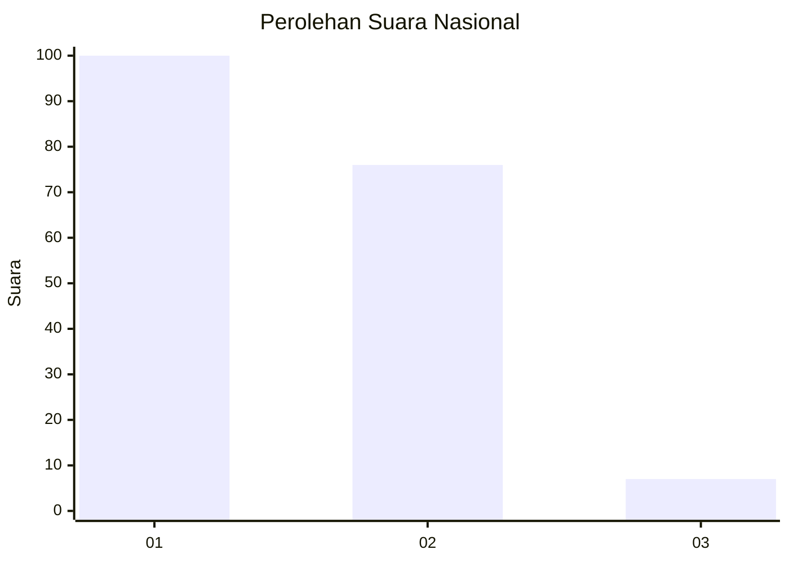
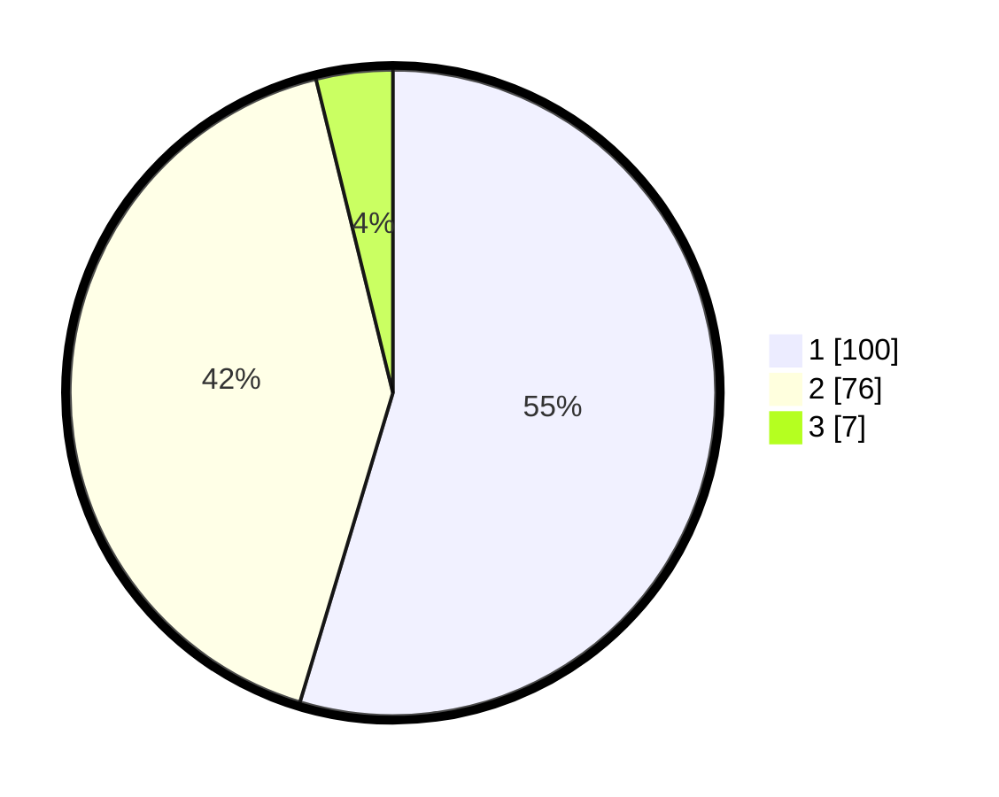

# Hasil

## Grafik

## Tabel

| No. | Nama Paslon    | Suara | Suara (raw) | Persentase |
|:--- |:-------------- | -----:| -----------:| ----------:|
| 1   | ANIES MUHAIMIN | 100   | [100][p-1]  | 54,64      |
| 2   | PRABOWO GIBRAN | 76    | [76][p-2]   | 41,53      |
| 3   | GANJAR MAHFUD  | 7     | [7][p-3]    | 3,83       |

[p-1]: https://github.com/gigit-pemilu/pemilu-2024/blob/main/pilpres/hitung-suara/sub/14-riau/sub/01-kampar/sub/13-salo/sub/2003-salo-timur/sub/002-tps/sub/paslon-1.txt
[p-2]: https://github.com/gigit-pemilu/pemilu-2024/blob/main/pilpres/hitung-suara/sub/14-riau/sub/01-kampar/sub/13-salo/sub/2003-salo-timur/sub/002-tps/sub/paslon-2.txt
[p-3]: https://github.com/gigit-pemilu/pemilu-2024/blob/main/pilpres/hitung-suara/sub/14-riau/sub/01-kampar/sub/13-salo/sub/2003-salo-timur/sub/002-tps/sub/paslon-3.txt

## Foto C Plano

https://sirekap-obj-formc.kpu.go.id/fd68/pemilu/ppwp/14/01/13/20/03/1401132003002-20240215-013018--a0f9ba0e-40eb-4f83-b929-b6fe1db3fc34.jpg

https://sirekap-obj-formc.kpu.go.id/fd68/pemilu/ppwp/14/01/13/20/03/1401132003002-20240215-013151--8320e6eb-7b53-4626-a2d3-622d2c4c3948.jpg

https://sirekap-obj-formc.kpu.go.id/fd68/pemilu/ppwp/14/01/13/20/03/1401132003002-20240215-013243--eda82019-2ae4-41c5-8ae3-59ba89b7d26f.jpg

## Metadata

| Key        | Value               |
| ---------- | ------------------- |
| Time Stamp | 2024-02-15 12:00:28 |

