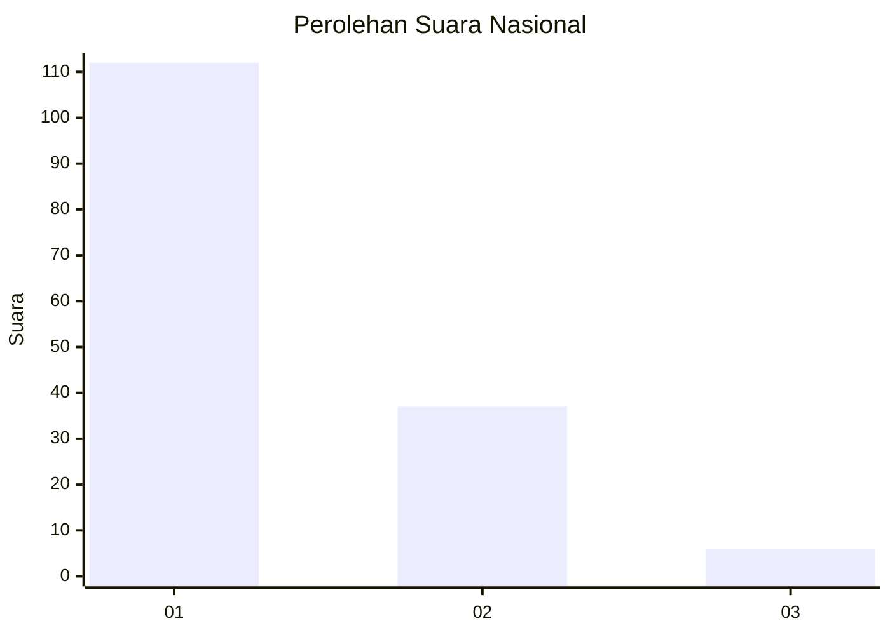
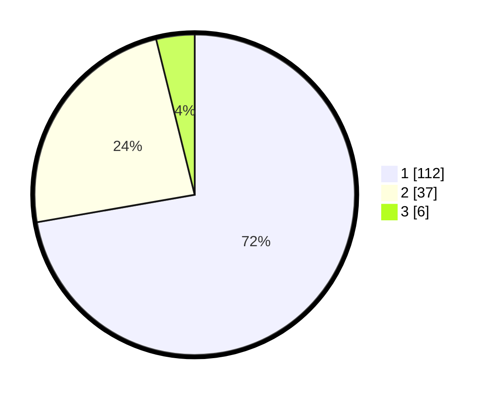

# Hasil

## Grafik

## Tabel

| No. | Nama Paslon    | Suara | Suara (raw) | Persentase |
|:--- |:-------------- | -----:| -----------:| ----------:|
| 1   | ANIES MUHAIMIN | 112   | [112][p-1]  | 72,26      |
| 2   | PRABOWO GIBRAN | 37    | [37][p-2]   | 23,87      |
| 3   | GANJAR MAHFUD  | 6     | [6][p-3]    | 3,87       |

[p-1]: https://github.com/gigit-pemilu/pemilu-2024/blob/main/pilpres/hitung-suara/sub/14-riau/sub/01-kampar/sub/13-salo/sub/2005-ganting-damai/sub/007-tps/sub/paslon-1.txt
[p-2]: https://github.com/gigit-pemilu/pemilu-2024/blob/main/pilpres/hitung-suara/sub/14-riau/sub/01-kampar/sub/13-salo/sub/2005-ganting-damai/sub/007-tps/sub/paslon-2.txt
[p-3]: https://github.com/gigit-pemilu/pemilu-2024/blob/main/pilpres/hitung-suara/sub/14-riau/sub/01-kampar/sub/13-salo/sub/2005-ganting-damai/sub/007-tps/sub/paslon-3.txt

## Foto C Plano

https://sirekap-obj-formc.kpu.go.id/f849/pemilu/ppwp/14/01/13/20/05/1401132005007-20240214-214600--491df307-9645-49d3-96ba-53b478c5c473.jpg

https://sirekap-obj-formc.kpu.go.id/f849/pemilu/ppwp/14/01/13/20/05/1401132005007-20240214-215002--1841cfd0-0ad0-4511-848d-96347250c31f.jpg

https://sirekap-obj-formc.kpu.go.id/f849/pemilu/ppwp/14/01/13/20/05/1401132005007-20240214-215132--8628305d-0ebe-4b2a-8b92-39baf1fb5231.jpg

## Metadata

| Key        | Value               |
| ---------- | ------------------- |
| Time Stamp | 2024-02-16 11:00:29 |

