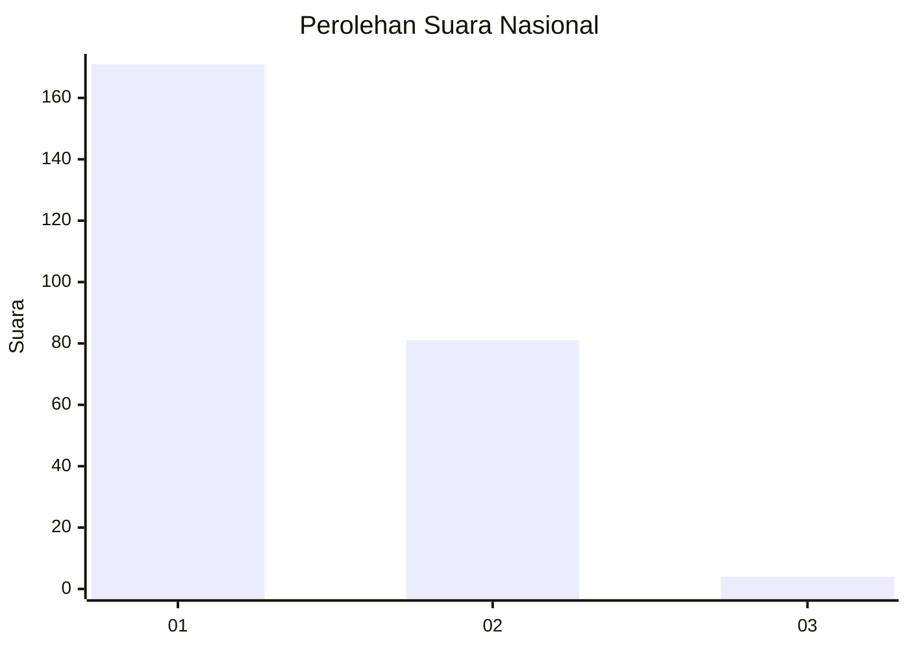
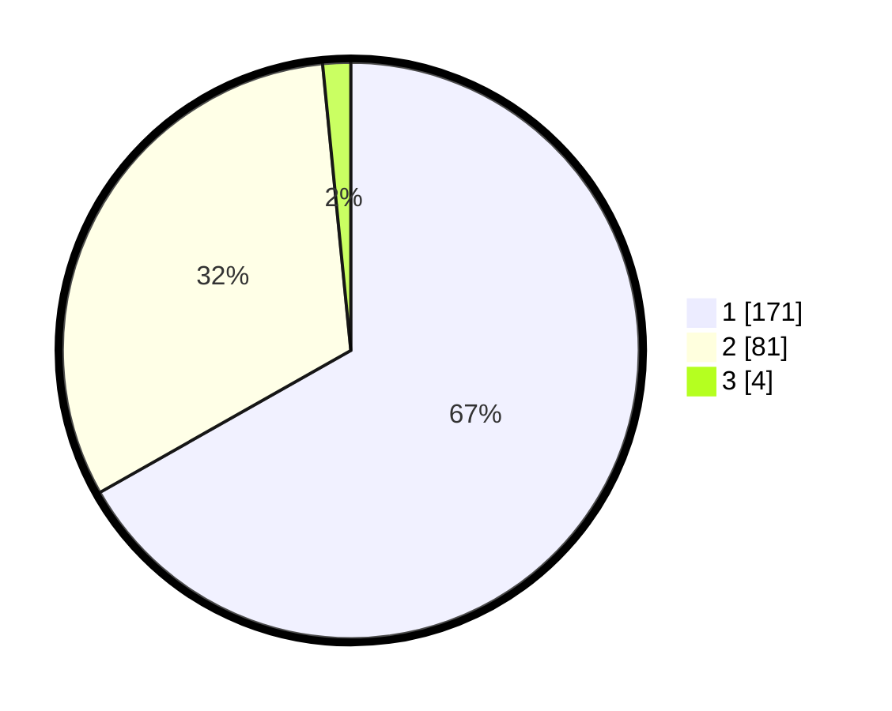

# Hasil

## Grafik

## Tabel

| No. | Nama Paslon    | Suara | Suara (raw) | Persentase |
|:--- |:-------------- | -----:| -----------:| ----------:|
| 1   | ANIES MUHAIMIN | 171   | [171][p-1]  | 66,80      |
| 2   | PRABOWO GIBRAN | 81    | [81][p-2]   | 31,64      |
| 3   | GANJAR MAHFUD  | 4     | [4][p-3]    | 1,56       |

[p-1]: https://github.com/gigit-pemilu/pemilu-2024/blob/main/pilpres/hitung-suara/sub/14-riau/sub/01-kampar/sub/14-rumbio-jaya/sub/2001-pulau-payung/sub/006-tps/sub/paslon-1.txt
[p-2]: https://github.com/gigit-pemilu/pemilu-2024/blob/main/pilpres/hitung-suara/sub/14-riau/sub/01-kampar/sub/14-rumbio-jaya/sub/2001-pulau-payung/sub/006-tps/sub/paslon-2.txt
[p-3]: https://github.com/gigit-pemilu/pemilu-2024/blob/main/pilpres/hitung-suara/sub/14-riau/sub/01-kampar/sub/14-rumbio-jaya/sub/2001-pulau-payung/sub/006-tps/sub/paslon-3.txt

## Foto C Plano

https://sirekap-obj-formc.kpu.go.id/8a7a/pemilu/ppwp/14/01/14/20/01/1401142001006-20240214-235549--82dc9846-1285-4722-a6bb-ac9fe4fdf4ac.jpg

https://sirekap-obj-formc.kpu.go.id/8a7a/pemilu/ppwp/14/01/14/20/01/1401142001006-20240216-211820--dc06985e-53cf-4277-8e50-d2afa20c271c.jpg

https://sirekap-obj-formc.kpu.go.id/8a7a/pemilu/ppwp/14/01/14/20/01/1401142001006-20240216-203453--5982b9bb-d301-4d68-bac6-93fdaf52124e.jpg

## Metadata

| Key        | Value               |
| ---------- | ------------------- |
| Time Stamp | 2024-02-19 06:16:00 |

