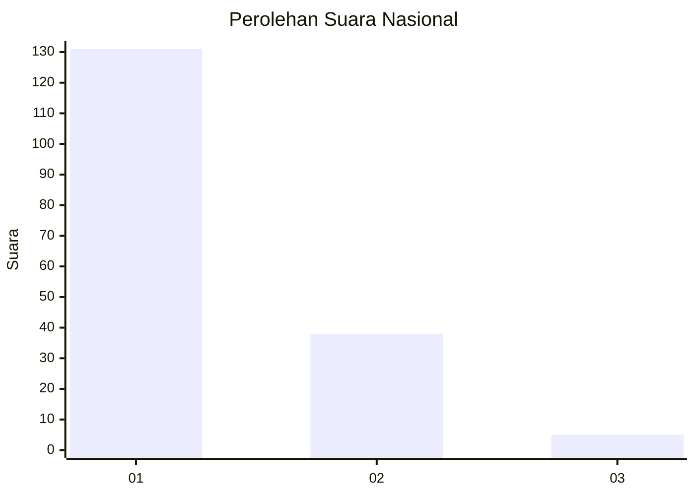
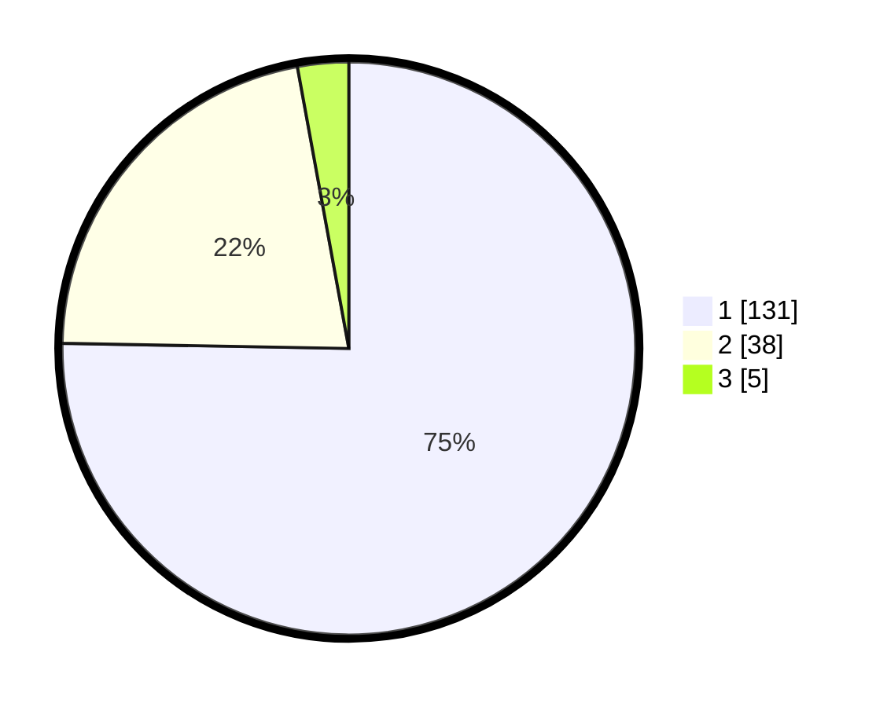

# Hasil

## Grafik

## Tabel

| No. | Nama Paslon    | Suara | Suara (raw) | Persentase |
|:--- |:-------------- | -----:| -----------:| ----------:|
| 1   | ANIES MUHAIMIN | 131   | [131][p-1]  | 75,29      |
| 2   | PRABOWO GIBRAN | 38    | [38][p-2]   | 21,84      |
| 3   | GANJAR MAHFUD  | 5     | [5][p-3]    | 2,87       |

[p-1]: https://github.com/gigit-pemilu/pemilu-2024/blob/main/pilpres/hitung-suara/sub/14-riau/sub/01-kampar/sub/14-rumbio-jaya/sub/2003-alam-panjang/sub/002-tps/sub/paslon-1.txt
[p-2]: https://github.com/gigit-pemilu/pemilu-2024/blob/main/pilpres/hitung-suara/sub/14-riau/sub/01-kampar/sub/14-rumbio-jaya/sub/2003-alam-panjang/sub/002-tps/sub/paslon-2.txt
[p-3]: https://github.com/gigit-pemilu/pemilu-2024/blob/main/pilpres/hitung-suara/sub/14-riau/sub/01-kampar/sub/14-rumbio-jaya/sub/2003-alam-panjang/sub/002-tps/sub/paslon-3.txt

## Foto C Plano

https://sirekap-obj-formc.kpu.go.id/dc39/pemilu/ppwp/14/01/14/20/03/1401142003002-20240216-171043--8bebba71-7ac3-4b94-8239-6dcd3ecaf17f.jpg

https://sirekap-obj-formc.kpu.go.id/dc39/pemilu/ppwp/14/01/14/20/03/1401142003002-20240215-015848--403ba655-60a8-409a-9f58-7db3901c7c12.jpg

https://sirekap-obj-formc.kpu.go.id/dc39/pemilu/ppwp/14/01/14/20/03/1401142003002-20240215-052232--05cf00d0-7f42-4bed-8644-c672948a549a.jpg

## Metadata

| Key        | Value               |
| ---------- | ------------------- |
| Time Stamp | 2024-02-16 17:30:00 |

