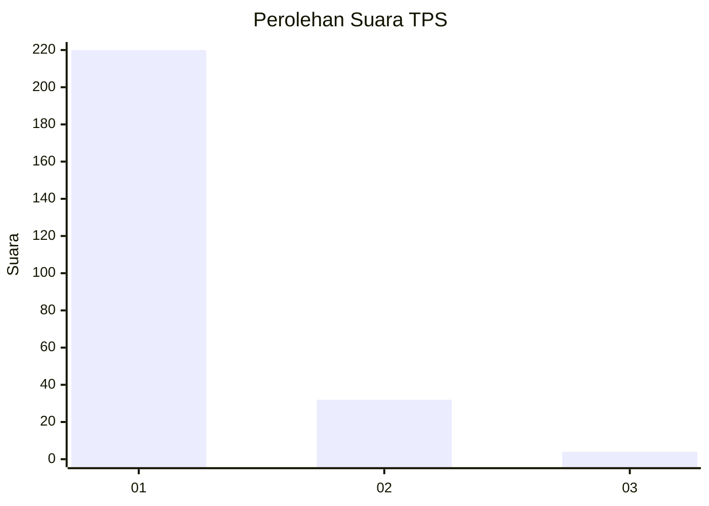
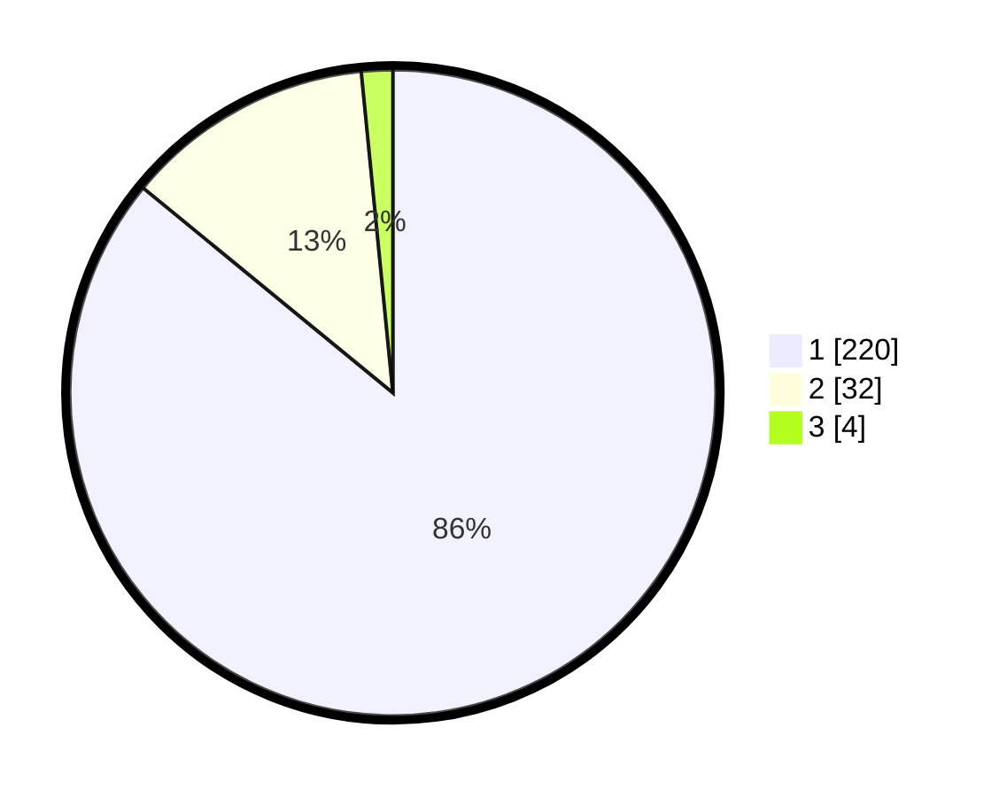

# Hasil

## Grafik

## Tabel

| No. | Nama Paslon    | Suara | Suara (raw) | Persentase |
|:--- |:-------------- | -----:| -----------:| ----------:|
| 1   | ANIES MUHAIMIN | 220   | [220][p-1]  | 85,94      |
| 2   | PRABOWO GIBRAN | 32    | [32][p-2]   | 12,50      |
| 3   | GANJAR MAHFUD  | 4     | [4][p-3]    | 1,56       |

[p-1]: https://github.com/gigit-pemilu/pemilu-2024-14-riau/blob/main/pilpres/hitung-suara/sub/14-riau/sub/01-kampar/sub/14-rumbio-jaya/sub/2003-alam-panjang/sub/009-tps/sub/paslon-1.txt
[p-2]: https://github.com/gigit-pemilu/pemilu-2024-14-riau/blob/main/pilpres/hitung-suara/sub/14-riau/sub/01-kampar/sub/14-rumbio-jaya/sub/2003-alam-panjang/sub/009-tps/sub/paslon-2.txt
[p-3]: https://github.com/gigit-pemilu/pemilu-2024-14-riau/blob/main/pilpres/hitung-suara/sub/14-riau/sub/01-kampar/sub/14-rumbio-jaya/sub/2003-alam-panjang/sub/009-tps/sub/paslon-3.txt

## Foto C Plano

https://sirekap-obj-formc.kpu.go.id/cc2f/pemilu/ppwp/14/01/14/20/03/1401142003009-20240215-032300--38b5b6ad-b0b6-4508-b340-db2dde9fc0e8.jpg

https://sirekap-obj-formc.kpu.go.id/cc2f/pemilu/ppwp/14/01/14/20/03/1401142003009-20240215-043542--e1124b8d-f658-44fc-9659-0a23080d310e.jpg

https://sirekap-obj-formc.kpu.go.id/cc2f/pemilu/ppwp/14/01/14/20/03/1401142003009-20240215-032618--7f2eaec7-7572-415c-92ea-56b4c4e7aed1.jpg

## Metadata

| Key        | Value               |
| ---------- | ------------------- |
| Time Stamp | 2024-02-15 15:30:25 |

