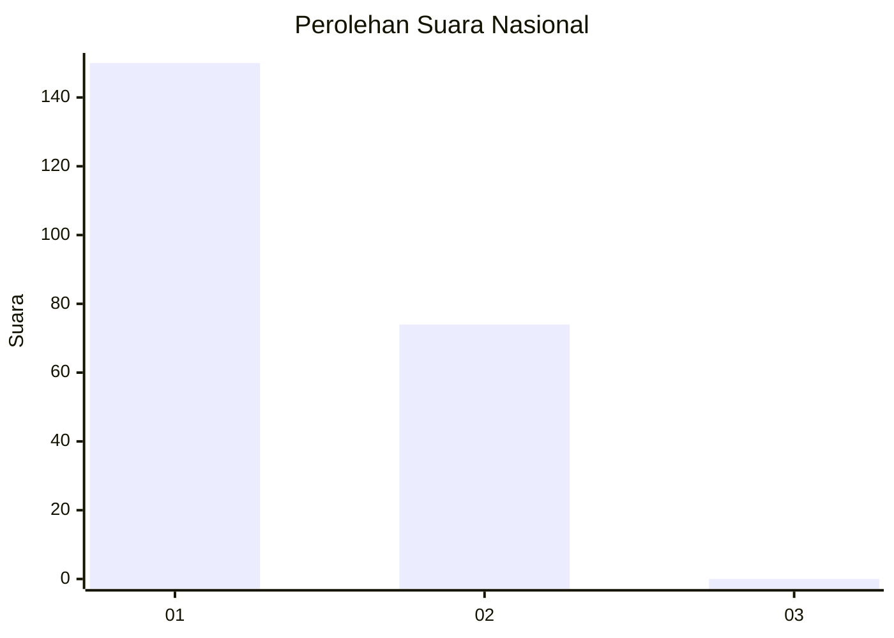
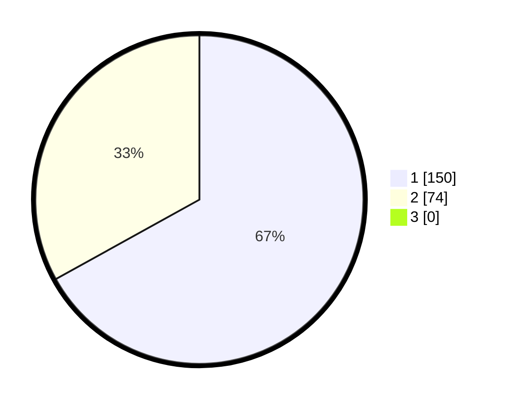

# Hasil

## Grafik

## Tabel

| No. | Nama Paslon    | Suara | Suara (raw) | Persentase |
|:--- |:-------------- | -----:| -----------:| ----------:|
| 1   | ANIES MUHAIMIN | 150   | [150][p-1]  | 66,96      |
| 2   | PRABOWO GIBRAN | 74    | [74][p-2]   | 33,04      |
| 3   | GANJAR MAHFUD  | 0     | [0][p-3]    | 0,00       |

[p-1]: https://github.com/gigit-pemilu/pemilu-2024/blob/main/pilpres/hitung-suara/sub/14-riau/sub/01-kampar/sub/15-bangkinang/sub/1008-pasir-sialang/sub/003-tps/sub/paslon-1.txt
[p-2]: https://github.com/gigit-pemilu/pemilu-2024/blob/main/pilpres/hitung-suara/sub/14-riau/sub/01-kampar/sub/15-bangkinang/sub/1008-pasir-sialang/sub/003-tps/sub/paslon-2.txt
[p-3]: https://github.com/gigit-pemilu/pemilu-2024/blob/main/pilpres/hitung-suara/sub/14-riau/sub/01-kampar/sub/15-bangkinang/sub/1008-pasir-sialang/sub/003-tps/sub/paslon-3.txt

## Foto C Plano

https://sirekap-obj-formc.kpu.go.id/320d/pemilu/ppwp/14/01/15/10/08/1401151008003-20240215-002909--e1e77f18-bd1a-4288-b74d-7f37eb75f908.jpg

https://sirekap-obj-formc.kpu.go.id/320d/pemilu/ppwp/14/01/15/10/08/1401151008003-20240215-002944--1e60757e-3cf7-4083-81f5-2b4a4babeff7.jpg

https://sirekap-obj-formc.kpu.go.id/320d/pemilu/ppwp/14/01/15/10/08/1401151008003-20240215-003007--9e11114d-6cc9-4184-a6ec-5cfb2cd3fe55.jpg

## Metadata

| Key        | Value               |
| ---------- | ------------------- |
| Time Stamp | 2024-02-16 12:51:22 |

