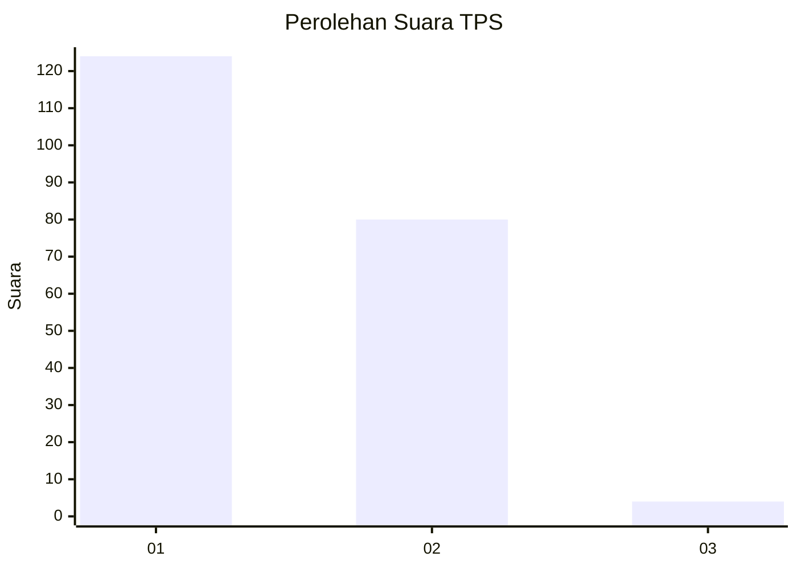
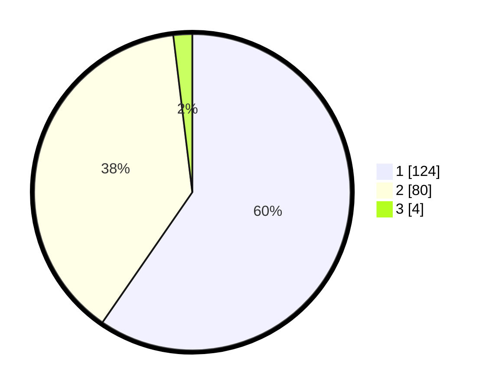

# Hasil

## Grafik

## Tabel

| No. | Nama Paslon    | Suara | Suara (raw) | Persentase |
|:--- |:-------------- | -----:| -----------:| ----------:|
| 1   | ANIES MUHAIMIN | 124   | [124][p-1]  | 59,62      |
| 2   | PRABOWO GIBRAN | 80    | [80][p-2]   | 38,46      |
| 3   | GANJAR MAHFUD  | 4     | [4][p-3]    | 1,92       |

[p-1]: https://github.com/gigit-pemilu/pemilu-2024-14-riau/blob/main/pilpres/hitung-suara/sub/14-riau/sub/01-kampar/sub/15-bangkinang/sub/1008-pasir-sialang/sub/007-tps/sub/paslon-1.txt
[p-2]: https://github.com/gigit-pemilu/pemilu-2024-14-riau/blob/main/pilpres/hitung-suara/sub/14-riau/sub/01-kampar/sub/15-bangkinang/sub/1008-pasir-sialang/sub/007-tps/sub/paslon-2.txt
[p-3]: https://github.com/gigit-pemilu/pemilu-2024-14-riau/blob/main/pilpres/hitung-suara/sub/14-riau/sub/01-kampar/sub/15-bangkinang/sub/1008-pasir-sialang/sub/007-tps/sub/paslon-3.txt

## Foto C Plano

https://sirekap-obj-formc.kpu.go.id/c5c5/pemilu/ppwp/14/01/15/10/08/1401151008007-20240215-002659--5f365dba-d7ba-4e1c-a109-a5d31a1a8e23.jpg

https://sirekap-obj-formc.kpu.go.id/c5c5/pemilu/ppwp/14/01/15/10/08/1401151008007-20240215-002833--9e779d4f-2a1e-44ee-8cbf-b9bbd97f4b7c.jpg

https://sirekap-obj-formc.kpu.go.id/c5c5/pemilu/ppwp/14/01/15/10/08/1401151008007-20240215-003005--8a3faa7a-2fca-41ca-a640-9d4e32d25702.jpg

## Metadata

| Key        | Value               |
| ---------- | ------------------- |
| Time Stamp | 2024-02-15 12:00:28 |

