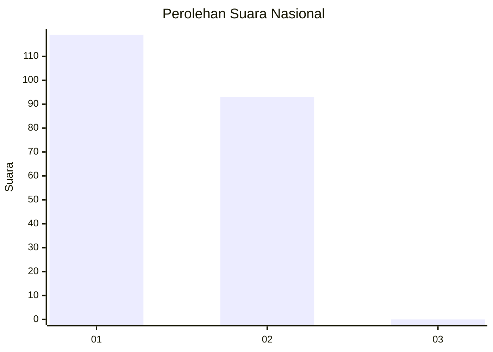
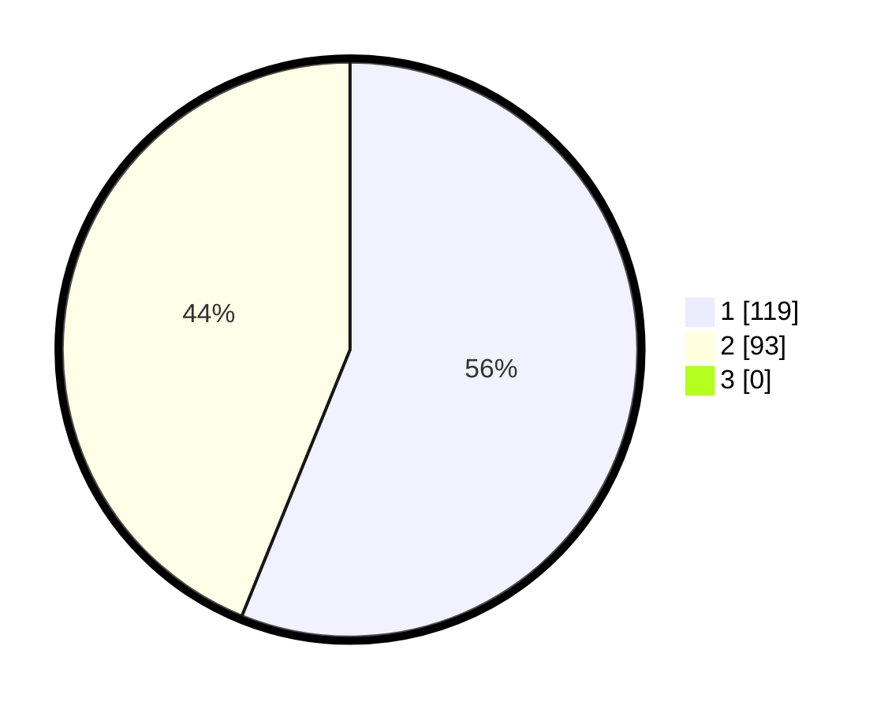

# Hasil

## Grafik

## Tabel

| No. | Nama Paslon    | Suara | Suara (raw) | Persentase |
|:--- |:-------------- | -----:| -----------:| ----------:|
| 1   | ANIES MUHAIMIN | 119   | [119][p-1]  | 56,13      |
| 2   | PRABOWO GIBRAN | 93    | [93][p-2]   | 43,87      |
| 3   | GANJAR MAHFUD  | 0     | [0][p-3]    | 0,00       |

[p-1]: https://github.com/gigit-pemilu/pemilu-2024/blob/main/pilpres/hitung-suara/sub/14-riau/sub/01-kampar/sub/15-bangkinang/sub/2001-pulau-lawas/sub/001-tps/sub/paslon-1.txt
[p-2]: https://github.com/gigit-pemilu/pemilu-2024/blob/main/pilpres/hitung-suara/sub/14-riau/sub/01-kampar/sub/15-bangkinang/sub/2001-pulau-lawas/sub/001-tps/sub/paslon-2.txt
[p-3]: https://github.com/gigit-pemilu/pemilu-2024/blob/main/pilpres/hitung-suara/sub/14-riau/sub/01-kampar/sub/15-bangkinang/sub/2001-pulau-lawas/sub/001-tps/sub/paslon-3.txt

## Foto C Plano

https://sirekap-obj-formc.kpu.go.id/6c40/pemilu/ppwp/14/01/15/20/01/1401152001001-20240214-232018--f8459150-50a0-469b-a60b-98c5b6f21b62.jpg

https://sirekap-obj-formc.kpu.go.id/6c40/pemilu/ppwp/14/01/15/20/01/1401152001001-20240214-201708--ce39606d-cbc0-420c-8c3a-a2c982e6951f.jpg

https://sirekap-obj-formc.kpu.go.id/6c40/pemilu/ppwp/14/01/15/20/01/1401152001001-20240214-202036--ae22849f-6fc0-4943-b573-314b5a44815c.jpg

## Metadata

| Key        | Value               |
| ---------- | ------------------- |
| Time Stamp | 2024-02-15 12:00:28 |

