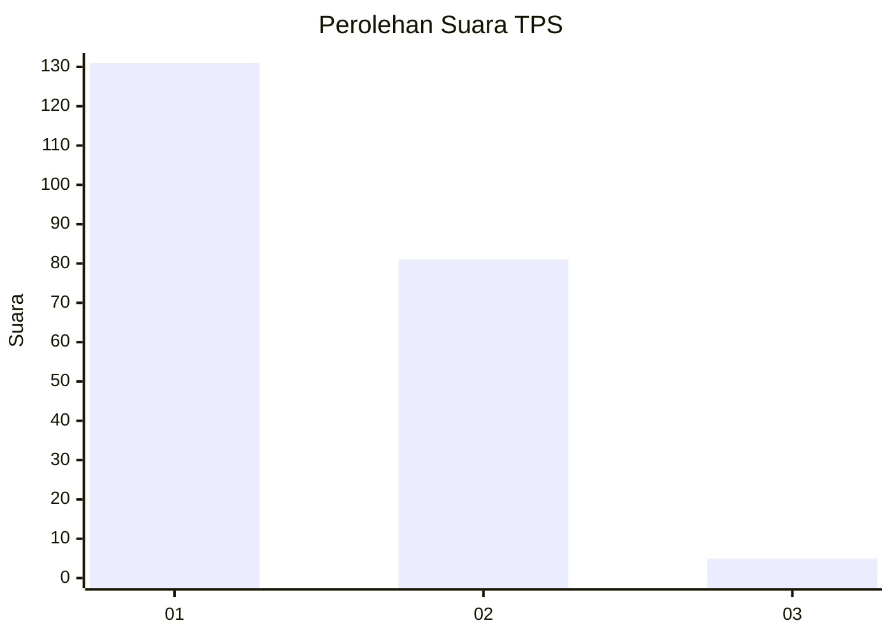
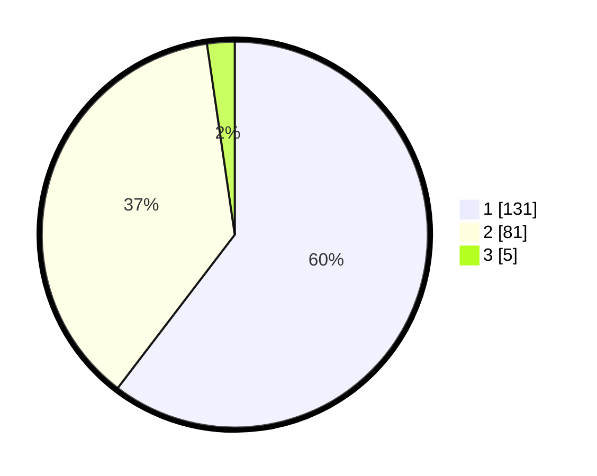

# Hasil

## Grafik

## Tabel

| No. | Nama Paslon    | Suara | Suara (raw) | Persentase |
|:--- |:-------------- | -----:| -----------:| ----------:|
| 1   | ANIES MUHAIMIN | 131   | [131][p-1]  | 60,37      |
| 2   | PRABOWO GIBRAN | 81    | [81][p-2]   | 37,33      |
| 3   | GANJAR MAHFUD  | 5     | [5][p-3]    | 2,30       |

[p-1]: https://github.com/gigit-pemilu/pemilu-2024-14-riau/blob/main/pilpres/hitung-suara/sub/14-riau/sub/01-kampar/sub/15-bangkinang/sub/2001-pulau-lawas/sub/002-tps/sub/paslon-1.txt
[p-2]: https://github.com/gigit-pemilu/pemilu-2024-14-riau/blob/main/pilpres/hitung-suara/sub/14-riau/sub/01-kampar/sub/15-bangkinang/sub/2001-pulau-lawas/sub/002-tps/sub/paslon-2.txt
[p-3]: https://github.com/gigit-pemilu/pemilu-2024-14-riau/blob/main/pilpres/hitung-suara/sub/14-riau/sub/01-kampar/sub/15-bangkinang/sub/2001-pulau-lawas/sub/002-tps/sub/paslon-3.txt

## Foto C Plano

https://sirekap-obj-formc.kpu.go.id/fb17/pemilu/ppwp/14/01/15/20/01/1401152001002-20240214-155311--c7e5c2a4-2ab7-4eb0-9a3c-f2f497092feb.jpg

https://sirekap-obj-formc.kpu.go.id/fb17/pemilu/ppwp/14/01/15/20/01/1401152001002-20240214-155055--e71d0de6-920a-42d4-831c-2b417aaf2abd.jpg

https://sirekap-obj-formc.kpu.go.id/fb17/pemilu/ppwp/14/01/15/20/01/1401152001002-20240214-155105--ddaf4b0a-a037-4d94-a41d-63528ba22d86.jpg

## Metadata

| Key        | Value               |
| ---------- | ------------------- |
| Time Stamp | 2024-02-15 12:00:28 |

