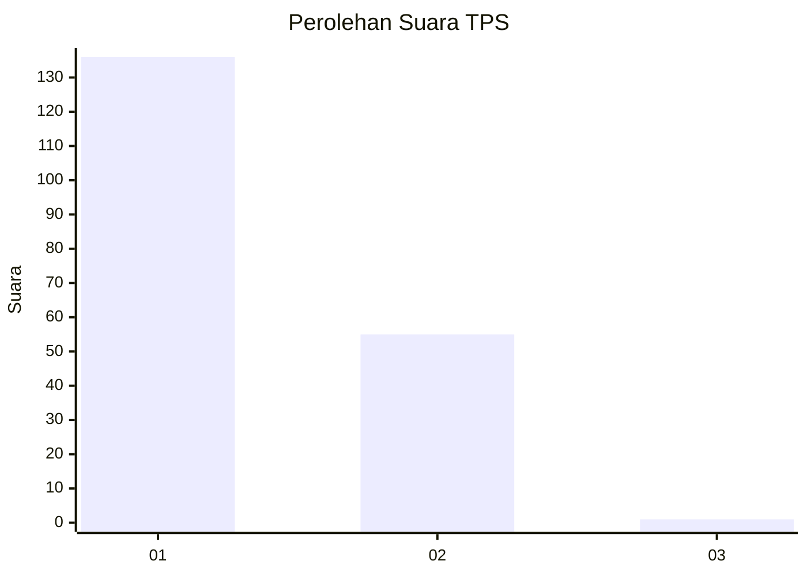
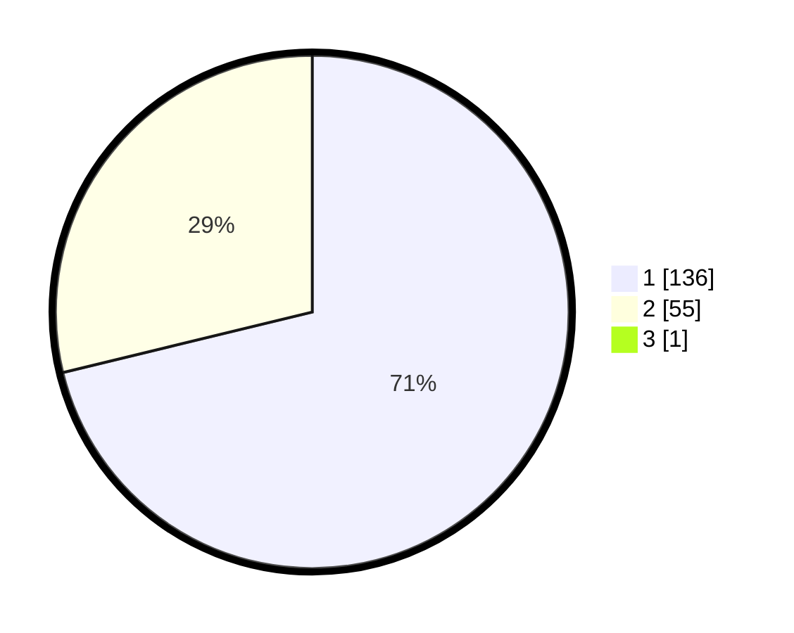

# Hasil

## Grafik

## Tabel

| No. | Nama Paslon    | Suara | Suara (raw) | Persentase |
|:--- |:-------------- | -----:| -----------:| ----------:|
| 1   | ANIES MUHAIMIN | 136   | [136][p-1]  | 70,83      |
| 2   | PRABOWO GIBRAN | 55    | [55][p-2]   | 28,65      |
| 3   | GANJAR MAHFUD  | 1     | [1][p-3]    | 0,52       |

[p-1]: https://github.com/gigit-pemilu/pemilu-2024-14-riau/blob/main/pilpres/hitung-suara/sub/14-riau/sub/01-kampar/sub/15-bangkinang/sub/2001-pulau-lawas/sub/004-tps/sub/paslon-1.txt
[p-2]: https://github.com/gigit-pemilu/pemilu-2024-14-riau/blob/main/pilpres/hitung-suara/sub/14-riau/sub/01-kampar/sub/15-bangkinang/sub/2001-pulau-lawas/sub/004-tps/sub/paslon-2.txt
[p-3]: https://github.com/gigit-pemilu/pemilu-2024-14-riau/blob/main/pilpres/hitung-suara/sub/14-riau/sub/01-kampar/sub/15-bangkinang/sub/2001-pulau-lawas/sub/004-tps/sub/paslon-3.txt

## Foto C Plano

https://sirekap-obj-formc.kpu.go.id/ec3a/pemilu/ppwp/14/01/15/20/01/1401152001004-20240215-014056--7909f345-3cb4-4156-ae27-9a34bc8a61b1.jpg

https://sirekap-obj-formc.kpu.go.id/ec3a/pemilu/ppwp/14/01/15/20/01/1401152001004-20240215-014145--0ec08c54-cb0e-470d-99ae-4e8c0863e20e.jpg

https://sirekap-obj-formc.kpu.go.id/ec3a/pemilu/ppwp/14/01/15/20/01/1401152001004-20240215-014249--0f6b9345-0654-444d-8ddf-60aab7a7e949.jpg

## Metadata

| Key        | Value               |
| ---------- | ------------------- |
| Time Stamp | 2024-02-15 15:00:29 |

