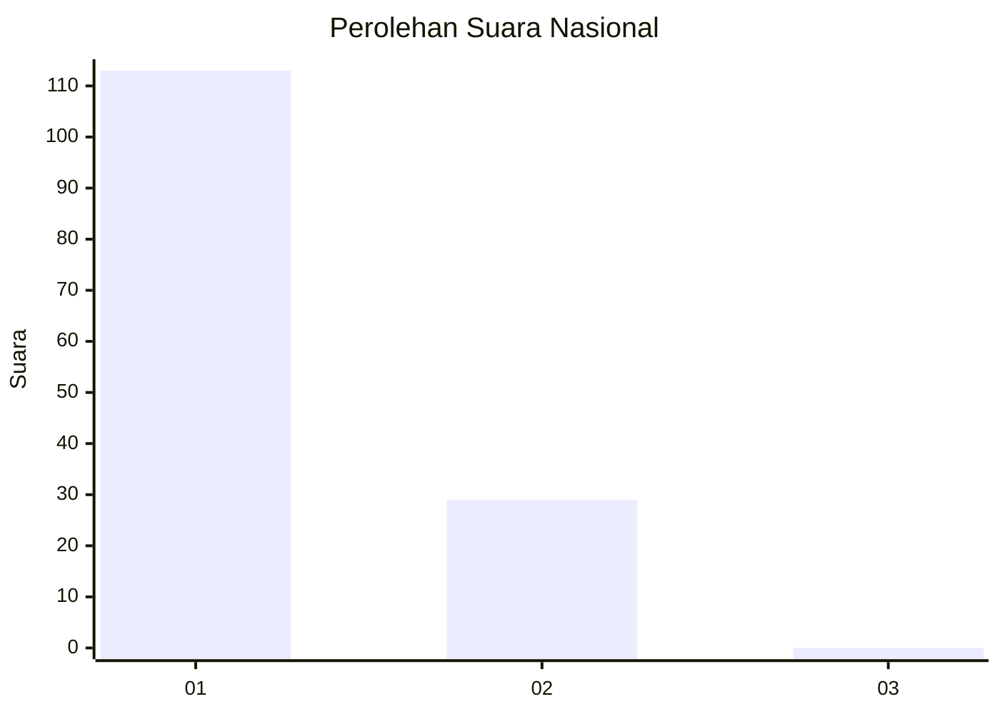
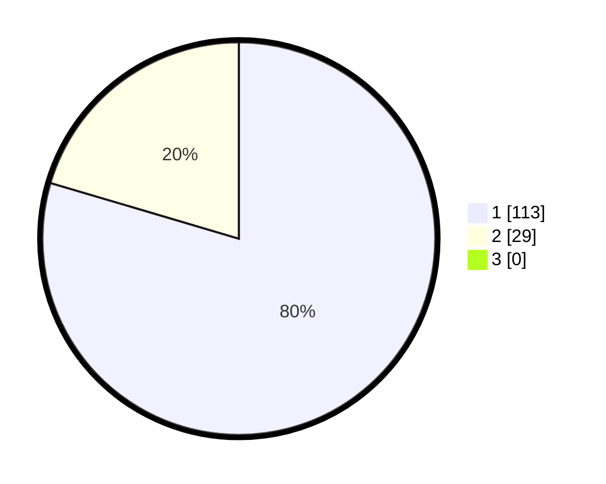

# Hasil

## Grafik

## Tabel

| No. | Nama Paslon    | Suara | Suara (raw) | Persentase |
|:--- |:-------------- | -----:| -----------:| ----------:|
| 1   | ANIES MUHAIMIN | 113   | [113][p-1]  | 79,58      |
| 2   | PRABOWO GIBRAN | 29    | [29][p-2]   | 20,42      |
| 3   | GANJAR MAHFUD  | 0     | [0][p-3]    | 0,00       |

[p-1]: https://github.com/gigit-pemilu/pemilu-2024/blob/main/pilpres/hitung-suara/sub/14-riau/sub/01-kampar/sub/15-bangkinang/sub/2002-muara-uwai/sub/005-tps/sub/paslon-1.txt
[p-2]: https://github.com/gigit-pemilu/pemilu-2024/blob/main/pilpres/hitung-suara/sub/14-riau/sub/01-kampar/sub/15-bangkinang/sub/2002-muara-uwai/sub/005-tps/sub/paslon-2.txt
[p-3]: https://github.com/gigit-pemilu/pemilu-2024/blob/main/pilpres/hitung-suara/sub/14-riau/sub/01-kampar/sub/15-bangkinang/sub/2002-muara-uwai/sub/005-tps/sub/paslon-3.txt

## Foto C Plano

https://sirekap-obj-formc.kpu.go.id/94b1/pemilu/ppwp/14/01/15/20/02/1401152002005-20240214-215930--a6d7dcba-6316-4e09-91e2-bcc0665c78ce.jpg

https://sirekap-obj-formc.kpu.go.id/94b1/pemilu/ppwp/14/01/15/20/02/1401152002005-20240214-220307--fe0a0d24-493c-4f03-8a44-7fe143cb3b39.jpg

https://sirekap-obj-formc.kpu.go.id/94b1/pemilu/ppwp/14/01/15/20/02/1401152002005-20240214-194315--78b04967-f842-4c3a-99e8-525bddf435f9.jpg

## Metadata

| Key        | Value               |
| ---------- | ------------------- |
| Time Stamp | 2024-02-15 15:00:29 |

