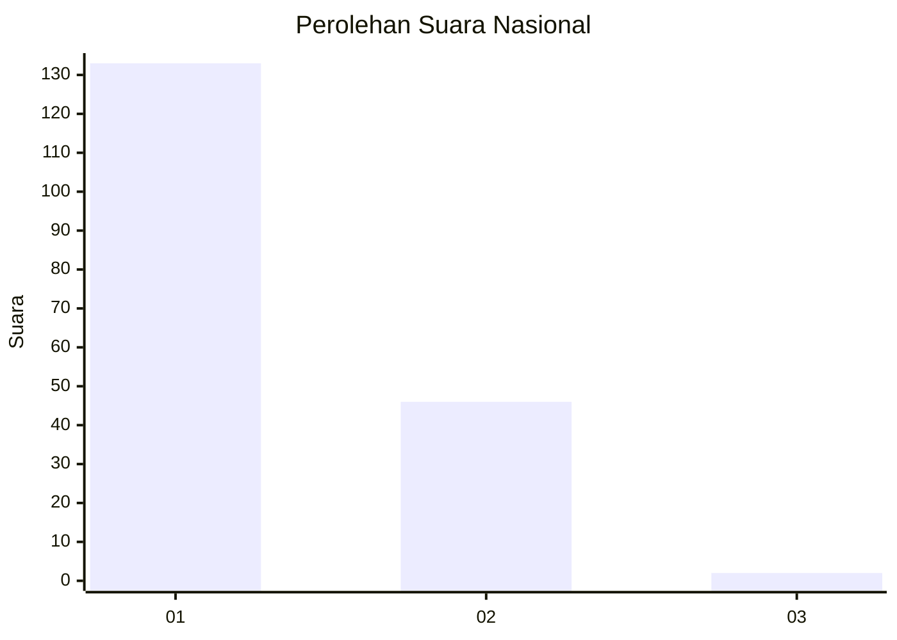
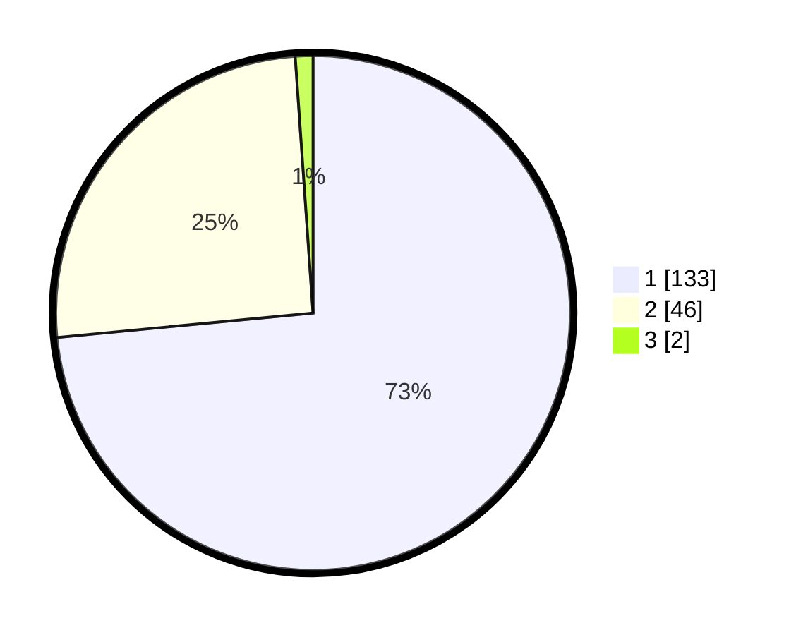

# Hasil

## Grafik

## Tabel

| No. | Nama Paslon    | Suara | Suara (raw) | Persentase |
|:--- |:-------------- | -----:| -----------:| ----------:|
| 1   | ANIES MUHAIMIN | 133   | [133][p-1]  | 73,48      |
| 2   | PRABOWO GIBRAN | 46    | [46][p-2]   | 25,41      |
| 3   | GANJAR MAHFUD  | 2     | [2][p-3]    | 1,10       |

[p-1]: https://github.com/gigit-pemilu/pemilu-2024/blob/main/pilpres/hitung-suara/sub/14-riau/sub/01-kampar/sub/15-bangkinang/sub/2009-binuang/sub/003-tps/sub/paslon-1.txt
[p-2]: https://github.com/gigit-pemilu/pemilu-2024/blob/main/pilpres/hitung-suara/sub/14-riau/sub/01-kampar/sub/15-bangkinang/sub/2009-binuang/sub/003-tps/sub/paslon-2.txt
[p-3]: https://github.com/gigit-pemilu/pemilu-2024/blob/main/pilpres/hitung-suara/sub/14-riau/sub/01-kampar/sub/15-bangkinang/sub/2009-binuang/sub/003-tps/sub/paslon-3.txt

## Foto C Plano

https://sirekap-obj-formc.kpu.go.id/6216/pemilu/ppwp/14/01/15/20/09/1401152009003-20240214-222917--4f6c8d00-930b-4aff-bbeb-7dd5ab93f4aa.jpg

https://sirekap-obj-formc.kpu.go.id/6216/pemilu/ppwp/14/01/15/20/09/1401152009003-20240214-223123--54ce1b40-373f-44be-84d6-8efd3455e601.jpg

https://sirekap-obj-formc.kpu.go.id/6216/pemilu/ppwp/14/01/15/20/09/1401152009003-20240214-223343--98b9482c-3f83-42ad-8449-12ed487f4119.jpg

## Metadata

| Key        | Value               |
| ---------- | ------------------- |
| Time Stamp | 2024-02-15 15:00:29 |

