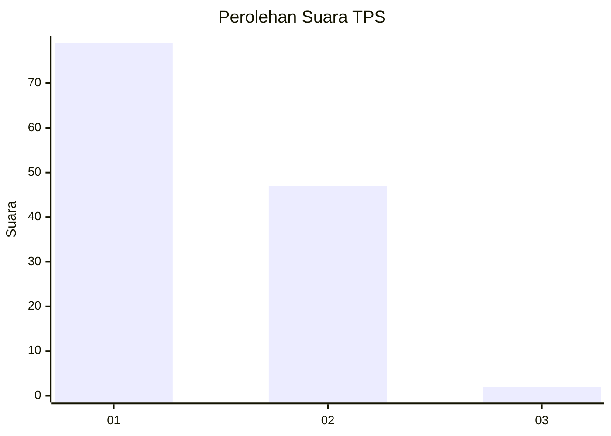
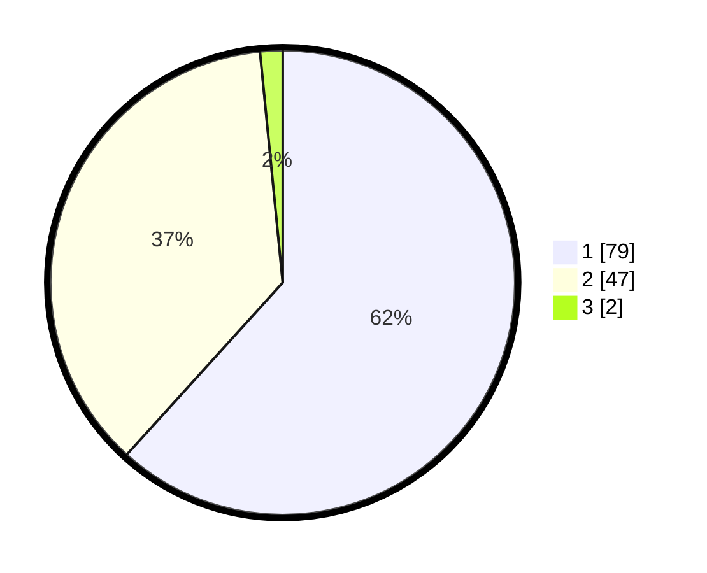

# Hasil

## Grafik

## Tabel

| No. | Nama Paslon    | Suara | Suara (raw) | Persentase |
|:--- |:-------------- | -----:| -----------:| ----------:|
| 1   | ANIES MUHAIMIN | 79    | [79][p-1]   | 61,72      |
| 2   | PRABOWO GIBRAN | 47    | [47][p-2]   | 36,72      |
| 3   | GANJAR MAHFUD  | 2     | [2][p-3]    | 1,56       |

[p-1]: https://github.com/gigit-pemilu/pemilu-2024-14-riau/blob/main/pilpres/hitung-suara/sub/14-riau/sub/01-kampar/sub/17-kampa/sub/2001-pulau-birandang/sub/005-tps/sub/paslon-1.txt
[p-2]: https://github.com/gigit-pemilu/pemilu-2024-14-riau/blob/main/pilpres/hitung-suara/sub/14-riau/sub/01-kampar/sub/17-kampa/sub/2001-pulau-birandang/sub/005-tps/sub/paslon-2.txt
[p-3]: https://github.com/gigit-pemilu/pemilu-2024-14-riau/blob/main/pilpres/hitung-suara/sub/14-riau/sub/01-kampar/sub/17-kampa/sub/2001-pulau-birandang/sub/005-tps/sub/paslon-3.txt

## Foto C Plano

https://sirekap-obj-formc.kpu.go.id/75e4/pemilu/ppwp/14/01/17/20/01/1401172001005-20240214-233337--0edc34d8-a6d2-438d-9347-3feed0ce87c9.jpg

https://sirekap-obj-formc.kpu.go.id/75e4/pemilu/ppwp/14/01/17/20/01/1401172001005-20240214-233340--b3b49955-cabd-49e2-bf34-bcd323cc679f.jpg

https://sirekap-obj-formc.kpu.go.id/75e4/pemilu/ppwp/14/01/17/20/01/1401172001005-20240214-233345--3f4ea2bd-d9fa-4ea2-a20d-818d7c64fcd4.jpg

## Metadata

| Key        | Value               |
| ---------- | ------------------- |
| Time Stamp | 2024-02-15 15:30:25 |

