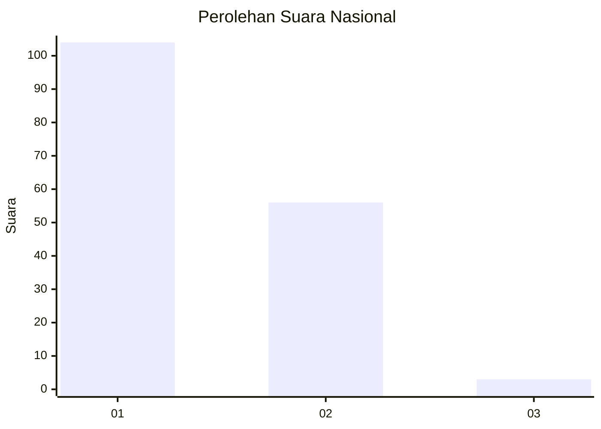
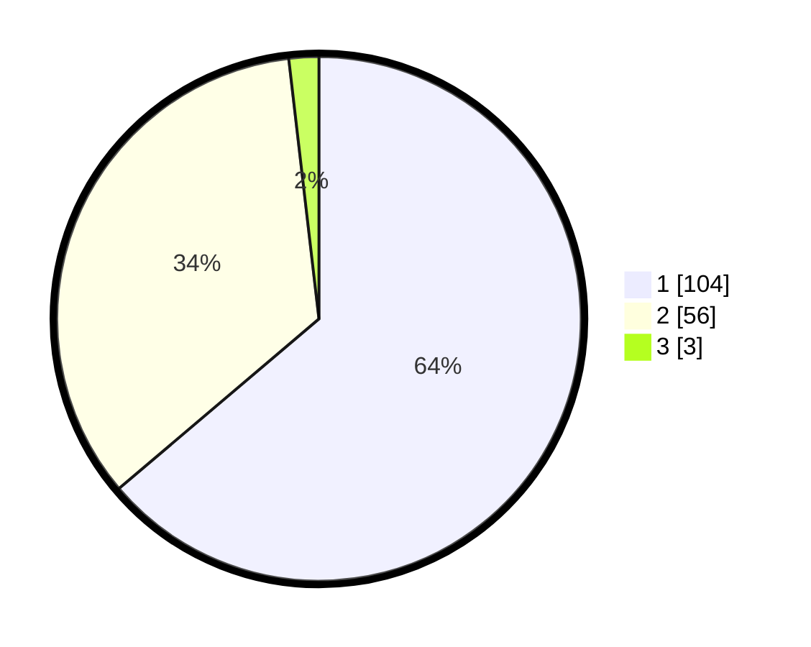

# Hasil

## Grafik

## Tabel

| No. | Nama Paslon    | Suara | Suara (raw) | Persentase |
|:--- |:-------------- | -----:| -----------:| ----------:|
| 1   | ANIES MUHAIMIN | 104   | [104][p-1]  | 63,80      |
| 2   | PRABOWO GIBRAN | 56    | [56][p-2]   | 34,36      |
| 3   | GANJAR MAHFUD  | 3     | [3][p-3]    | 1,84       |

[p-1]: https://github.com/gigit-pemilu/pemilu-2024/blob/main/pilpres/hitung-suara/sub/14-riau/sub/01-kampar/sub/17-kampa/sub/2004-koto-perambahan/sub/016-tps/sub/paslon-1.txt
[p-2]: https://github.com/gigit-pemilu/pemilu-2024/blob/main/pilpres/hitung-suara/sub/14-riau/sub/01-kampar/sub/17-kampa/sub/2004-koto-perambahan/sub/016-tps/sub/paslon-2.txt
[p-3]: https://github.com/gigit-pemilu/pemilu-2024/blob/main/pilpres/hitung-suara/sub/14-riau/sub/01-kampar/sub/17-kampa/sub/2004-koto-perambahan/sub/016-tps/sub/paslon-3.txt

## Foto C Plano

https://sirekap-obj-formc.kpu.go.id/399b/pemilu/ppwp/14/01/17/20/04/1401172004016-20240215-065912--343e4485-4276-4379-b430-8e44ca680f85.jpg

https://sirekap-obj-formc.kpu.go.id/399b/pemilu/ppwp/14/01/17/20/04/1401172004016-20240215-065256--fb821ce0-35e0-4197-b8a6-b3d66dc24f15.jpg

https://sirekap-obj-formc.kpu.go.id/399b/pemilu/ppwp/14/01/17/20/04/1401172004016-20240215-065736--d993f031-cede-4773-967a-82579d2f6cb9.jpg

## Metadata

| Key        | Value               |
| ---------- | ------------------- |
| Time Stamp | 2024-02-16 16:25:10 |

