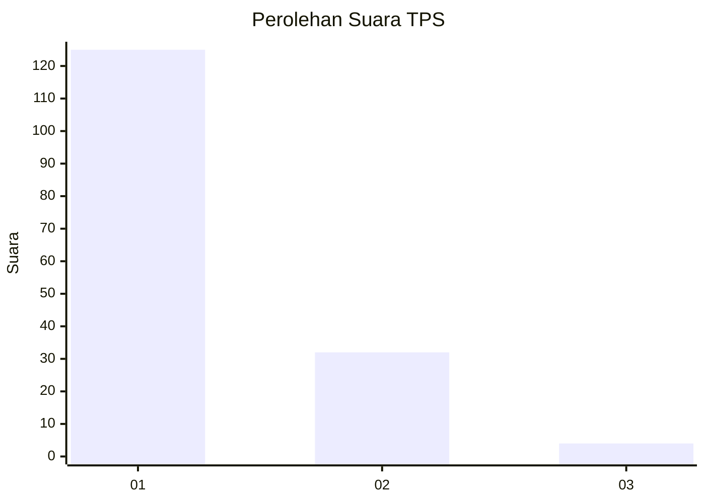
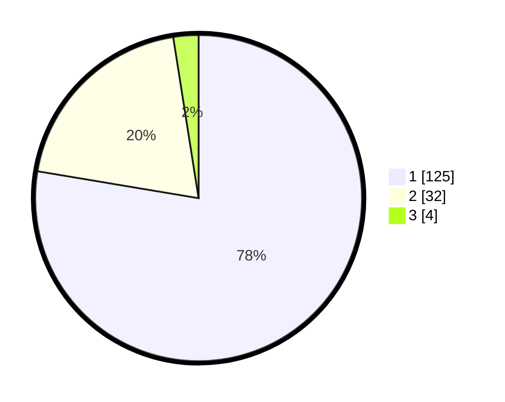

# Hasil

## Grafik

## Tabel

| No. | Nama Paslon    | Suara | Suara (raw) | Persentase |
|:--- |:-------------- | -----:| -----------:| ----------:|
| 1   | ANIES MUHAIMIN | 125   | [125][p-1]  | 77,64      |
| 2   | PRABOWO GIBRAN | 32    | [32][p-2]   | 19,88      |
| 3   | GANJAR MAHFUD  | 4     | [4][p-3]    | 2,48       |

[p-1]: https://github.com/gigit-pemilu/pemilu-2024-14-riau/blob/main/pilpres/hitung-suara/sub/14-riau/sub/01-kampar/sub/18-kampar-utara/sub/2001-muara-jalai/sub/003-tps/sub/paslon-1.txt
[p-2]: https://github.com/gigit-pemilu/pemilu-2024-14-riau/blob/main/pilpres/hitung-suara/sub/14-riau/sub/01-kampar/sub/18-kampar-utara/sub/2001-muara-jalai/sub/003-tps/sub/paslon-2.txt
[p-3]: https://github.com/gigit-pemilu/pemilu-2024-14-riau/blob/main/pilpres/hitung-suara/sub/14-riau/sub/01-kampar/sub/18-kampar-utara/sub/2001-muara-jalai/sub/003-tps/sub/paslon-3.txt

## Foto C Plano

https://sirekap-obj-formc.kpu.go.id/2a75/pemilu/ppwp/14/01/18/20/01/1401182001003-20240214-155601--22ccc364-5bac-41b5-8910-50248238887e.jpg

https://sirekap-obj-formc.kpu.go.id/2a75/pemilu/ppwp/14/01/18/20/01/1401182001003-20240214-160111--cb0dfd5b-649f-4485-81d9-f306f7328e9e.jpg

https://sirekap-obj-formc.kpu.go.id/2a75/pemilu/ppwp/14/01/18/20/01/1401182001003-20240214-155855--3eaa46b3-87b6-4c29-87c9-0438d8011471.jpg

## Metadata

| Key        | Value               |
| ---------- | ------------------- |
| Time Stamp | 2024-02-15 15:30:25 |

