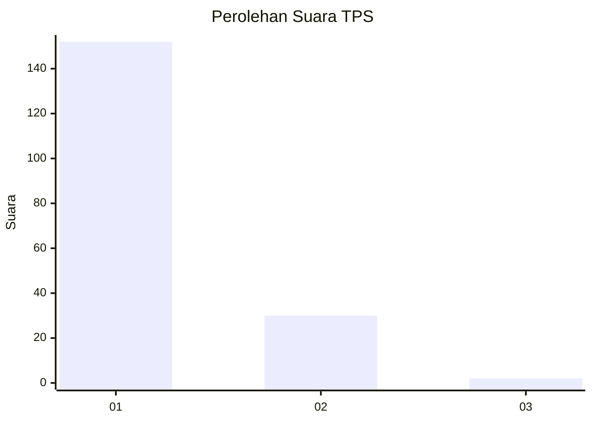
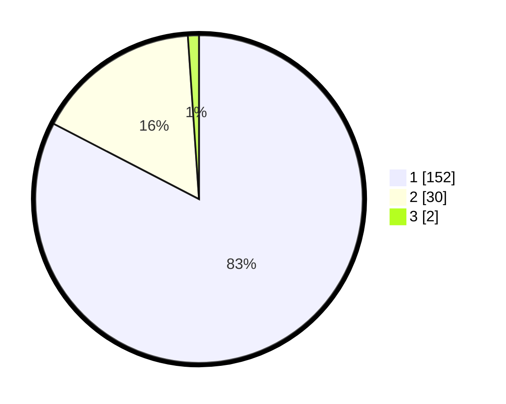

# Hasil

## Grafik

## Tabel

| No. | Nama Paslon    | Suara | Suara (raw) | Persentase |
|:--- |:-------------- | -----:| -----------:| ----------:|
| 1   | ANIES MUHAIMIN | 152   | [152][p-1]  | 82,61      |
| 2   | PRABOWO GIBRAN | 30    | [30][p-2]   | 16,30      |
| 3   | GANJAR MAHFUD  | 2     | [2][p-3]    | 1,09       |

[p-1]: https://github.com/gigit-pemilu/pemilu-2024-14-riau/blob/main/pilpres/hitung-suara/sub/14-riau/sub/01-kampar/sub/18-kampar-utara/sub/2002-sawah/sub/001-tps/sub/paslon-1.txt
[p-2]: https://github.com/gigit-pemilu/pemilu-2024-14-riau/blob/main/pilpres/hitung-suara/sub/14-riau/sub/01-kampar/sub/18-kampar-utara/sub/2002-sawah/sub/001-tps/sub/paslon-2.txt
[p-3]: https://github.com/gigit-pemilu/pemilu-2024-14-riau/blob/main/pilpres/hitung-suara/sub/14-riau/sub/01-kampar/sub/18-kampar-utara/sub/2002-sawah/sub/001-tps/sub/paslon-3.txt

## Foto C Plano

https://sirekap-obj-formc.kpu.go.id/e450/pemilu/ppwp/14/01/18/20/02/1401182002001-20240214-203708--bb51b8f4-d351-422d-84c7-b2b7bcfd193e.jpg

https://sirekap-obj-formc.kpu.go.id/e450/pemilu/ppwp/14/01/18/20/02/1401182002001-20240214-204509--9f9ee531-76c1-4578-8c83-1506bef85c0d.jpg

https://sirekap-obj-formc.kpu.go.id/e450/pemilu/ppwp/14/01/18/20/02/1401182002001-20240214-204854--8f689dc7-a6bf-4319-84da-2b93dcffa960.jpg

## Metadata

| Key        | Value               |
| ---------- | ------------------- |
| Time Stamp | 2024-02-15 15:30:25 |

