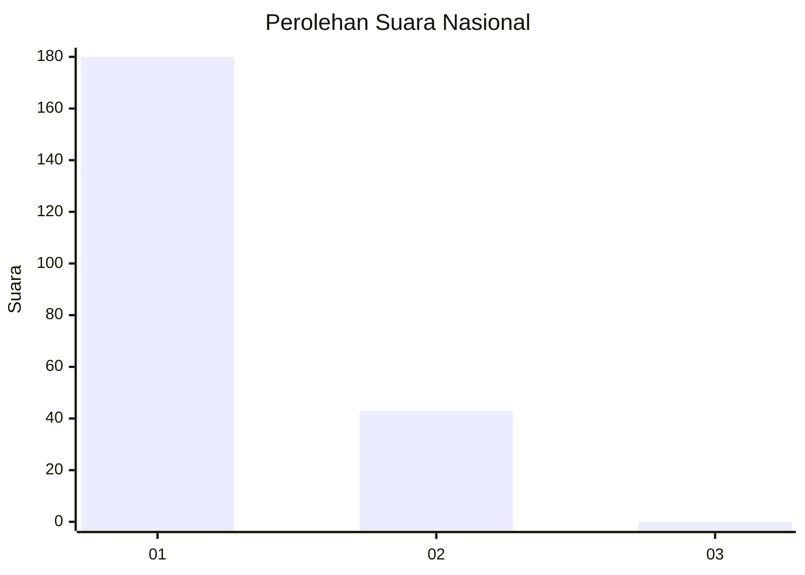
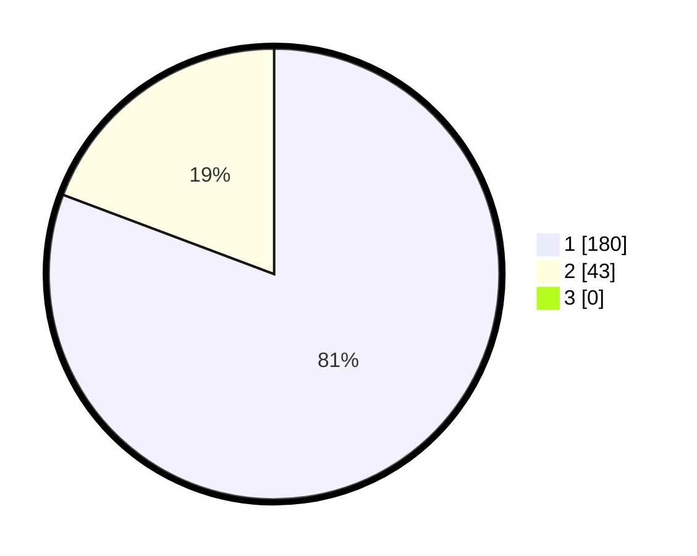

# Hasil

## Grafik

## Tabel

| No. | Nama Paslon    | Suara | Suara (raw) | Persentase |
|:--- |:-------------- | -----:| -----------:| ----------:|
| 1   | ANIES MUHAIMIN | 180   | [180][p-1]  | 80,72      |
| 2   | PRABOWO GIBRAN | 43    | [43][p-2]   | 19,28      |
| 3   | GANJAR MAHFUD  | 0     | [0][p-3]    | 0,00       |

[p-1]: https://github.com/gigit-pemilu/pemilu-2024/blob/main/pilpres/hitung-suara/sub/14-riau/sub/01-kampar/sub/18-kampar-utara/sub/2002-sawah/sub/010-tps/sub/paslon-1.txt
[p-2]: https://github.com/gigit-pemilu/pemilu-2024/blob/main/pilpres/hitung-suara/sub/14-riau/sub/01-kampar/sub/18-kampar-utara/sub/2002-sawah/sub/010-tps/sub/paslon-2.txt
[p-3]: https://github.com/gigit-pemilu/pemilu-2024/blob/main/pilpres/hitung-suara/sub/14-riau/sub/01-kampar/sub/18-kampar-utara/sub/2002-sawah/sub/010-tps/sub/paslon-3.txt

## Foto C Plano

https://sirekap-obj-formc.kpu.go.id/fcd2/pemilu/ppwp/14/01/18/20/02/1401182002010-20240215-025217--1a0c92b7-e1c9-45ea-a727-896cd2cc98f0.jpg

https://sirekap-obj-formc.kpu.go.id/fcd2/pemilu/ppwp/14/01/18/20/02/1401182002010-20240215-025429--f3080d97-c391-4f61-88dc-bc588ab08601.jpg

https://sirekap-obj-formc.kpu.go.id/fcd2/pemilu/ppwp/14/01/18/20/02/1401182002010-20240215-025623--b2dddaf7-ce61-4d2f-aecc-20cf939c8b41.jpg

## Metadata

| Key        | Value               |
| ---------- | ------------------- |
| Time Stamp | 2024-02-16 16:25:10 |

