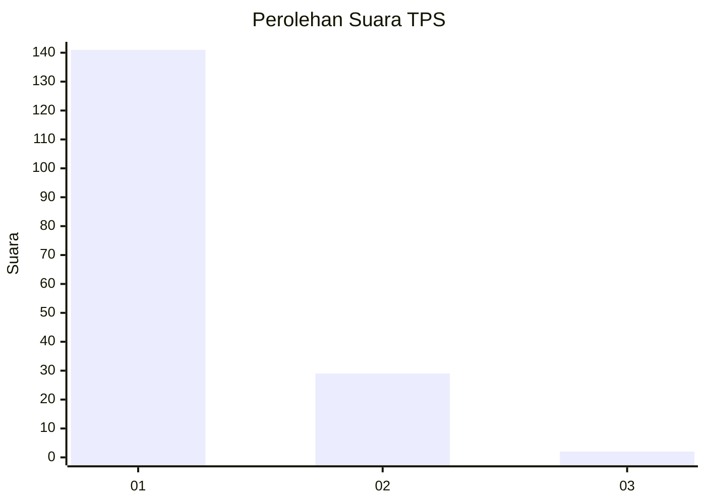
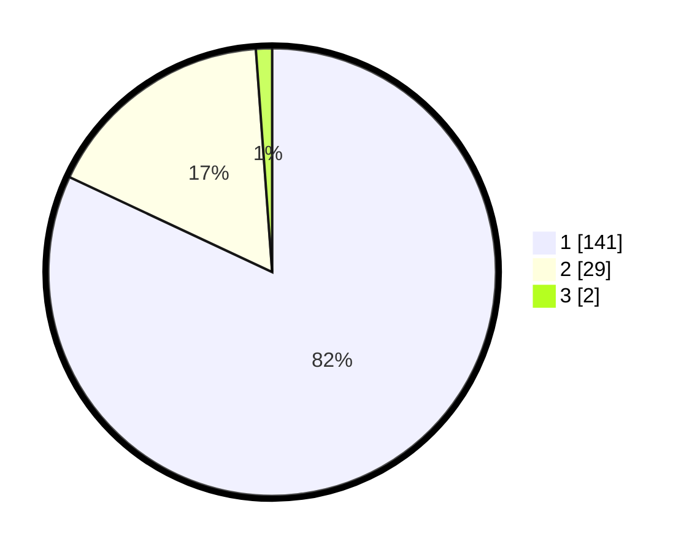

# Hasil

## Grafik

## Tabel

| No. | Nama Paslon    | Suara | Suara (raw) | Persentase |
|:--- |:-------------- | -----:| -----------:| ----------:|
| 1   | ANIES MUHAIMIN | 141   | [141][p-1]  | 81,98      |
| 2   | PRABOWO GIBRAN | 29    | [29][p-2]   | 16,86      |
| 3   | GANJAR MAHFUD  | 2     | [2][p-3]    | 1,16       |

[p-1]: https://github.com/gigit-pemilu/pemilu-2024-14-riau/blob/main/pilpres/hitung-suara/sub/14-riau/sub/01-kampar/sub/18-kampar-utara/sub/2005-sungai-tonang/sub/002-tps/sub/paslon-1.txt
[p-2]: https://github.com/gigit-pemilu/pemilu-2024-14-riau/blob/main/pilpres/hitung-suara/sub/14-riau/sub/01-kampar/sub/18-kampar-utara/sub/2005-sungai-tonang/sub/002-tps/sub/paslon-2.txt
[p-3]: https://github.com/gigit-pemilu/pemilu-2024-14-riau/blob/main/pilpres/hitung-suara/sub/14-riau/sub/01-kampar/sub/18-kampar-utara/sub/2005-sungai-tonang/sub/002-tps/sub/paslon-3.txt

## Foto C Plano

https://sirekap-obj-formc.kpu.go.id/6674/pemilu/ppwp/14/01/18/20/05/1401182005002-20240215-001932--4e9107f7-41e9-4b42-b5a4-8653eaf8a08f.jpg

https://sirekap-obj-formc.kpu.go.id/6674/pemilu/ppwp/14/01/18/20/05/1401182005002-20240215-002151--7e325ade-0318-4ee2-90a8-53bbf19dd6d3.jpg

https://sirekap-obj-formc.kpu.go.id/6674/pemilu/ppwp/14/01/18/20/05/1401182005002-20240215-040522--94c02e6f-9dd8-48b4-a9ba-7c1a81e0618c.jpg

## Metadata

| Key        | Value               |
| ---------- | ------------------- |
| Time Stamp | 2024-02-15 15:30:25 |

