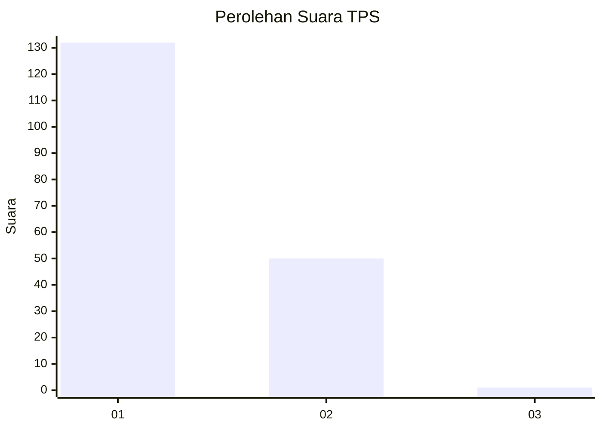
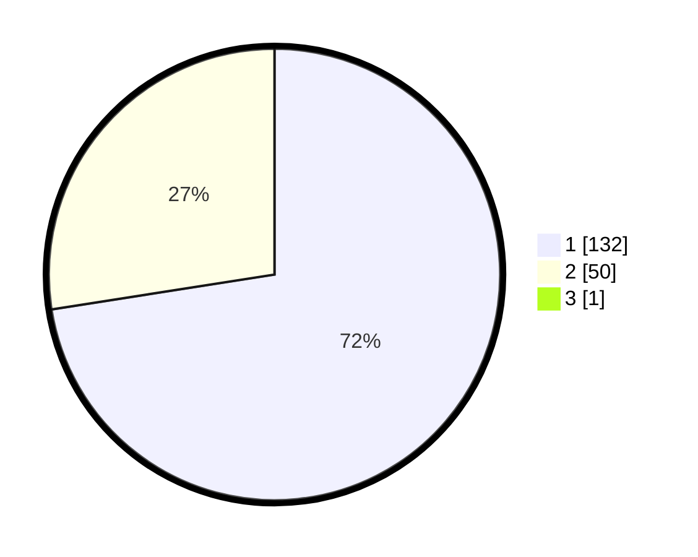

# Hasil

## Grafik

## Tabel

| No. | Nama Paslon    | Suara | Suara (raw) | Persentase |
|:--- |:-------------- | -----:| -----------:| ----------:|
| 1   | ANIES MUHAIMIN | 132   | [132][p-1]  | 72,13      |
| 2   | PRABOWO GIBRAN | 50    | [50][p-2]   | 27,32      |
| 3   | GANJAR MAHFUD  | 1     | [1][p-3]    | 0,55       |

[p-1]: https://github.com/gigit-pemilu/pemilu-2024-14-riau/blob/main/pilpres/hitung-suara/sub/14-riau/sub/01-kampar/sub/18-kampar-utara/sub/2005-sungai-tonang/sub/007-tps/sub/paslon-1.txt
[p-2]: https://github.com/gigit-pemilu/pemilu-2024-14-riau/blob/main/pilpres/hitung-suara/sub/14-riau/sub/01-kampar/sub/18-kampar-utara/sub/2005-sungai-tonang/sub/007-tps/sub/paslon-2.txt
[p-3]: https://github.com/gigit-pemilu/pemilu-2024-14-riau/blob/main/pilpres/hitung-suara/sub/14-riau/sub/01-kampar/sub/18-kampar-utara/sub/2005-sungai-tonang/sub/007-tps/sub/paslon-3.txt

## Foto C Plano

https://sirekap-obj-formc.kpu.go.id/1d1d/pemilu/ppwp/14/01/18/20/05/1401182005007-20240215-030911--838d6161-bee2-45cd-9785-f9d4f1200518.jpg

https://sirekap-obj-formc.kpu.go.id/1d1d/pemilu/ppwp/14/01/18/20/05/1401182005007-20240215-030923--f1e0a73d-ee3b-4530-ba79-6d1bd0aa9932.jpg

https://sirekap-obj-formc.kpu.go.id/1d1d/pemilu/ppwp/14/01/18/20/05/1401182005007-20240215-030934--b747f2ad-ec6e-4e23-883d-7c6d3973321c.jpg

## Metadata

| Key        | Value               |
| ---------- | ------------------- |
| Time Stamp | 2024-02-15 22:30:27 |

