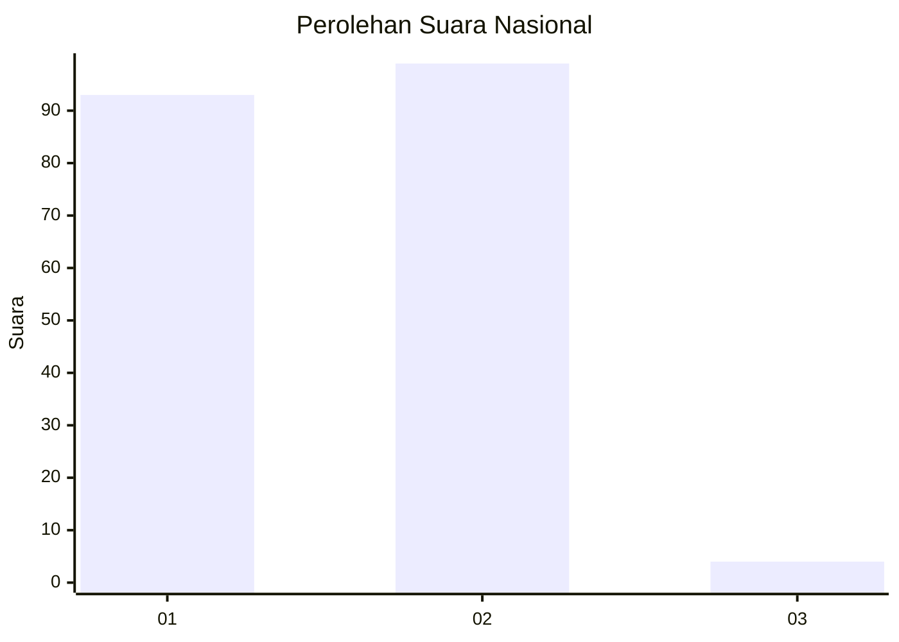
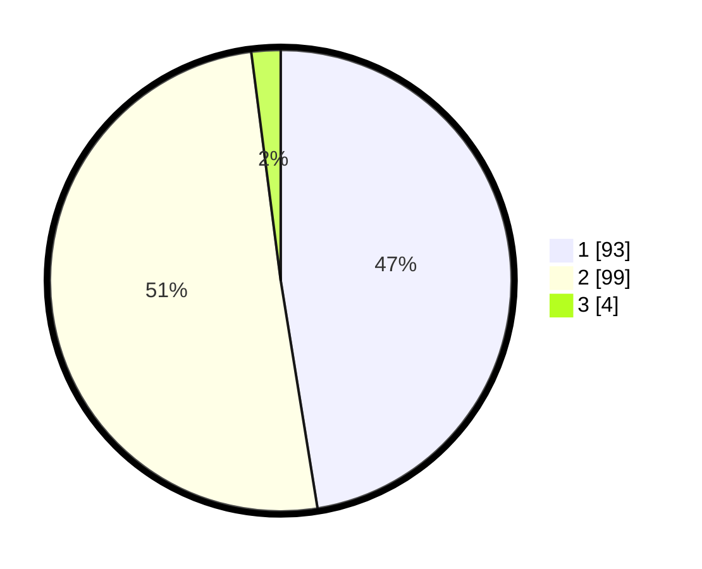

# Hasil

## Grafik

## Tabel

| No. | Nama Paslon    | Suara | Suara (raw) | Persentase |
|:--- |:-------------- | -----:| -----------:| ----------:|
| 1   | ANIES MUHAIMIN | 93    | [93][p-1]   | 47,45      |
| 2   | PRABOWO GIBRAN | 99    | [99][p-2]   | 50,51      |
| 3   | GANJAR MAHFUD  | 4     | [4][p-3]    | 2,04       |

[p-1]: https://github.com/gigit-pemilu/pemilu-2024/blob/main/pilpres/hitung-suara/sub/14-riau/sub/02-indragiri-hulu/sub/01-rengat/sub/2010-pasir-kemilu/sub/004-tps/sub/paslon-1.txt
[p-2]: https://github.com/gigit-pemilu/pemilu-2024/blob/main/pilpres/hitung-suara/sub/14-riau/sub/02-indragiri-hulu/sub/01-rengat/sub/2010-pasir-kemilu/sub/004-tps/sub/paslon-2.txt
[p-3]: https://github.com/gigit-pemilu/pemilu-2024/blob/main/pilpres/hitung-suara/sub/14-riau/sub/02-indragiri-hulu/sub/01-rengat/sub/2010-pasir-kemilu/sub/004-tps/sub/paslon-3.txt

## Foto C Plano

https://sirekap-obj-formc.kpu.go.id/9cdd/pemilu/ppwp/14/02/01/20/10/1402012010004-20240215-001454--db15706e-2469-4e25-a2fd-e13a27506004.jpg

https://sirekap-obj-formc.kpu.go.id/9cdd/pemilu/ppwp/14/02/01/20/10/1402012010004-20240215-001854--ed39defd-5633-40b7-940a-f964652a9eb8.jpg

https://sirekap-obj-formc.kpu.go.id/9cdd/pemilu/ppwp/14/02/01/20/10/1402012010004-20240215-002130--60d8005a-ff06-4ce6-8872-1dc8727766bd.jpg

## Metadata

| Key        | Value               |
| ---------- | ------------------- |
| Time Stamp | 2024-02-15 20:30:46 |

