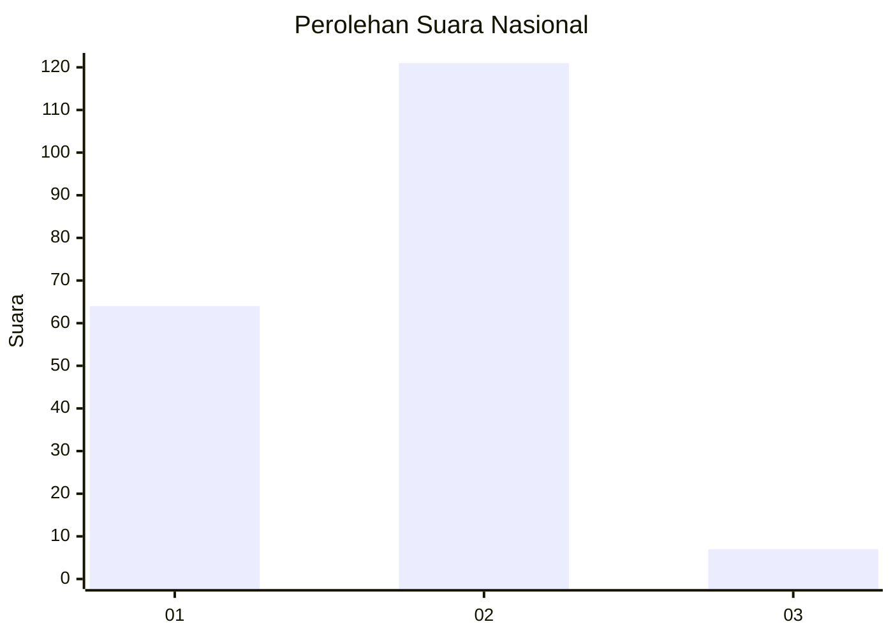
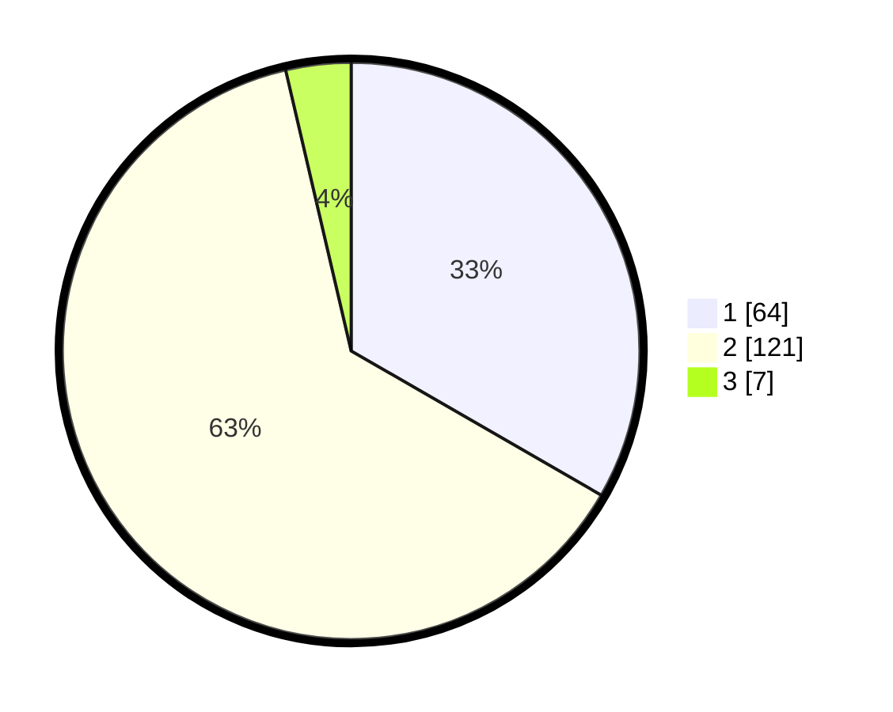

# Hasil

## Grafik

## Tabel

| No. | Nama Paslon    | Suara | Suara (raw) | Persentase |
|:--- |:-------------- | -----:| -----------:| ----------:|
| 1   | ANIES MUHAIMIN | 64    | [64][p-1]   | 33,33      |
| 2   | PRABOWO GIBRAN | 121   | [121][p-2]  | 63,02      |
| 3   | GANJAR MAHFUD  | 7     | [7][p-3]    | 3,65       |

[p-1]: https://github.com/gigit-pemilu/pemilu-2024/blob/main/pilpres/hitung-suara/sub/14-riau/sub/02-indragiri-hulu/sub/02-rengat-barat/sub/1009-pematang-reba/sub/001-tps/sub/paslon-1.txt
[p-2]: https://github.com/gigit-pemilu/pemilu-2024/blob/main/pilpres/hitung-suara/sub/14-riau/sub/02-indragiri-hulu/sub/02-rengat-barat/sub/1009-pematang-reba/sub/001-tps/sub/paslon-2.txt
[p-3]: https://github.com/gigit-pemilu/pemilu-2024/blob/main/pilpres/hitung-suara/sub/14-riau/sub/02-indragiri-hulu/sub/02-rengat-barat/sub/1009-pematang-reba/sub/001-tps/sub/paslon-3.txt

## Foto C Plano

https://sirekap-obj-formc.kpu.go.id/9143/pemilu/ppwp/14/02/02/10/09/1402021009001-20240220-210941--807b538d-b2f2-41e2-b9ca-d9c11e6547b5.jpg

https://sirekap-obj-formc.kpu.go.id/9143/pemilu/ppwp/14/02/02/10/09/1402021009001-20240220-211738--85f942f3-ed42-4420-ad2b-29184a0b6fb0.jpg

https://sirekap-obj-formc.kpu.go.id/9143/pemilu/ppwp/14/02/02/10/09/1402021009001-20240220-212414--92ac69d1-4d8c-4b0c-afe4-364d602f14f3.jpg

## Metadata

| Key        | Value               |
| ---------- | ------------------- |
| Time Stamp | 2024-02-22 11:00:00 |

