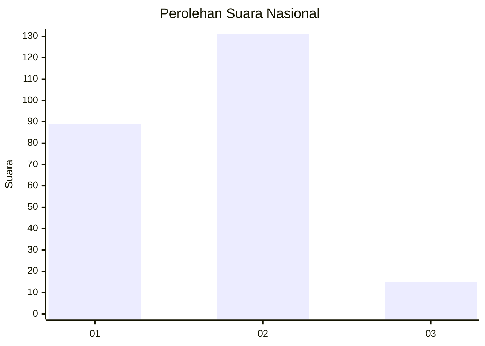
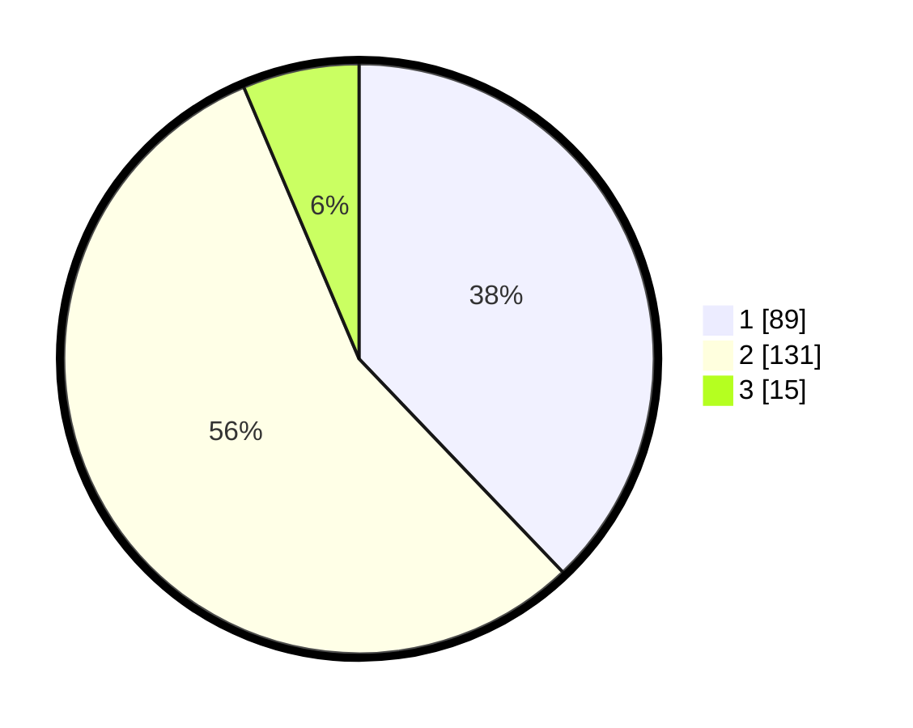

# Hasil

## Grafik

## Tabel

| No. | Nama Paslon    | Suara | Suara (raw) | Persentase |
|:--- |:-------------- | -----:| -----------:| ----------:|
| 1   | ANIES MUHAIMIN | 89    | [89][p-1]   | 37,87      |
| 2   | PRABOWO GIBRAN | 131   | [131][p-2]  | 55,74      |
| 3   | GANJAR MAHFUD  | 15    | [15][p-3]   | 6,38       |

[p-1]: https://github.com/gigit-pemilu/pemilu-2024/blob/main/pilpres/hitung-suara/sub/14-riau/sub/02-indragiri-hulu/sub/02-rengat-barat/sub/1009-pematang-reba/sub/007-tps/sub/paslon-1.txt
[p-2]: https://github.com/gigit-pemilu/pemilu-2024/blob/main/pilpres/hitung-suara/sub/14-riau/sub/02-indragiri-hulu/sub/02-rengat-barat/sub/1009-pematang-reba/sub/007-tps/sub/paslon-2.txt
[p-3]: https://github.com/gigit-pemilu/pemilu-2024/blob/main/pilpres/hitung-suara/sub/14-riau/sub/02-indragiri-hulu/sub/02-rengat-barat/sub/1009-pematang-reba/sub/007-tps/sub/paslon-3.txt

## Foto C Plano

https://sirekap-obj-formc.kpu.go.id/e5f4/pemilu/ppwp/14/02/02/10/09/1402021009007-20240222-101149--a1150d5a-d465-41b0-8300-98aea3595192.jpg

https://sirekap-obj-formc.kpu.go.id/e5f4/pemilu/ppwp/14/02/02/10/09/1402021009007-20240222-101228--715b0fb6-63f2-4a4b-b9b5-a820681017f7.jpg

https://sirekap-obj-formc.kpu.go.id/e5f4/pemilu/ppwp/14/02/02/10/09/1402021009007-20240222-101317--41fd7fa2-cbe1-4de2-8fa0-24b29a4d7044.jpg

## Metadata

| Key        | Value               |
| ---------- | ------------------- |
| Time Stamp | 2024-02-25 21:00:00 |

