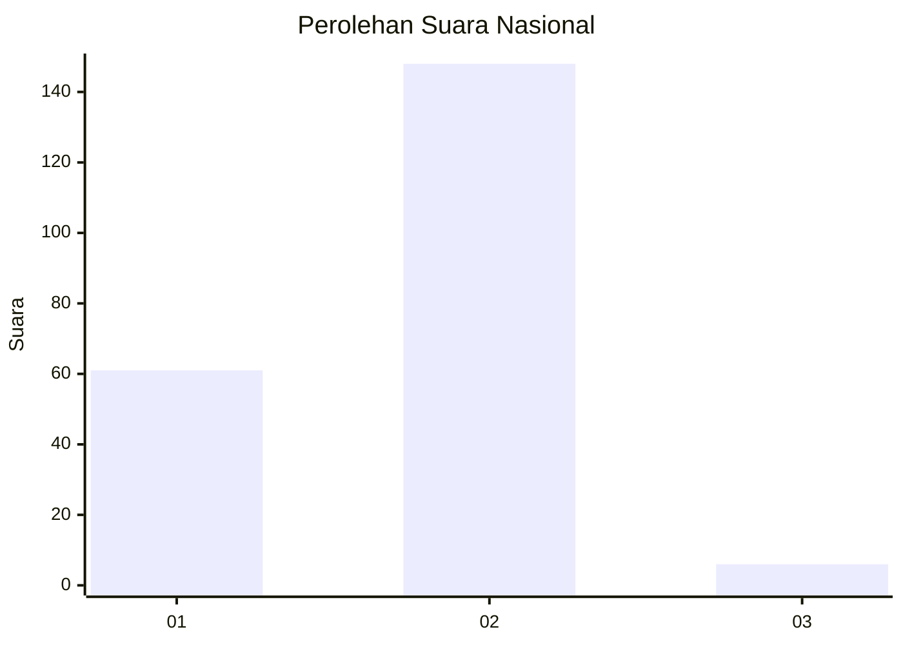
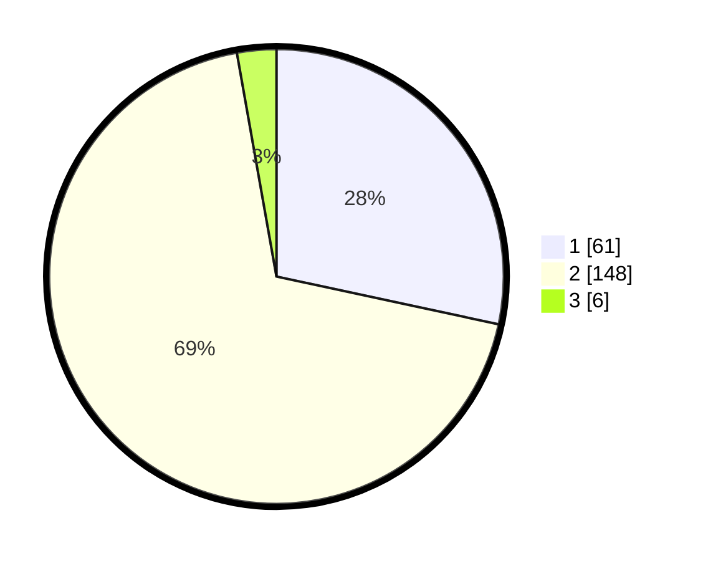

# Hasil

## Grafik

## Tabel

| No. | Nama Paslon    | Suara | Suara (raw) | Persentase |
|:--- |:-------------- | -----:| -----------:| ----------:|
| 1   | ANIES MUHAIMIN | 61    | [61][p-1]   | 28,37      |
| 2   | PRABOWO GIBRAN | 148   | [148][p-2]  | 68,84      |
| 3   | GANJAR MAHFUD  | 6     | [6][p-3]    | 2,79       |

[p-1]: https://github.com/gigit-pemilu/pemilu-2024/blob/main/pilpres/hitung-suara/sub/14-riau/sub/02-indragiri-hulu/sub/02-rengat-barat/sub/2007-talang-jerinjing/sub/003-tps/sub/paslon-1.txt
[p-2]: https://github.com/gigit-pemilu/pemilu-2024/blob/main/pilpres/hitung-suara/sub/14-riau/sub/02-indragiri-hulu/sub/02-rengat-barat/sub/2007-talang-jerinjing/sub/003-tps/sub/paslon-2.txt
[p-3]: https://github.com/gigit-pemilu/pemilu-2024/blob/main/pilpres/hitung-suara/sub/14-riau/sub/02-indragiri-hulu/sub/02-rengat-barat/sub/2007-talang-jerinjing/sub/003-tps/sub/paslon-3.txt

## Foto C Plano

https://sirekap-obj-formc.kpu.go.id/3dd1/pemilu/ppwp/14/02/02/20/07/1402022007003-20240225-153106--851fbed8-1f8c-4be2-86fa-f239e4353d55.jpg

https://sirekap-obj-formc.kpu.go.id/3dd1/pemilu/ppwp/14/02/02/20/07/1402022007003-20240225-153332--b91b888e-86e0-489d-b570-7ddc47970954.jpg

https://sirekap-obj-formc.kpu.go.id/3dd1/pemilu/ppwp/14/02/02/20/07/1402022007003-20240225-153509--cfed93fb-dd8b-457b-b6ef-1dd63d3fc3df.jpg

## Metadata

| Key        | Value               |
| ---------- | ------------------- |
| Time Stamp | 2024-02-28 19:00:00 |

