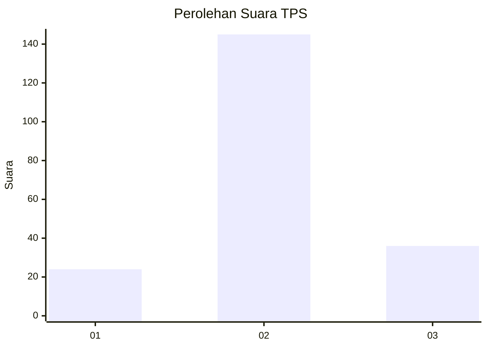
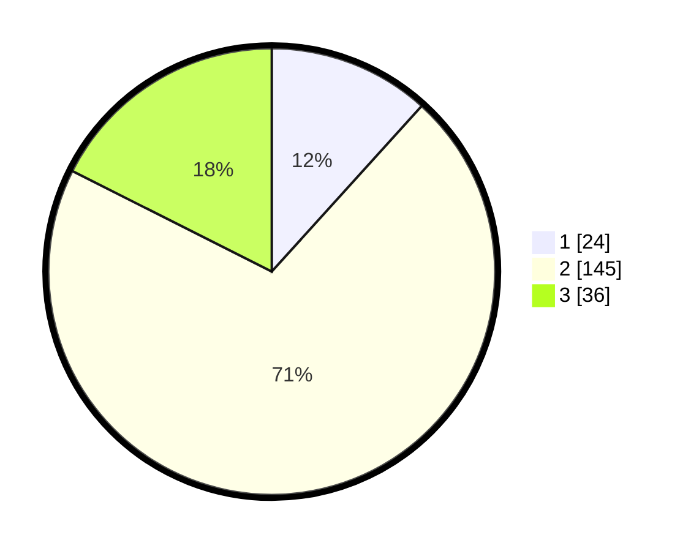

# Hasil

## Grafik

## Tabel

| No. | Nama Paslon    | Suara | Suara (raw) | Persentase |
|:--- |:-------------- | -----:| -----------:| ----------:|
| 1   | ANIES MUHAIMIN | 24    | [24][p-1]   | 11,71      |
| 2   | PRABOWO GIBRAN | 145   | [145][p-2]  | 70,73      |
| 3   | GANJAR MAHFUD  | 36    | [36][p-3]   | 17,56      |

[p-1]: https://github.com/gigit-pemilu/pemilu-2024-14-riau/blob/main/pilpres/hitung-suara/sub/14-riau/sub/02-indragiri-hulu/sub/02-rengat-barat/sub/2011-bukit-petaling/sub/004-tps/sub/paslon-1.txt
[p-2]: https://github.com/gigit-pemilu/pemilu-2024-14-riau/blob/main/pilpres/hitung-suara/sub/14-riau/sub/02-indragiri-hulu/sub/02-rengat-barat/sub/2011-bukit-petaling/sub/004-tps/sub/paslon-2.txt
[p-3]: https://github.com/gigit-pemilu/pemilu-2024-14-riau/blob/main/pilpres/hitung-suara/sub/14-riau/sub/02-indragiri-hulu/sub/02-rengat-barat/sub/2011-bukit-petaling/sub/004-tps/sub/paslon-3.txt

## Foto C Plano

https://sirekap-obj-formc.kpu.go.id/f2b6/pemilu/ppwp/14/02/02/20/11/1402022011004-20240214-205557--05fcd468-bb05-4af2-b0e3-972bfa06e0a4.jpg

https://sirekap-obj-formc.kpu.go.id/f2b6/pemilu/ppwp/14/02/02/20/11/1402022011004-20240214-205613--c4cb7f7e-f01b-489a-b512-8d5b329f5a5b.jpg

https://sirekap-obj-formc.kpu.go.id/f2b6/pemilu/ppwp/14/02/02/20/11/1402022011004-20240214-205628--0b4bed6e-153a-40aa-b0d6-7a2b3d3db361.jpg

## Metadata

| Key        | Value               |
| ---------- | ------------------- |
| Time Stamp | 2024-02-15 21:30:27 |

