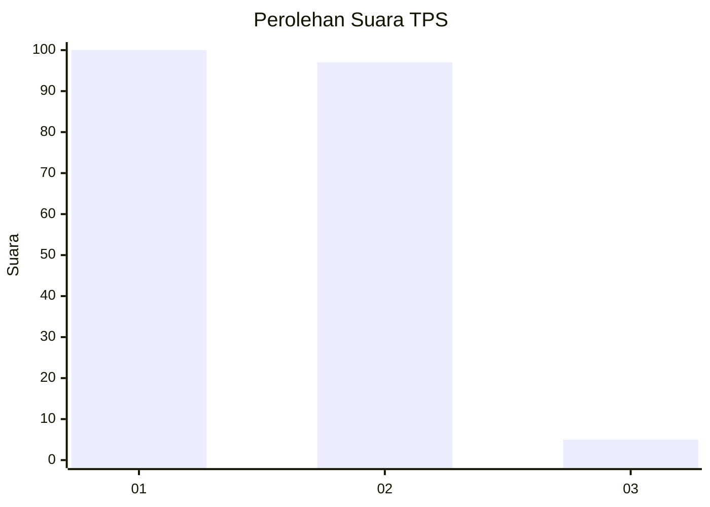
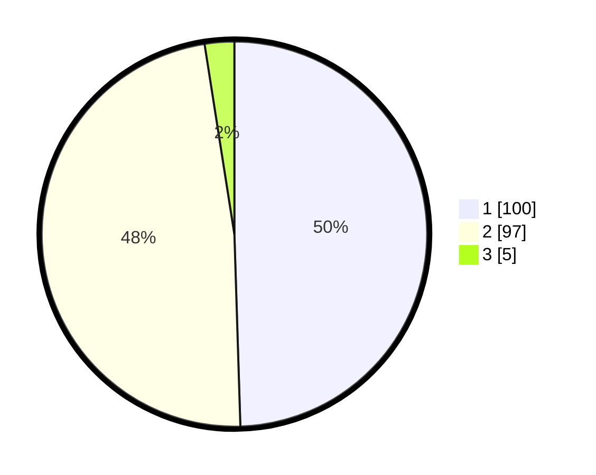

# Hasil

## Grafik

## Tabel

| No. | Nama Paslon    | Suara | Suara (raw) | Persentase |
|:--- |:-------------- | -----:| -----------:| ----------:|
| 1   | ANIES MUHAIMIN | 100   | [100][p-1]  | 49,50      |
| 2   | PRABOWO GIBRAN | 97    | [97][p-2]   | 48,02      |
| 3   | GANJAR MAHFUD  | 5     | [5][p-3]    | 2,48       |

[p-1]: https://github.com/gigit-pemilu/pemilu-2024-14-riau/blob/main/pilpres/hitung-suara/sub/14-riau/sub/02-indragiri-hulu/sub/03-kelayang/sub/1019-simpang-kelayang/sub/003-tps/sub/paslon-1.txt
[p-2]: https://github.com/gigit-pemilu/pemilu-2024-14-riau/blob/main/pilpres/hitung-suara/sub/14-riau/sub/02-indragiri-hulu/sub/03-kelayang/sub/1019-simpang-kelayang/sub/003-tps/sub/paslon-2.txt
[p-3]: https://github.com/gigit-pemilu/pemilu-2024-14-riau/blob/main/pilpres/hitung-suara/sub/14-riau/sub/02-indragiri-hulu/sub/03-kelayang/sub/1019-simpang-kelayang/sub/003-tps/sub/paslon-3.txt

## Foto C Plano

https://sirekap-obj-formc.kpu.go.id/ea6d/pemilu/ppwp/14/02/03/10/19/1402031019003-20240224-150055--7e61e5c1-0043-449c-97f9-10bd56736fdb.jpg

https://sirekap-obj-formc.kpu.go.id/ea6d/pemilu/ppwp/14/02/03/10/19/1402031019003-20240224-150131--a35f24a2-4d4f-477c-a8ed-d4dacc2b2103.jpg

https://sirekap-obj-formc.kpu.go.id/ea6d/pemilu/ppwp/14/02/03/10/19/1402031019003-20240224-150202--0597ed0f-c682-4e43-87c8-9d8a97fecf44.jpg

## Metadata

| Key        | Value               |
| ---------- | ------------------- |
| Time Stamp | 2024-02-25 01:00:00 |

