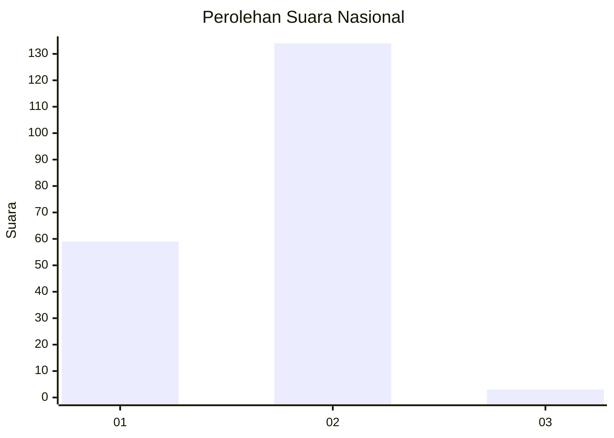
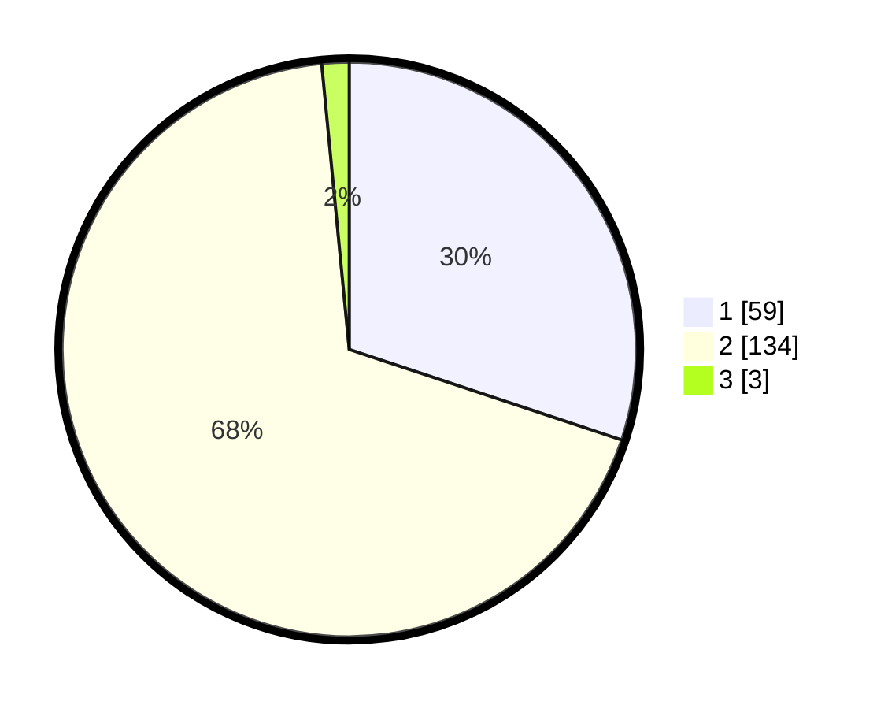

# Hasil

## Grafik

## Tabel

| No. | Nama Paslon    | Suara | Suara (raw) | Persentase |
|:--- |:-------------- | -----:| -----------:| ----------:|
| 1   | ANIES MUHAIMIN | 59    | [59][p-1]   | 30,10      |
| 2   | PRABOWO GIBRAN | 134   | [134][p-2]  | 68,37      |
| 3   | GANJAR MAHFUD  | 3     | [3][p-3]    | 1,53       |

[p-1]: https://github.com/gigit-pemilu/pemilu-2024/blob/main/pilpres/hitung-suara/sub/14-riau/sub/02-indragiri-hulu/sub/03-kelayang/sub/2007-pulau-sengkilo/sub/005-tps/sub/paslon-1.txt
[p-2]: https://github.com/gigit-pemilu/pemilu-2024/blob/main/pilpres/hitung-suara/sub/14-riau/sub/02-indragiri-hulu/sub/03-kelayang/sub/2007-pulau-sengkilo/sub/005-tps/sub/paslon-2.txt
[p-3]: https://github.com/gigit-pemilu/pemilu-2024/blob/main/pilpres/hitung-suara/sub/14-riau/sub/02-indragiri-hulu/sub/03-kelayang/sub/2007-pulau-sengkilo/sub/005-tps/sub/paslon-3.txt

## Foto C Plano

https://sirekap-obj-formc.kpu.go.id/b358/pemilu/ppwp/14/02/03/20/07/1402032007005-20240224-170404--27bf74d4-bc45-42f3-b927-1b852564e1c4.jpg

https://sirekap-obj-formc.kpu.go.id/b358/pemilu/ppwp/14/02/03/20/07/1402032007005-20240224-170442--dbcd9924-4de8-4d30-8e8e-4f9fa35a135c.jpg

https://sirekap-obj-formc.kpu.go.id/b358/pemilu/ppwp/14/02/03/20/07/1402032007005-20240224-170519--332aaba3-b247-49dc-b12a-e336ee004726.jpg

## Metadata

| Key        | Value               |
| ---------- | ------------------- |
| Time Stamp | 2024-02-25 01:00:00 |

