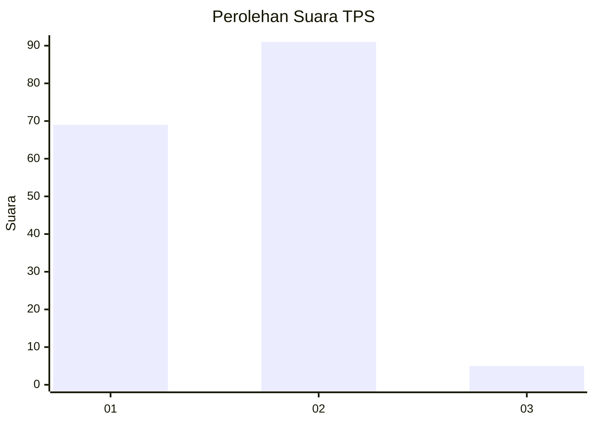
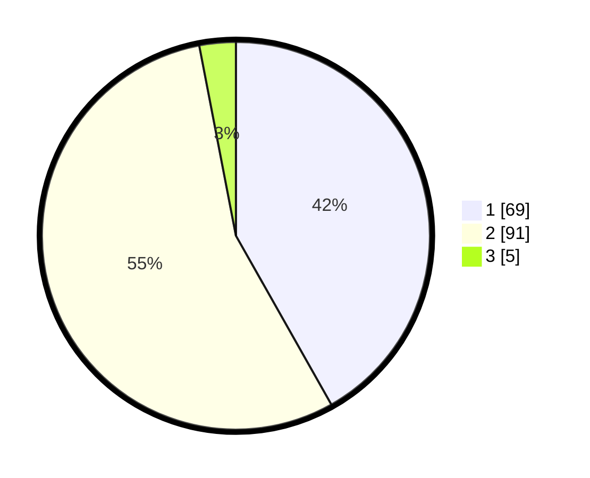

# Hasil

## Grafik

## Tabel

| No. | Nama Paslon    | Suara | Suara (raw) | Persentase |
|:--- |:-------------- | -----:| -----------:| ----------:|
| 1   | ANIES MUHAIMIN | 69    | [69][p-1]   | 41,82      |
| 2   | PRABOWO GIBRAN | 91    | [91][p-2]   | 55,15      |
| 3   | GANJAR MAHFUD  | 5     | [5][p-3]    | 3,03       |

[p-1]: https://github.com/gigit-pemilu/pemilu-2024-14-riau/blob/main/pilpres/hitung-suara/sub/14-riau/sub/02-indragiri-hulu/sub/03-kelayang/sub/2008-kota-medan/sub/001-tps/sub/paslon-1.txt
[p-2]: https://github.com/gigit-pemilu/pemilu-2024-14-riau/blob/main/pilpres/hitung-suara/sub/14-riau/sub/02-indragiri-hulu/sub/03-kelayang/sub/2008-kota-medan/sub/001-tps/sub/paslon-2.txt
[p-3]: https://github.com/gigit-pemilu/pemilu-2024-14-riau/blob/main/pilpres/hitung-suara/sub/14-riau/sub/02-indragiri-hulu/sub/03-kelayang/sub/2008-kota-medan/sub/001-tps/sub/paslon-3.txt

## Foto C Plano

https://sirekap-obj-formc.kpu.go.id/2a71/pemilu/ppwp/14/02/03/20/08/1402032008001-20240217-224502--16054800-a393-40ba-a3a2-c860bad0a59a.jpg

https://sirekap-obj-formc.kpu.go.id/2a71/pemilu/ppwp/14/02/03/20/08/1402032008001-20240217-224921--dbd57e82-163c-4be1-9cf9-17626d2a38bf.jpg

https://sirekap-obj-formc.kpu.go.id/2a71/pemilu/ppwp/14/02/03/20/08/1402032008001-20240217-225953--1d6f0706-ac0f-49e3-957c-c92983b4df8d.jpg

## Metadata

| Key        | Value               |
| ---------- | ------------------- |
| Time Stamp | 2024-02-19 06:16:00 |

## DATA PEMILIH TETAP

Jumlah pemilih dalam DPT: **555**.
 * L: **225**.
 * P: **55**.

## DATA PENGGUNA HAK PILIH

Jumlah pengguna hak pilih dalam DPT: **88**.
 * L: **255**.
 * P: **750**.

Jumlah pengguna hak pilih dalam DPTb: **888**.
 * L: **50**.
 * P: **404**.

Jumlah pengguna hak pilih dalam DPK: **884**.
 * L: **0**.
 * P: **88**.

Jumlah pengguna hak pilih: **427**.
 * L: **708**.
 * P: **300**.

## JUMLAH SUARA SAH DAN TIDAK SAH

JUMLAH SELURUH SUARA SAH: **165**.

JUMLAH SUARA TIDAK SAH: **2**.

JUMLAH SELURUH SUARA SAH DAN SUARA TIDAK SAH: **167**.

