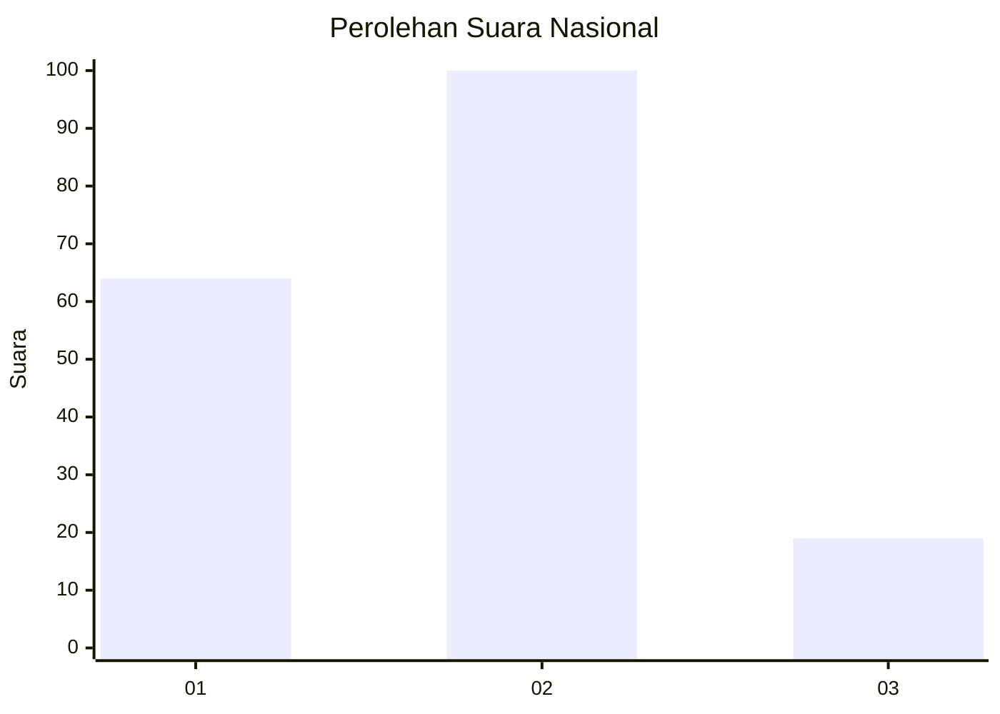
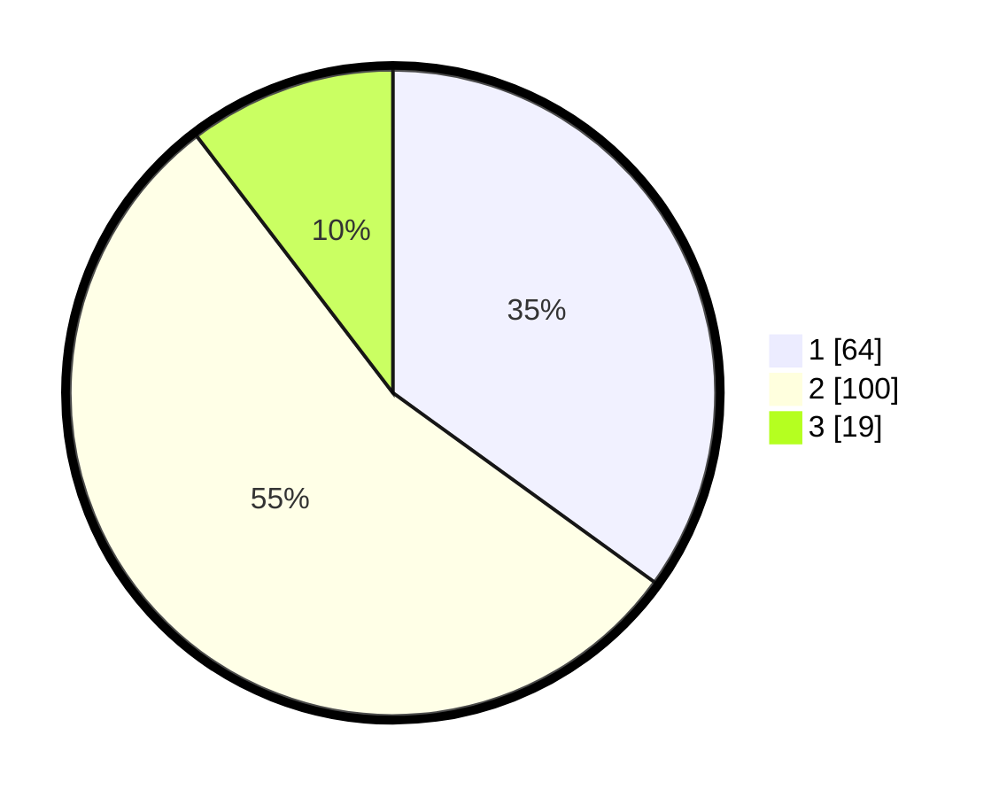

# Hasil

## Grafik

## Tabel

| No. | Nama Paslon    | Suara | Suara (raw) | Persentase |
|:--- |:-------------- | -----:| -----------:| ----------:|
| 1   | ANIES MUHAIMIN | 64    | [64][p-1]   | 34,97      |
| 2   | PRABOWO GIBRAN | 100   | [100][p-2]  | 54,64      |
| 3   | GANJAR MAHFUD  | 19    | [19][p-3]   | 10,38      |

[p-1]: https://github.com/gigit-pemilu/pemilu-2024/blob/main/pilpres/hitung-suara/sub/14-riau/sub/02-indragiri-hulu/sub/03-kelayang/sub/2021-bongkal-malang/sub/008-tps/sub/paslon-1.txt
[p-2]: https://github.com/gigit-pemilu/pemilu-2024/blob/main/pilpres/hitung-suara/sub/14-riau/sub/02-indragiri-hulu/sub/03-kelayang/sub/2021-bongkal-malang/sub/008-tps/sub/paslon-2.txt
[p-3]: https://github.com/gigit-pemilu/pemilu-2024/blob/main/pilpres/hitung-suara/sub/14-riau/sub/02-indragiri-hulu/sub/03-kelayang/sub/2021-bongkal-malang/sub/008-tps/sub/paslon-3.txt

## Foto C Plano

https://sirekap-obj-formc.kpu.go.id/4382/pemilu/ppwp/14/02/03/20/21/1402032021008-20240217-160742--d659effe-4e1e-4b99-8529-79dd7bbd63a8.jpg

https://sirekap-obj-formc.kpu.go.id/4382/pemilu/ppwp/14/02/03/20/21/1402032021008-20240217-160930--69d24626-3dbb-4643-b982-1fda6c0d7032.jpg

https://sirekap-obj-formc.kpu.go.id/4382/pemilu/ppwp/14/02/03/20/21/1402032021008-20240217-161011--81f00f3d-f55c-4cc4-a221-91ddd6fdaba2.jpg

## Metadata

| Key        | Value               |
| ---------- | ------------------- |
| Time Stamp | 2024-02-17 16:36:25 |

## DATA PEMILIH TETAP

Jumlah pemilih dalam DPT: **249**.
 * L: **882**.
 * P: **888**.

## DATA PENGGUNA HAK PILIH

Jumlah pengguna hak pilih dalam DPT: **682**.
 * L: **886**.
 * P: **745**.

Jumlah pengguna hak pilih dalam DPTb: **884**.
 * L: **882**.
 * P: **283**.

Jumlah pengguna hak pilih dalam DPK: **2**.
 * L: **808**.
 * P: **4**.

Jumlah pengguna hak pilih: **588**.
 * L: **849**.
 * P: **48**.

## JUMLAH SUARA SAH DAN TIDAK SAH

JUMLAH SELURUH SUARA SAH: **183**.

JUMLAH SUARA TIDAK SAH: **5**.

JUMLAH SELURUH SUARA SAH DAN SUARA TIDAK SAH: **188**.

