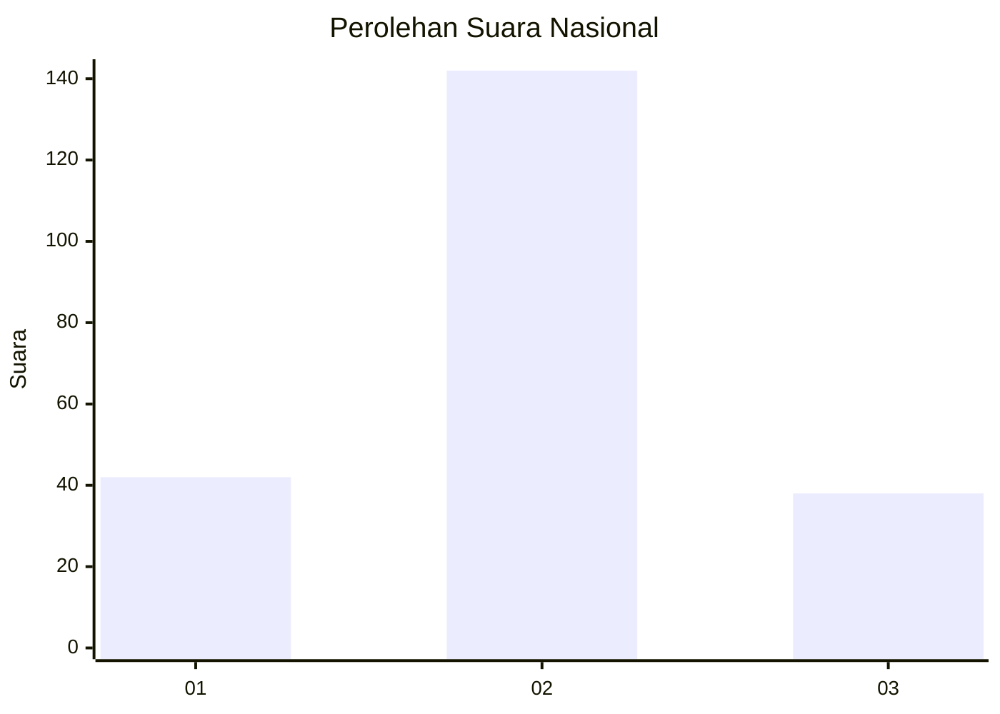
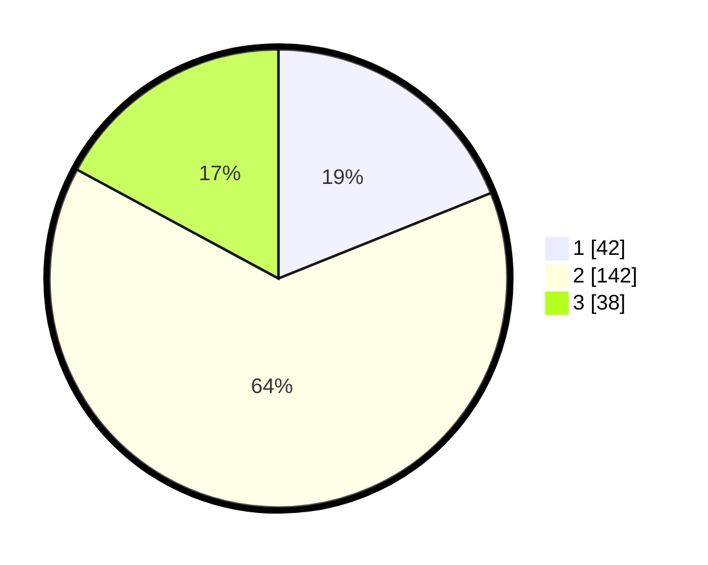

# Hasil

## Grafik

## Tabel

| No. | Nama Paslon    | Suara | Suara (raw) | Persentase |
|:--- |:-------------- | -----:| -----------:| ----------:|
| 1   | ANIES MUHAIMIN | 42    | [42][p-1]   | 18,92      |
| 2   | PRABOWO GIBRAN | 142   | [142][p-2]  | 63,96      |
| 3   | GANJAR MAHFUD  | 38    | [38][p-3]   | 17,12      |

[p-1]: https://github.com/gigit-pemilu/pemilu-2024/blob/main/pilpres/hitung-suara/sub/14-riau/sub/02-indragiri-hulu/sub/03-kelayang/sub/2024-sungai-banyak-ikan/sub/002-tps/sub/paslon-1.txt
[p-2]: https://github.com/gigit-pemilu/pemilu-2024/blob/main/pilpres/hitung-suara/sub/14-riau/sub/02-indragiri-hulu/sub/03-kelayang/sub/2024-sungai-banyak-ikan/sub/002-tps/sub/paslon-2.txt
[p-3]: https://github.com/gigit-pemilu/pemilu-2024/blob/main/pilpres/hitung-suara/sub/14-riau/sub/02-indragiri-hulu/sub/03-kelayang/sub/2024-sungai-banyak-ikan/sub/002-tps/sub/paslon-3.txt

## Foto C Plano

https://sirekap-obj-formc.kpu.go.id/b641/pemilu/ppwp/14/02/03/20/24/1402032024002-20240223-111142--541b5d85-d621-4692-8c84-61b1099f1193.jpg

https://sirekap-obj-formc.kpu.go.id/b641/pemilu/ppwp/14/02/03/20/24/1402032024002-20240223-111327--7293de7f-c132-4cf7-be27-9525e602ff97.jpg

https://sirekap-obj-formc.kpu.go.id/b641/pemilu/ppwp/14/02/03/20/24/1402032024002-20240214-191633--4dddef72-a363-4ccf-bf3a-0d1606f58843.jpg

## Metadata

| Key        | Value               |
| ---------- | ------------------- |
| Time Stamp | 2024-02-24 22:31:28 |

