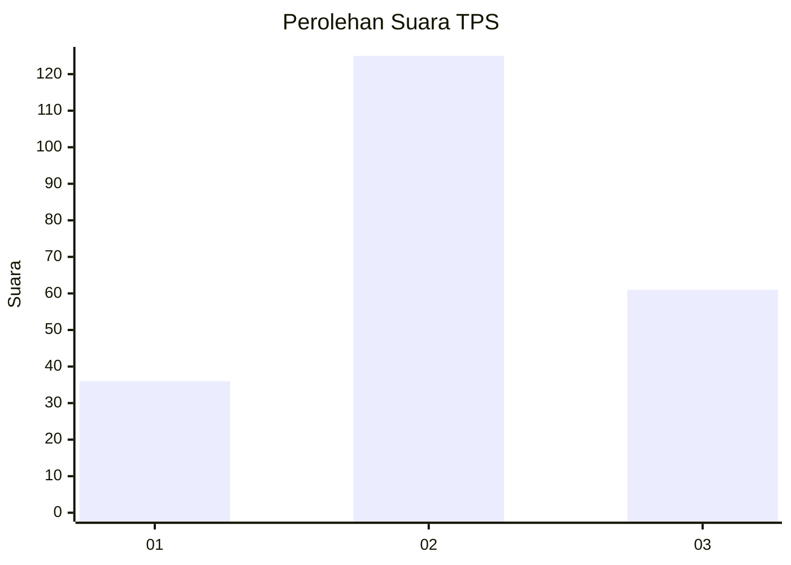
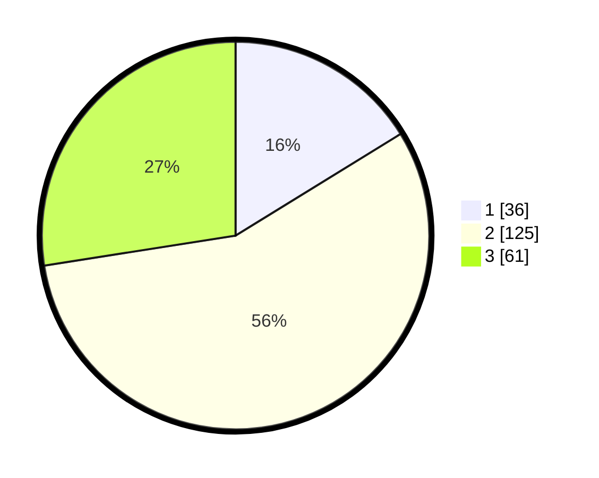

# Hasil

## Grafik

## Tabel

| No. | Nama Paslon    | Suara | Suara (raw) | Persentase |
|:--- |:-------------- | -----:| -----------:| ----------:|
| 1   | ANIES MUHAIMIN | 36    | [36][p-1]   | 16,22      |
| 2   | PRABOWO GIBRAN | 125   | [125][p-2]  | 56,31      |
| 3   | GANJAR MAHFUD  | 61    | [61][p-3]   | 27,48      |

[p-1]: https://github.com/gigit-pemilu/pemilu-2024-14-riau/blob/main/pilpres/hitung-suara/sub/14-riau/sub/02-indragiri-hulu/sub/03-kelayang/sub/2025-tanjung-beludu/sub/005-tps/sub/paslon-1.txt
[p-2]: https://github.com/gigit-pemilu/pemilu-2024-14-riau/blob/main/pilpres/hitung-suara/sub/14-riau/sub/02-indragiri-hulu/sub/03-kelayang/sub/2025-tanjung-beludu/sub/005-tps/sub/paslon-2.txt
[p-3]: https://github.com/gigit-pemilu/pemilu-2024-14-riau/blob/main/pilpres/hitung-suara/sub/14-riau/sub/02-indragiri-hulu/sub/03-kelayang/sub/2025-tanjung-beludu/sub/005-tps/sub/paslon-3.txt

## Foto C Plano

https://sirekap-obj-formc.kpu.go.id/ec38/pemilu/ppwp/14/02/03/20/25/1402032025005-20240214-190024--d318cd1a-cabf-4ec3-a06f-2ee1b9617ade.jpg

https://sirekap-obj-formc.kpu.go.id/ec38/pemilu/ppwp/14/02/03/20/25/1402032025005-20240214-192859--8f31fcae-8889-4181-81c7-c608bc8d0160.jpg

https://sirekap-obj-formc.kpu.go.id/ec38/pemilu/ppwp/14/02/03/20/25/1402032025005-20240214-234312--762367e2-4abf-40e5-8e3c-91e346133217.jpg

## Metadata

| Key        | Value               |
| ---------- | ------------------- |
| Time Stamp | 2024-02-15 17:00:25 |

