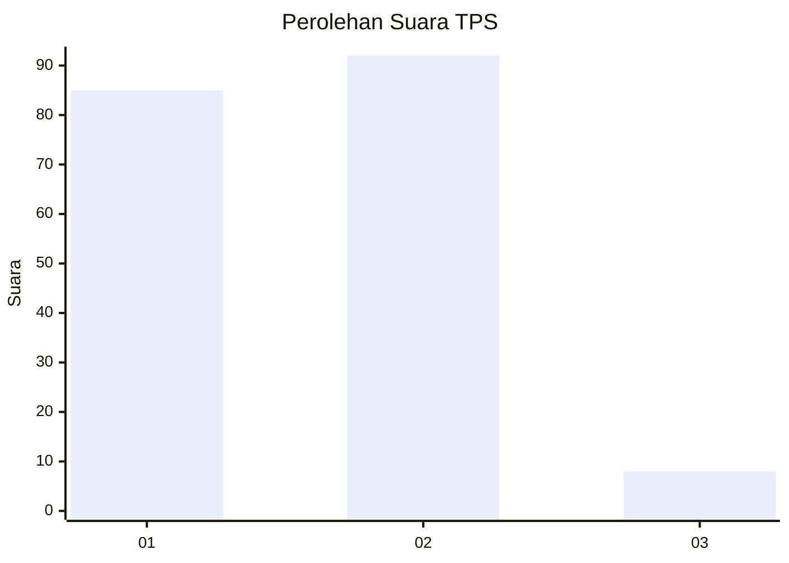
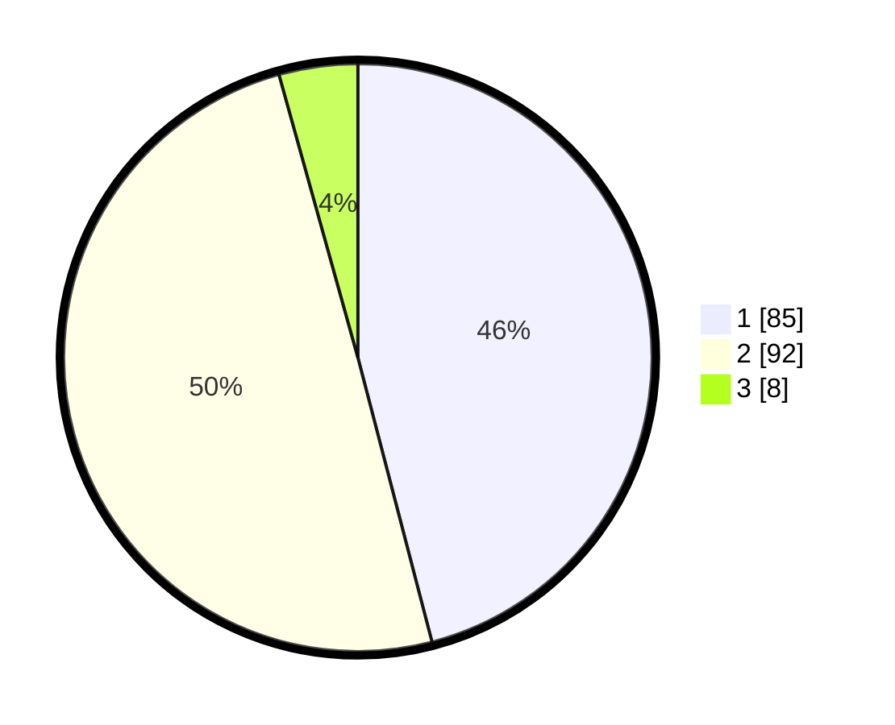

# Hasil

## Grafik

## Tabel

| No. | Nama Paslon    | Suara | Suara (raw) | Persentase |
|:--- |:-------------- | -----:| -----------:| ----------:|
| 1   | ANIES MUHAIMIN | 85    | [85][p-1]   | 45,95      |
| 2   | PRABOWO GIBRAN | 92    | [92][p-2]   | 49,73      |
| 3   | GANJAR MAHFUD  | 8     | [8][p-3]    | 4,32       |

[p-1]: https://github.com/gigit-pemilu/pemilu-2024-14-riau/blob/main/pilpres/hitung-suara/sub/14-riau/sub/02-indragiri-hulu/sub/03-kelayang/sub/2029-sungai-kuning-benio/sub/003-tps/sub/paslon-1.txt
[p-2]: https://github.com/gigit-pemilu/pemilu-2024-14-riau/blob/main/pilpres/hitung-suara/sub/14-riau/sub/02-indragiri-hulu/sub/03-kelayang/sub/2029-sungai-kuning-benio/sub/003-tps/sub/paslon-2.txt
[p-3]: https://github.com/gigit-pemilu/pemilu-2024-14-riau/blob/main/pilpres/hitung-suara/sub/14-riau/sub/02-indragiri-hulu/sub/03-kelayang/sub/2029-sungai-kuning-benio/sub/003-tps/sub/paslon-3.txt

## Foto C Plano

https://sirekap-obj-formc.kpu.go.id/2225/pemilu/ppwp/14/02/03/20/29/1402032029003-20240223-215721--71fba435-abaf-412b-a7cc-9507cbd42981.jpg

https://sirekap-obj-formc.kpu.go.id/2225/pemilu/ppwp/14/02/03/20/29/1402032029003-20240223-215807--cb3204e7-8fda-4b9d-92eb-d9b230fc4cff.jpg

https://sirekap-obj-formc.kpu.go.id/2225/pemilu/ppwp/14/02/03/20/29/1402032029003-20240223-215852--d08e7607-2e3d-4515-80d4-438411c5513e.jpg

## Metadata

| Key        | Value               |
| ---------- | ------------------- |
| Time Stamp | 2024-02-25 01:00:00 |

