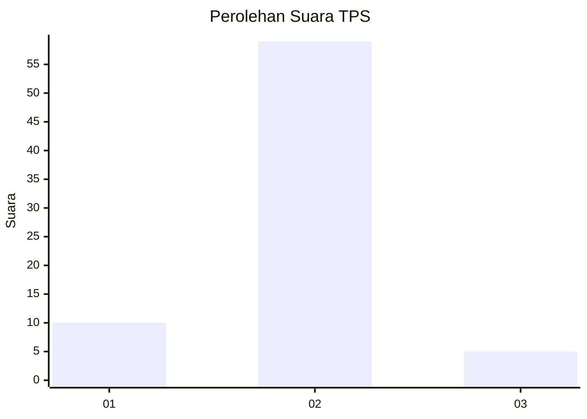
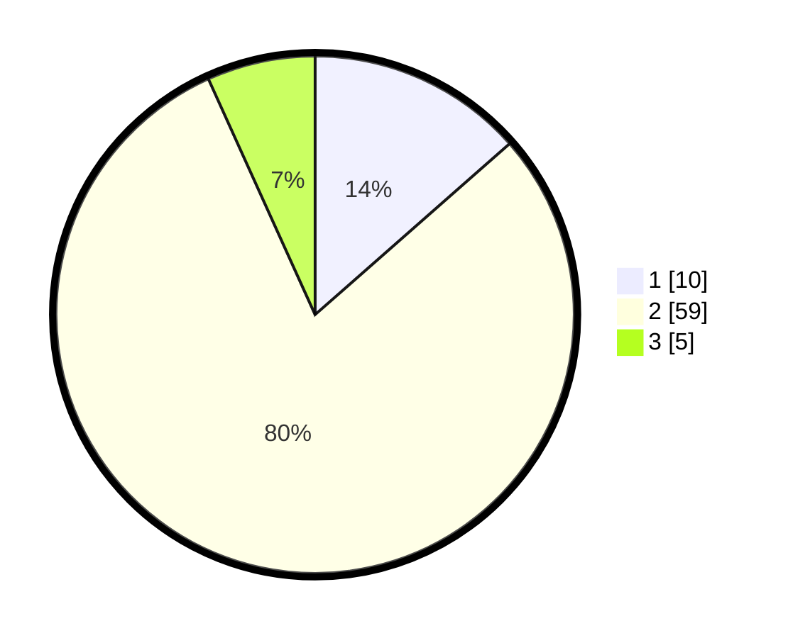

# Hasil

## Grafik

## Tabel

| No. | Nama Paslon    | Suara | Suara (raw) | Persentase |
|:--- |:-------------- | -----:| -----------:| ----------:|
| 1   | ANIES MUHAIMIN | 10    | [10][p-1]   | 13,51      |
| 2   | PRABOWO GIBRAN | 59    | [59][p-2]   | 79,73      |
| 3   | GANJAR MAHFUD  | 5     | [5][p-3]    | 6,76       |

[p-1]: https://github.com/gigit-pemilu/pemilu-2024-14-riau/blob/main/pilpres/hitung-suara/sub/14-riau/sub/02-indragiri-hulu/sub/08-batang-gangsal/sub/2002-rantai-langsat/sub/006-tps/sub/paslon-1.txt
[p-2]: https://github.com/gigit-pemilu/pemilu-2024-14-riau/blob/main/pilpres/hitung-suara/sub/14-riau/sub/02-indragiri-hulu/sub/08-batang-gangsal/sub/2002-rantai-langsat/sub/006-tps/sub/paslon-2.txt
[p-3]: https://github.com/gigit-pemilu/pemilu-2024-14-riau/blob/main/pilpres/hitung-suara/sub/14-riau/sub/02-indragiri-hulu/sub/08-batang-gangsal/sub/2002-rantai-langsat/sub/006-tps/sub/paslon-3.txt

## Foto C Plano

https://sirekap-obj-formc.kpu.go.id/b04e/pemilu/ppwp/14/02/08/20/02/1402082002006-20240317-122330--9455bd01-d18a-4136-ab0f-d526d649a494.jpg

https://sirekap-obj-formc.kpu.go.id/b04e/pemilu/ppwp/14/02/08/20/02/1402082002006-20240317-122406--0804bab5-f3b9-40da-987b-5ed7161279be.jpg

https://sirekap-obj-formc.kpu.go.id/b04e/pemilu/ppwp/14/02/08/20/02/1402082002006-20240317-122447--5ee730a3-e71f-440c-bb28-ebdbf177fb9a.jpg

## Metadata

| Key        | Value               |
| ---------- | ------------------- |
| Time Stamp | 2024-03-17 12:30:00 |

## DATA PEMILIH TETAP

Jumlah pemilih dalam DPT: **191**.
 * L: **109**.
 * P: **82**.

## DATA PENGGUNA HAK PILIH

Jumlah pengguna hak pilih dalam DPT: **57**.
 * L: **33**.
 * P: **24**.

Jumlah pengguna hak pilih dalam DPTb: **9**.
 * L: **9**.
 * P: **0**.

Jumlah pengguna hak pilih dalam DPK: **8**.
 * L: **4**.
 * P: **4**.

Jumlah pengguna hak pilih: **74**.
 * L: **46**.
 * P: **28**.

## JUMLAH SUARA SAH DAN TIDAK SAH

JUMLAH SELURUH SUARA SAH: **74**.

JUMLAH SUARA TIDAK SAH: **888**.

JUMLAH SELURUH SUARA SAH DAN SUARA TIDAK SAH: **74**.

